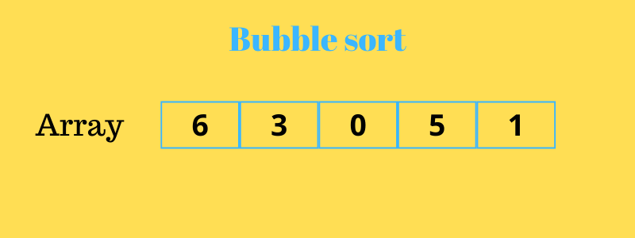

# 버블 정렬

:writing_hand: *Assembled by Yunju Jang*

🤝*Contributors : Jeonghea Shin*

- <b>버블 정렬이란?</b>

  - 거품이 수면으로 올라오는 듯한 모습 때문에 붙여진 이름이다.
  - 서로 <b>인접한 두 원소를 비교</b>하여 큰 수 (작은 수) 를 뒤로 보내는 정렬 알고리즘
  - O(n2)의 시간 복잡도를 가진다.

   

   

- <b>버블 정렬 과정 (오름차순 정렬 기준)</b>

  - 버블 정렬은 첫 번째 자료와 두 번째 자료, 두 번째 자료와 세 번째 자료, ... 이런식으로 인접한 자료를 비교하여 교환하면서 자료를 정렬한다.

  - <b>한번 전체 반복을 수행하고 나면 가장 큰 자료가 맨 뒤로 이동</b>한다.

  - 따라서, 1회전 반복을 수행할 때마다 정렬에서 제외되는 데이터가 하나씩 늘어간다.

  - 예제

    

    - 수열의 왼쪽 끝에 있는 두 숫자를 비교한다.
    - 비교한 결과 왼쪽 숫자가 오른쪽 숫자보다 크면 자리를 교환한다.
    - 크지 않으면 교환하지 않고 넘어간다.
    - 오른쪽으로 한 칸 이동한 후, 동일한 방법으로 숫자를 비교한다.
    - 동일한 작업을 오른쪽 끝의 숫자에 이동하기까지 반복한다.
    - 오른쪽 끝에 도착하면 수열 중 가장 큰 수가 오른쪽 끝으로 이동한 상태가 된다.
    - 오른쪽 끝 숫자는 정렬을 끝낸 것으로 간주한다.
    - s다시 왼쪽 끝에서 부터 작업을 시작한다.
    - 동일한 작업을 모든 숫자가 정렬될 때까지 반복한다.

 

 

- <b>버블 정렬의 특징</b>
  - 장점
    - 구현이 매우 간단하다.
  - 단점
    - 순서에 맞지 않은 요소를 인접한 요소와 교환한다.
    - 하나의 요소가 가장 왼쪽에서 가장 오른쪽으로 이동하기 위해서 배열의 모든 다른 요소들과 교체되어야 한다.
    - 특히, 특정 요소가 최종 정렬 위치에 이미 있는 경우라도 교환되는 일이 일어난다.
  - 일반적으로 자료의 교환 작업이 자료의 이동작업 보다 더 복잡하여 버블 정렬은 단순성에도 불구하고 거의 쓰이지 않는다.

 

 

- <b>버블 정렬 시간 복잡도</b>

  - 최선의 경우

    - 자료가 이미 정렬되어 있는 경우
    - O(n2)
      - 비교 횟수 : n-1, n-2, ... , 2 ,1 번 = n(n-1)/2 번
      - 교환 횟수 : 일어나지 않음

     

  - 최악의 경우

    - 자료가 역순으로 정렬되어 있는 경우
    - O(n2)
      - 비교 횟수 : n(n-1)/2 번
      - 교환 횟수 : n(n-1)/2 번

 

 

## 예상질문❔

Q1) 버블 정렬이란 무엇인가?

A1) 서로 인접하 두 원소를 비교하여 큰 수 또는 작은 수를 뒤로 보내는 정렬 알고리즘으로, 정렬이 완료되어도 끝까지 비교하게 되어 단순성에도 불고하고 잘 사용하지 않는다.

 

 

### Reference📖

- https://github.com/fake-developers/1st/blob/main/SJH/Bubble%20sort.md

