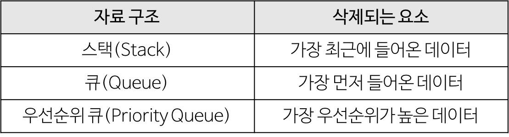
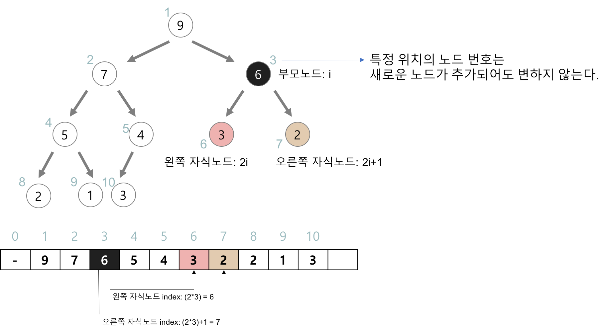

# Heap

:writing_hand: *Assembled by Yunju Jang*

- <b>Heap 이란?</b>

- 우선순위 큐를 위해 만들어진 자료구조이다.

  > <b>우선순위 큐</b>
  >
  > - 우선순위의 개념에 큐를 도입한 자료구조
  > - 데이터들이 우선순위를 가지고 있고, 우선순위가 높은 데이터가 먼저 나간다.
  >
  > 
  >
  > - 우선순위 큐는 배열, 연결리스트, 힙으로 구현 가능하다.
  >
  >   - 이 중, <b>힙으로 구현하는 것이 가장 효율적</b>이다.
  >
  >   

- 힙은 <b>완전 이진 트리</b>의 일종으로, 최댓값과 최솟값을 빠르게 찾아내는 연산을 위해 고안되었다.

- 힙은 일종의 <b>반정렬 상태(느슨한 정렬 상태)</b>를 유지한다.

  - 큰 값이 상위 레벨에 있고, 작은 값이 하위 레벨에 있다는 정도
  - 부모 노드의 키 값이 자식 노드의 키 값보다 항상 큰 (작은) 이진 트리를 말한다.

  - 힙 트리에서는 중복된 값을 <b>허용</b>한다. (이진 탐색 트리에서는 허용하지 않음)

 

 

- <b>힙의 종류</b>

  - 최대 힙 (Max Heap)

    - 부모 노드의 키 값이 자식 노드의 키 값보다 크거나 같은 완전 이진 트리
    - key (부모 노드) >= key (자식 노드)
    - 최댓값은 이진트리의 root 부분에 항상 존재한다.

     

  - 최소 힙 (Min Heap)

    - 부모 노드의 키 값이 자식 노드의 키 값보다 작거나 같은 완전 이진 트리
    - key (부모 노드) <= key (자식 노드)
    - 최솟값은 이진트리의 root 부분에 항상 존재한다.

     

    

 

 

- <b>힙의 구현</b>

  - 힙을 저장하는 표준적인 자료구조는 배열이다.

  - 구현을 쉽게 하기 위해 배열의 첫 번째 인덱스인 0은 사용되지 않는다.

  - 특정 위치의 노드 번호는 새로운 노드가 추가되어도 변하지 않는다.

    - 예를 들어, 루트 노드의 오른쪽 노드의 번호는 항상 3이다.

     

    

  - 힙에서의 부모 노드와 자식 노드의 관계

    - 왼쪽 자식의 인덱스 = (부모의 인덱스) * 2
    - 오른쪽 자식의 인덱스 = (부모의 인덱스) * 2 + 1
    - 부모의 인덱스 = (자식의 인덱스) / 2

 

 

- <b>힙의 삽입</b>

  1. 힙에 새로운 요소가 들어오면, 일단 새로운 노드를 힙의 마지막 노드에 이어서 삽입한다.

  2. 새로운 노드를 부모 노드들과 교환해서 힙의 성질을 만족시킨다.

  > 예시
  >
  > 
  >
  > 

   

   

- <b>힙 삭제</b>

  1. 최대 힙에서 최댓값은 루트 노드 이므로 루트 노드가 삭제된다.

     <small>(최대 힙에서 삭제 연산은 최댓값을 가진 요소를 삭제하는 것)</small>

  2. 삭제된 루트 노드에는 힙의 마지막 노드를 가져온다.

  3. 힙을 재구성한다.

  > 예시
  >
  > 

   

   

## 예상질문❔

Q1) 힙이란 무엇인가?

A1) 최댓값과 최솟값을 빠르게 찾아내는 연산을 위해 고안된 자료구조로, 이진트리의 형태이다.

 

Q2) 힙의 종류는 무엇이 있는가?

A2) 최대 힙과 최소 힙이 있다. 최대 힙은 루트에 최댓값이 존재하고, 최소 힙은 루트에 최솟값이 존재한다.

 

 

### Reference📖

- https://gmlwjd9405.github.io/2018/05/10/data-structure-heap.html
- https://www.crocus.co.kr/1184

