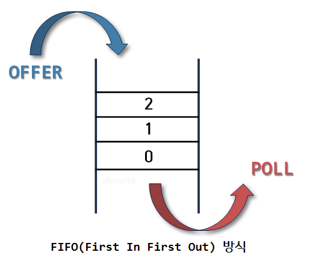

# 스택, 큐

:writing_hand: *Assembled by Yunju Jang*

🤝*Contributors :  JiYoung-Kwon* 

<hr>


### 스택 (Stack)


- <b>Stack 이란?</b>

  

  - 스택은 쌓아 올린다는 것을 의미한다.
  - 따라서 차곡차곡 쌓아 올린 형태의 자료구조를 스택이라고 한다.

  <br/>

  <br/>

- <b>스택의 특징</b>

  - LIFO 구조이다.

    - 후입 선출 (Last - in - First - out)
    - 마지막에 들어온 것이 먼저 나간다.
    - 입구와 출구가 같은 자료구조이다.

    <br/>

  - 같은 구조와 크기의 자료를 정해진 방향으로만 쌓을 수 있다.

  - top으로 정한 곳을 통해서만 접근할 수 있고, 자료 삭제 또한 top을 통해서만 가능하다.

    - top : 가장 위에 있는 자료로, 가장 최근에 들어온 데이터이다.
      - 삽입되는 새 자료는 top이 가리키는 자료의 위에 쌓이게 되고, 초기값은 -1이다.
    - push : top을 통해 삽입하는 연산이다.
    - pop : top을 통해 삭제하는 연산이다.

    <br/>

  - 예외처리

    - stack underflow : 비어있는 스택에서 원소를 추출하려 할 때 발생하는 에러이다.
    - stack overflow : 스택이 넘치는 경우 발생하는 에러이다.

  <br/>

  <br/>

- <b>활용 예시</b>

  - 웹 브라우저 방문 기록 (뒤로 가기) : 가장 나중에 열린 페이지부터 다시 보여준다.
  - 역순 문자열 만들기 : 가장 나중에 입력된 문자부터 출력한다.
  - 실행 취소 (undo) : 가장 나중에 실행된 것부터 실행을 취소한다.
  - 후위 표기법 계산
  - 수식의 괄호 검사 (연산자 우선순위 표현을 위한 괄호 검사)

  <br/>

  <br/>

- <b>오퍼레이션</b>

  - isEmpty() : 스택이 현재 비어있는지 체크한다.
  - push(data) : 스택에 데이터를 삽입한다.
  - pop() : 스택에서 데이터를 삭제한다.
  - peek() : 스택의 맨 위(다음에 꺼낼 데이터)를 확인한다.

  <br/>

  <br/>

- <b>구현</b>

  ``` Java
  import java.util.EmptyStackException;
  
  public class Stack{
      private static class Node{
          private int data;
          private Node next;
          private Node(int data) {
              this.data = data;
          }
      }
      private Node top;
      
      public boolean isEmpty() {
          return top == null;
      }
      
      public int peek() {
          if(isEmpty()) throw new EmptyStackException();
          
          return top.data;
      }
      
      public void push(int data){
          Node node = new Node(data);
          node.next = top;
          top = node;
      }
      
      public int pop(){
          if(isEmpty()) throw new EmptyStackException();
          
          int data = top.data;
          top = top.next;
          return data;
      }
  }
  ```

  

<br/>

<br/>

<br/>

### 큐 (Queue)

- <b>Queue 란?</b>

  

  - 줄, 또는 줄을 서서 기다리는 것을 뜻한다.

  <br/>

  <br/>

- <b>큐의 특징</b>

  - FIFO 구조이다.

    - 선입 선출 (First - in - First - out)
    - 먼저 들어온 것이 먼저 나간다.
    - ex) 공연장에서 입장을 기다리는 관객

    <br/>

  - 한 쪽 끝에서 삽입 작업, 다른 쪽 끝에서 삭제 작업이 양쪽으로 이루어진다.

    - front : 삭제 연산만 수행되는 곳, 첫 원소
    - rear : 삽입 연산만 수행되는 곳, 끝 원소
    - deQueue : 데이터의 삭제 연산, front에서 이루어진다.
    - enQueue : 데이터의 삽입 연산, rear에서 이루어진다.

    <br/>

  - 들어올 때 rear로 들어오지만 나올 때는 front 부터 빠지는 특성을 가지고 있다.

    

  <br/>

  <br/>

- <b>활용 예시>

  - 주로 데이터가 입력된 시간 순서대로 처리해야할 필요가 있는 상황에 이용한다.
  - 우선순위가 같은 작업의 예약 (프린터의 인쇄 대기열)
  - 은행 업무
  - 콜 센터 고객 대기 시간
  - 프로세스 관리
  - 너비 우선 탐색 (BFS, Breadth-First Search) 구현
  - 캐시 (Cache) 구현

  <br/>

  <br/>

- <b>문제점</b>

  - 일반적으로 배열을 직선 형태로 보았을 때, 가장 오래 기다린, 즉 처음 들어온 데이터가 pop이 되면

  - 다른 데이터들을 차례대로 땡겨주어야한다.

  - deQueue가 되면 deQueue된 자리를 채우기 위해 rear에서 front 까지 자리 이동을 해주어야 한다.

  - 소수의 자료의 경우는 상관이 없지만 많은 데이터의 경우 연산에 많은 시간이 걸린다.

    - 이러한 문제점을 해결하기 위해 나온 것이 원형 큐, 순환 큐, 환영 큐라고 불리는 방법

      

    - 배열을 직선으로 보는게 아니라 원형으로 보는 방법이다.

    <br/>

    <br/>

- <b>오퍼레이션</b>

  - isEmpty() : 큐가 현재 비어있는지 체크한다.
  - enqueue() : 큐에 데이터를 삽입한다.
  - dequeue() : 큐에서 데이터를 삭제한다.
  - peek() : 큐의 맨 앞(다음에 꺼낼 데이터) 확인한다.

  <br/>

  <br/>

- <b>구현</b>

  ``` Java
  import java.util.EmptyStackException;
  
  public class Queue {
      private static class Node{
          private int data;
          private Node next;
          private Node(int data){
              this.data = data;
          }
      }
      
      private Node front;
      private Node rear;
      
      public boolean isEmpty(){
          return front == null;
      }
      
      public int peek() {
          return front.data;
      }
      
      public void enqueue(int data){
          Node node = new Node(data);
          if(rear != null) {
              rear.next = node;
          }
          rear = node;
          if(front == null){
              front = node;
          }
      }
      
      public int dequeue(){
          if(isEmpty()) throw new EmptyStackException();
          
          int data = front.data;
          front = front.next;
          if(front == null) {
              rear = null;
          }
          return data;
      }
  }
  ```

  <br/>

  <br/>

  <br/>

### 스택 vs 큐


- 스택, 큐 java코드 및 실행 결과

  

  

  <br/>

  <br/>

## 예상질문❔

Q1) 스택이란 무엇인가?

A1) 데이터를 한방향으로 쌓아 올린 형태의 자료구조로, 후입선출의 특징을 가지고 있다.

<br/>

Q2) 큐는 무엇이 있는가?

A2) 일렬로 줄 지어진 형태의 자료구조로, 선입선출의 특징을 가지고 있다. 번호표 대기열 순서대로 처리 등이 해당된다.

<br/>

<br/>

### Reference📖

- https://github.com/fake-developers/1st/blob/main/KJY/%5BDATA%20STRUCTURE%5D%20%EC%8A%A4%ED%83%9D(Stack),%20%ED%81%90(Queue).md
