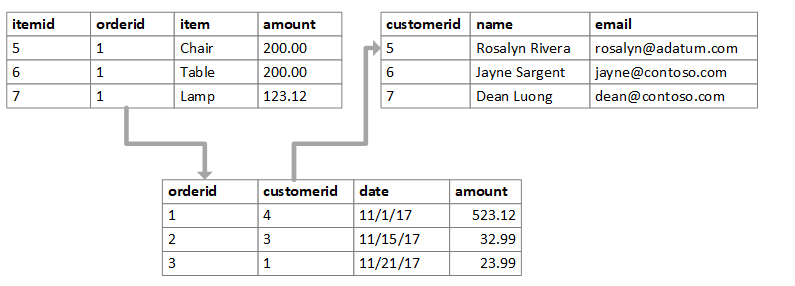
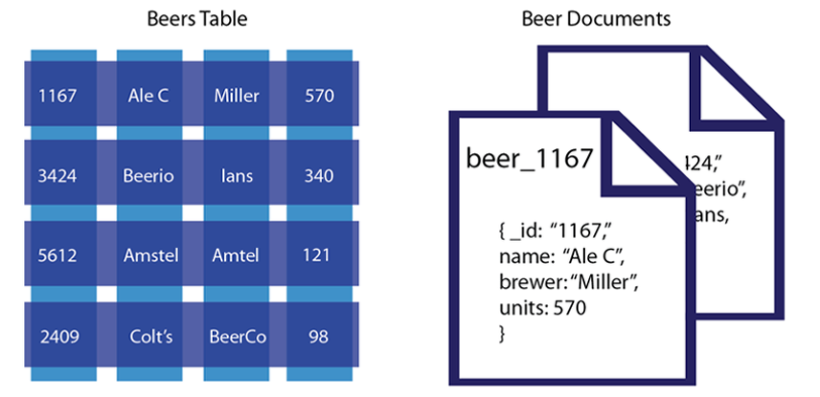

# RDBMS와 NoSQL 차이

:writing_hand: *Assembled by Yunju Jang*

##### 참고 ✔

- <b>데이터베이스</b>

  - 여러 사람들이 공유하고 사용할 목적으로 통합 관리되는 데이터들의 모임이다.

   

- <b>데이터베이스 관리 시스템 (DBMS)</b>

  - Database Management System
  - 다수의 사용자들이 데이터베이스 내의 데이터를 접근할 수 있도록 해주는 소프트웨어
  - 관계형<b>(RDBMS)</b>과 비관계형<b>(NoSQL)</b>으로 나뉜다.

 

 

### RDBMS

- <b>RDBMS란?</b>

  

  - 관계형 데이터베이스 (RDB) 를 생성하고 수정, 삭제 관리할 수 있는 소프트웨어이다.
    - RDB (Realational Database)란 관계형 데이터 모델에 기초를 둔 데이터베이스이다.
    - 관계형 데이터 모델이란, 데이터를 구성하는데 필요한 방법 중 하나로 모든 데이터를 2차원의 테이블 형태로 표현해준다.
  - SQL을 이용하여 RDBMS에서 데이터를 검색, 저장, 수정, 삭제한다.
    - SQL (Structed Query Language)는 데이터베이스에서 사용하는 쿼리 언어이다.

   

   

- <b>RDBMS의 특징</b>

  - 데이터를 column과 row 형태로 저장한다.
  - 데이터의 분류, 정렬, 탐색 속도가 비교적 빠르다.
  - SQL이라는 정교한 검색 query를 통해 데이터를 다룬다.
  - Transaction 을 제공한다. (작업의 완전성을 보장)
  - 반드시 Schema 규격에 맞춰야 한다. (유연한 데이터 저장 X)
  - 부하의 분산이 어렵다.
  - ex) MySQL, SQLite 등

   

  ✨<b>Schema 란? </b>

  - 데이터베이스에서 자료의 구조, 자료의 표현 방법, 자료간의 관계를 형식 언어로 정의한 구조
  - 데이터베이스 관리 시스템이 주어진 설정에 따라 데이터베이스 스키마를 생성하며,
  - 데이터베이스 사용자가 자료를 CRUD 할 때, DBMS 는 자신이 생성한 데이터베이스 스키마를 참조하여 명령을 수행한다.

 

- <b>RDBMS의 장점</b>
- 스키마가 정해져 있어, 명확한 데이터 구조를 보장한다. (데이터의 무결성 보장)
  - 하나의 테이블에서 중복없이 하나의 데이터만을 관리하기 때문에 부정확한 데이터를 다룰 위험이 없음
  - 데이터의 중복을 피해 데이터 공간을 절약할 수 있다.

 

- <b>RDBMS의 단점</b>
  - Oracle 같은 유료 시스템을 사용하게될 경우 비용적으로 부담이 된다.
  - 시스템 복잡도를 고려하여 구조화해야한다.
  - 복잡한 시스템일 수록 Query 문이 복잡해지고 성능이 떨어진다.
  - 수평확장이 어려워 대부분 수직 확장을 한다.

 

 

### NoSQL

- <b>NoSQL 이란?</b>

  

  - NoSQL (Not Only SQL<small> 또는 Non relational Database</small>) 은 관계형 데이터베이스와 반대되는 방식을 사용하여 데이터 간의 관계를 정의하지 않는다.
  - RDBMS에서는 스키마에 맞추어 데이터를 관리하여야 하지만 NoSQL은 스키마가 없어 좀 더 자유롭게 데이터를 관리할 수 있다.
  - NoSQL에서 테이블과 같은 개념으로 컬렉션이라는 형태로 데이터를 관리한다.

   

   

- <b>NoSQL의 특징</b>

  - 데이터 간의 관계를 정의하지 않는다. (테이블 간의 조인도 불가능하다.)
  - RDBMS의 복잡도와 용량 한계를 극복하기 위한 목적으로 등장한 만큼 RDBMS에 비해 훨씬 더 대용량의 데이터를 저장할 수 있다.
  - 분산형 구조로 데이터를 여러 대의 서버에 분산해 저장한다.
  - 고정되지 않은 테이블 스키마가 없어 다루기 쉽다.
    - 다른 구조의 데이터를 같은 컬렉션에 추가할 수 있음
  - key에 대한 put/get만 지원한다.
  - Schema가 없기 때문에 데이터에 대한 규격화된 결과 값을 얻기 힘들다.
  - 분산 처리 목적으로 나왔기 떄문에 프레임워크에서 분산 처리 기능을 포함하고 있다.
  - ex) MongoDB (문서형 데이터베이스) , Cassand, Redis 등

   

   

- <b>NoSQL의 장점</b>

  - 정해진 스키마에 따라 저장해야하는 RDBMS 보다 자유롭게 데이터를 추가할 수 있다.
  - 따라서 복잡한 테이블간의 관계를 형성하는 형태의 구조를 신경쓰지 않아도 된다.
  - 수평적 확장이 비교적 쉽다.

   

- <b>NoSQL의 단점</b>

  - 자유롭게 데이터 추가가 가능하기 때문에 컬렉션에 중복된 데이터가 저장될 수 있다.
  - 데이터 업데이트 시 중복되어 저장된 데이터를 똑같이 업데이트 해주어야 한다.

 

 

## 예상질문❔

Q1) RDBMS란 무엇인가?

A1) 정해진 데이터 스키마를 따라 구조화된 데이터베이스를 관리하는 소프트웨어로, 각 데이터는 관계를 통해 연결된 여러개의 테이블에 분산된다.

 

Q2) NoSQL이란 무엇인가?

A2) 스키마, 관계 없이 다른 구조의 데이터를 같은 컬렉션에 추가하여 데이터를 관리한다.

 

 

### Reference📖

- https://velog.io/@wlsgh46/RDBMS-NOSQl-%EC%B0%A8%EC%9D%B4
- https://kimsangyeon.github.io/sql/nosql/database/2019/08/16/rdbms-nosql.html
- https://m.blog.naver.com/jaeyoon_95/222057565334
- https://toma0912.tistory.com/83
- https://siyoon210.tistory.com/130
