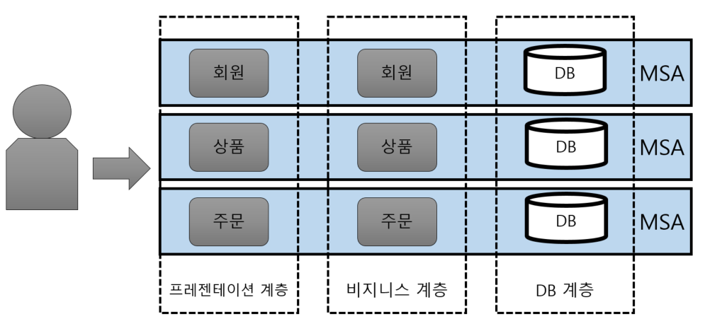

# MSA (Micro Service Architecture)

:writing_hand: *Assembled by Yunju Jang*

✔ 참고)

- <b>모놀리틱 아키텍쳐 스타일</b>

  - MSA 도입 전, 전통적인 방식의 개발 방식으로 한 덩어리의 구조라고 할 수 있다.
  - 전체 애플리케이션이 하나로 되어 있어 개발 및 환경설정이 간단하다.
  - 각 컴포넌트들이 함수로 호출되기 때문에 성능 제약이 덜하고, 운영 및 관리가 용이하다.
    - 서비스 간 호출이 하나의 프로세스 내에 이루어지기 때문에 속도가 빠르다.
  - 소규모 시스템 개발에는 유용하나, 대규모 시스템에는 불리하다.
    - 작은 수정에도 시스템 전체를 빌드해야 하기 때문에 빌드/테스트 시간이 길어진다.
    - 선택적 확장이 불가능하다.
    - 하나의 서비스가 모든 서비스에 영향을 준다.

   

   

## MSA

- <b>MSA란?</b>
  - 마이크로 서비스 아키텍처
  - 단일 프로그램을 각 컴포넌트 별로 나누어 작은 서비스의 조합으로 구축하는 방법이다.

 

 

- <b>MSA 사용 시 장점</b>

  

  - 각 컴포넌트는 서비스 형태로 구현되고, API를 이용하여 타 서비스와 통신하게 된다.
  - 각 서비스는 독립된 서버로, 타 컴포넌트와 의존성이 없기 때문에 독립된 배포를 하게 된다.
  - 각 컴포넌트가 독립된 서비스로 개발되어있기 때문에 부분적 확장이 가능하다.

 

 

- <b>MSA 사용 시 단점</b>
  - MSA의 경우 서비스간 호출을 API 통신을 이용하기 때문에 속도가 느리다.
  - 통신에 사용하기 위해 값을 데이터 모델로 변환시켜주는 오버헤드가 발생하기도 한다.

 

 

- <b>특징</b>

  - 데이터 분리

    - 데이터 저장 시 하나의 DB에 중앙 집중화를 하지 않고, 서비스 별 별도의 데이터 베이스를 이용한다.
    - DB의 종류를 별도로 가져갈 수 있고, 같은 DB를 사용하더라도 나누어서 사용하게 된다.
    - 데이터가 분산되어 있어 다른 컴포넌트에 대한 의존성 없이 독립적인 개발 및 배포/운영이 가능하다.
      - 그러나 다른 컴포넌트의 데이터를 API 통신을 통해 가져와야 하기 때문에 성능상의 문제가 발생할 수 있고, 트렌잭션으로 묶을 수 없는 문제가 발생하기도 한다.

     

  - API Gateway

    - MSA의 문제점 중 하나인, 각 서비스가 다른 서버에 분리 배포되어 있어 서버 URL이 다르다는 점을 보완한다.
      - API Gateway는 API 서버 앞 단에서 모든 API 서버들의 End-Point를 단일화하여 묶어주는 역할을 한다.
    - 거미줄처럼 복잡한 서비스간의 API 호출 구조를 단순화 시킨다.
    - 그 외에 라우팅, 로드밸런싱, 인증 역할 등등 여러 역할을 수행한다.

     

  - 팀의 변화

    - 기존의 팀 모델은 역할별로 나누어진 모델로 팀을 구분
      - 이러한 팀 모델은 인력 관리, 운영에 유연성을 부여하지만
      - 팀 간의 커뮤니케이션이 원활하지 않고, 협업에 걸리는 시간이 지연되는 경우가 많다.
    - MSA에서는 서비스 별로 팀을 나누고, 기획부터 설계 개발 운영이 팀 내에서 이루어진다.
      - 다른 팀에 대한 의존이 없어 역할별 요청과 피드백이 빠르고, 유연하고 지속적인 운영과 개발이 가능하다.

 

 

 

## 예상질문❔

Q1) MSA란 무엇인가?

A1) 복잡한 웹 시스템에 맞추어 개발된 API 기반의 서비스 지향적 아키텍처 스타일로, 서비스 단위로 독립적 개발, 운영, 배포가 가능하다.

 

 

### Reference📖

- http://clipsoft.co.kr/wp/blog/%EB%A7%88%EC%9D%B4%ED%81%AC%EB%A1%9C%EC%84%9C%EB%B9%84%EC%8A%A4-%EC%95%84%ED%82%A4%ED%85%8D%EC%B2%98msa-%EA%B0%9C%EB%85%90/
