# Git 브랜치 전략 (GitHub flow, Git flow)

:writing_hand: *Assembled by Yunju Jang*

🤝*Contributors :  JiYoung-Kwon* 

- <b>대표적인 브랜칭 (branching) 전략</b>
  - Git-flow
  - GitHub-flow

 

- <b>Git vs GitHub</b>
  - Git
    - 분산 소스 버전 관리 시스템
    - 서버를 분산시켜 구축할 수 있게 하는 소프트웨어
    - 소스 코드를 효율적으로 관리할 수 있게 해주는 형상 관리 도구
  - GitHub
    - Git을 사용하는 프로젝트를 지원하는 웹호스팅 서비스
    - Git을 업로드 할 수 있는 웹사이트
    - 개발자들의 버전 제어 및 공동 작업을 위한 플랫폼

 

 

### Git-flow

- <b>Git-flow</b>

  - 가장 최초로 제안된, 가장 유명한 Git 워크플로우
  - Vincent Driessen 이 말한 branching model을 구현한 Git 확장 모듈
  - 브랜치 전략에 있어서 다른 워크플로우보다 엄격하다.
    - 대규모의 프로젝트를 관리하는데 적합한 것으로 평가 받고 있다.

   

- <b>기본 브랜치 구분</b>

  - <code>feature > develop > release > hotfix > master</code>
    - 항상 유지되는 메인 브랜치들 (master, develop)
    - 일정 기간 동안만 유지되는 보조 브랜치들 (feature, release, hotfix)
      - 이 브랜치들은 머지되면 삭제된다.
  - master : 제품으로 출시될 수 있는 브랜치
  - develop : 다음 출시 버전을 개발하는 브랜치
  - feature : 기능을 개발하는 브랜치
  - release : 이번 출시 버전을 준비하는 브랜치
  - hotfix : 출시 버전에서 발생한 버그를 수정하는 브랜치 

   

   

- <b>기본 플로우</b>

  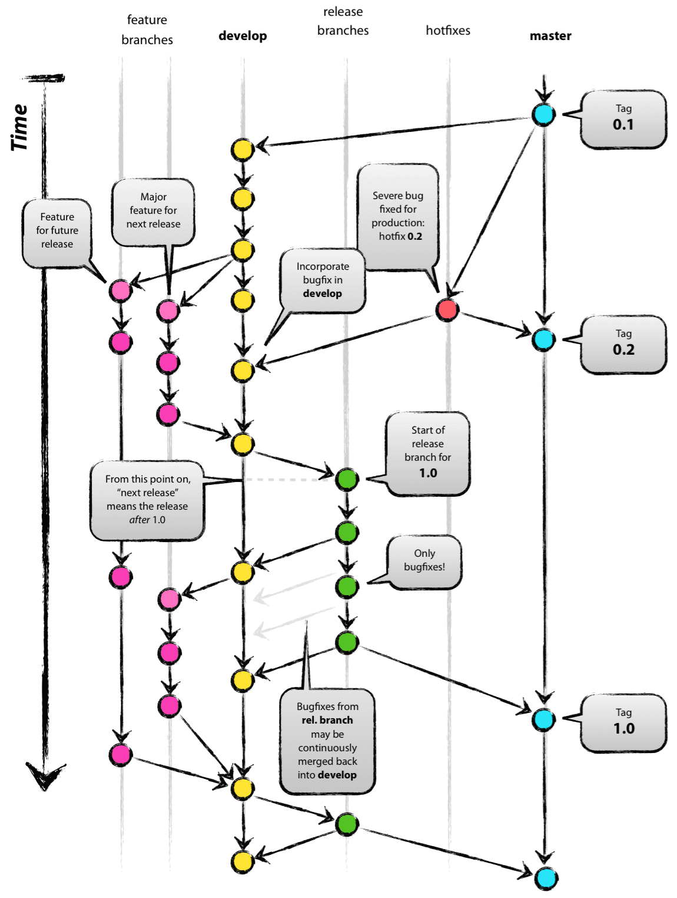

  1. master와 develop 브랜치가 존재한다. (develop 브랜치는 master에서부터 시작된 브랜치)
  2. develop 브랜치에서는 상시로 버그를 수정한 커밋들이 추가된다.
  3. 새로운 기능 추가 작업이 있는 경우
     - develop 브랜치에서 feature 브랜치를 생성한다. (feature 브랜치는 언제나 develop 브랜치에서부터 시작된다.)
  4. 기능 추가 작업이 완료되었다면
     - feature 브랜치는 develop 브랜치로 merge 된다.
  5. develop에 이번 버전에 포함되는 모든 기능이 merge 되었다면
     - QA를 하기 위해 develop 브랜치에서부터 release 브랜치를 생성한다.
  6. QA를 진행하면서 발생한 버그들은 release 브랜치에서 수정한다.
  7. AQ를 무사히 통과했다면
     - release 브랜치를 master와 develop 브랜치로 merge한다.
  8. 마지막으로 출시된 master 브랜치에서 버전 태그를 추가한다.

 

 

- <b>메인 브랜치</b>

  - master 브랜치와 develop 브랜치를 병행으로 유지

    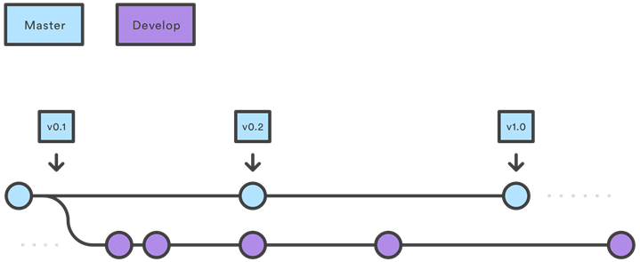

  - <b>master</b>

    - 배포 가능한 상태만을 관리하는 브랜치

  - <b>develop</b>

    - 다음에 배포할 것을 개발하는 브랜치
    - develop 브랜치는 통합 브랜치의 역할을 하며, 평소에는 이 브랜치를 기반으로 개발을 진행한다.

 

 

- <b>보조 브랜치</b>

  - <b>feature</b>

    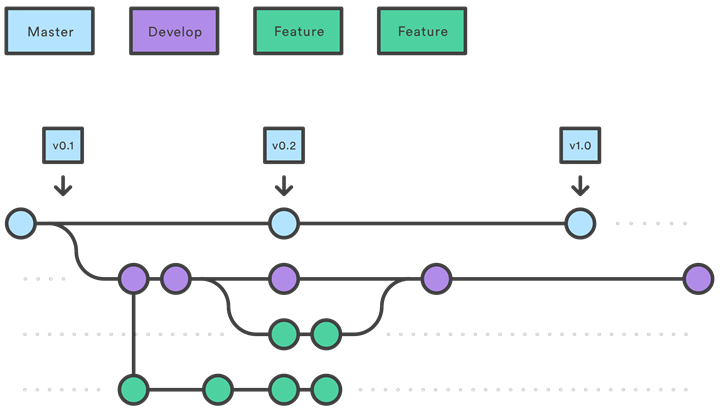

    > - 갈라져 나온 브랜치 : develop
    > - 다시 merge할 브랜치 : develop
    > - 브랜치 이름 규칙 : master, develop, release-\*, hotfix-\*를 제외한 것

    - 기능을 개발하는 브랜치로, develop 브랜치로 부터 분기된다.
    - 기능을 다 완성할 때까지 유지하고, 다 완성되면 develop 브랜치로 merge된다.

     

    - develop 브랜치, feature 브랜치
      - 기존에 잘 작동하는 개발 코들(develop 브랜치)와 새로 변경될 개발 코드(feature 브랜치)를 분리하고 각각 보존하는 것
      - feature 브랜치는 Git-flow 전략에서 지칭하는 단위 개발 브랜치의 의미를 가진다.

   

   

  - <b>release</b>

    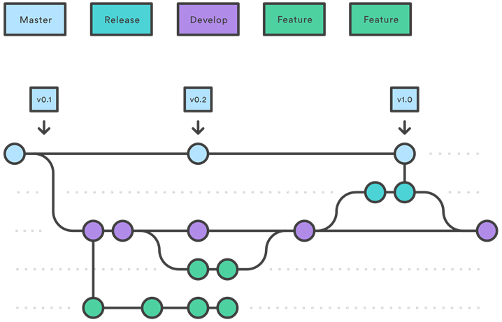

    > - 갈라져 나온 브랜치 : develop
    > - 다시 merge할 브랜치 : develop, master
    > - 브랜치 이름 규칙 : release-*

    - develop 브랜치에 이전 버전에 포함되는 기능이 merge 되었다면
      - QA를 위해 develop 브랜치에서부터 release 브랜치를 생성한다.
    - 배포를 위한 최종적인 버그 수정 등의 개발을 수행한다.
    - 배포 가능한 상태가 되면 master 브랜치로 병합시키고, 출시된 master 브랜치에 버전 태그를 추가한다.
    - release 브랜치에서 기능을 점검하며 발견한 버그 수정 사항은 develop 브랜치에도 적용해 주어야 한다.
      - 그러므로 배포 완료 후, develop 브랜치에 대해서도 merge 작업을 수행한다.

     

  - <b>hotfix</b>

    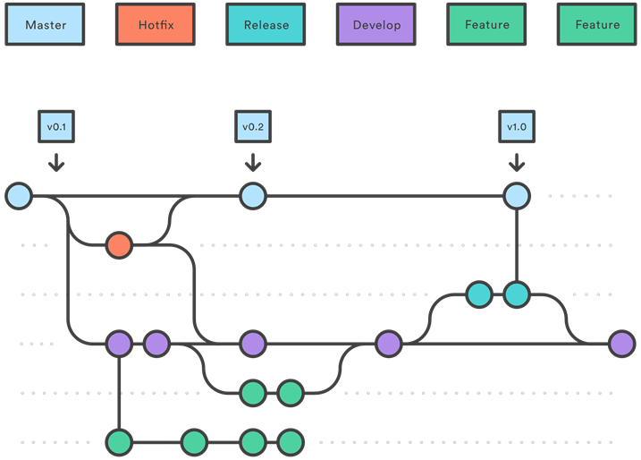

    > - 갈라져 나온 브랜치 : master
    > - 다시 merge할 브랜치 : develop, master
    > - 브랜치 이름 규칙 : hotfix-*

    - 배포한 버전에서 긴급하게 수정을 해야할 필요가 있을 경우, master 브랜치에서 분기하는 브랜치
    - 버그를 잡는 사람이 일하는 동안에도 다른 사람들은 develop 브랜치에서 하던 일을 계속할 수 있다.
    - 이 때 만든 hotfix 브랜치에서의 변경 사항은 develop 브랜치에서도 merge하여 문제가 되는 부분을 처리해 주어야 한다.

     

 

- <b>Git-flow의 장단점</b>

  - <b>장점</b>
    - 명령어가 명료하게 나와있다.
    - 거의 모든 에디터들과 IDE들에 플러그인으로서 이미 존재하고 있다.

   

  - <b>단점</b>
    - 브랜치가 많아 뻗어나가는 구조가 복잡하여 관리 등에 어려움이 있다.
    - 몇몇 branch는 쓰이지 않을 경우가 있다. 그리고 애매한 포지션의 브랜치가 존재한다.

 

 

 

### GitHub-flow

- <b>GitHub-flow</b>

  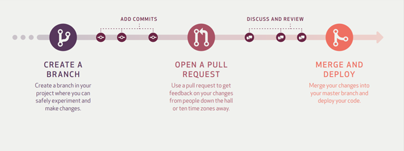

  - Git-flow 가 깃헙에서는 사용하기 복잡하다고 하여 나온 브랜칭 전략이다.
  - Git-flow에 비해 흐름이 단순해짐에 따라 그 규칙도 단순해진다.
  - master 브랜치에 대한 규칙만 정확하게 정립되어 있다면, 나머지 브랜치들에 대해서는 관여하지 않는다.
    - 즉, hotfix 브랜치나 feature 브랜치를 구분하지 않는다.
  - pull request 기능을 사용하도록 권장한다.

   

   

- <b>특징</b>

  - <b>자동화 개념이 들어가 있다</b>라는 큰 특징이 존재한다.
    - 만일 자동화가 적용되어 있지 않은 곳에서만 수동으로 진행하면 된다.
  - 수시로 배포가 일어나며, CI와 배포가 자동화 되어있는 프로젝트에 유용하다.
  - release 브랜치가 명확하지 않은 시스템에서 사용에 맞게 되어있다.
    - GitHub의 서비스 특성상 릴리즈라는 개념이 없는 서비스를 진행하고 있기 때문이다.
    - 웹 서비스들이 릴리즈라는 개념이 없어지고 있으니 사용하기 편할 것이다.
  - hotfix와 가장 작은 기능을 구분하지 않는다.
    - 어차피 둘 다 개발자가 수정해야 하는 일 중에 하나이다.
    - 단지 우선순위가 어디가 높냐의 차이

 

- <b>사용법</b>

  - <b>master 브랜치는 어떤 때든 배포가 가능하다.</b>

    - mater 브랜치는 항상 최신 상태이며, stable한 상태로 product에 배포되는 브랜치
    - 엄격한 규칙을 지정하여 사용한다.
    - merge 전에 충분한 테스트를 거쳐야한다.

    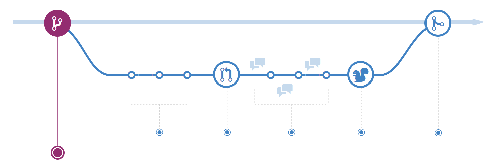

     

  - <b>master에서 새로운 일을 시작하기 위해 브랜치를 만든다면 이름을 명확히 작성한다.</b>

    - 브랜치는 항상 마스터 브랜치에서 만든다.
    - Git-flow와 다르게 feature 브랜치나 develop 브랜치가 존재하지 않는다.
    - 새로운 기능을 추가하거나, 버그를 해결하기 위한 브랜치 이름은 자세하게 어떤 일을 하고 있는지에 대해서 작성해주도록 한다.
    - 커밋 메시지를 명확하게 작성한다.

    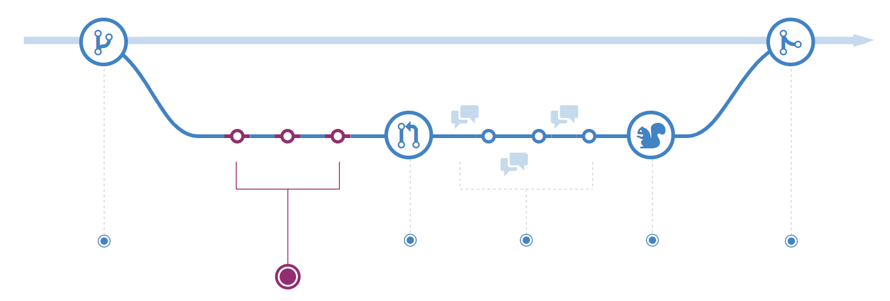

     

  - <b>원격지 브랜치로 수시로 push 한다.</b>

    - Git-flow와 상반되는 방식으로,
    - 항상 원격지에 자신이 하고 있는 일들을 올려 다른 사람들도 확인할 수 있도록 해준다.
    - 하드웨어에 문제가 발생해 작업하던 부분이 없어지더라도, 원격지에 있는 소스를 받아서 작업할 수 있도록 해준다.

     

  - <b>피드백이나 도움이 필요할 때, merge 준비가 완료되었을 때는 pull request를 생성한다.</b>

    - pull request 는 코드 리뷰를 도와주는 시스템이다.
    - ㅈ신의 코드를 공유하고 리뷰를 받는다.
    - merge 준비가 완료되었다면 master 브랜치로 반영을 요구한다.

    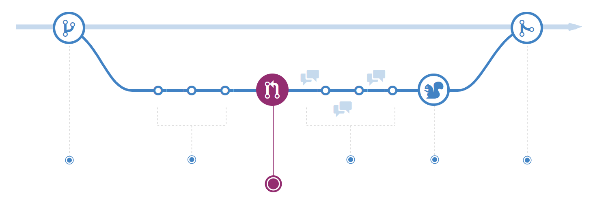

     

  - <b>기능에 대한 리뷰와 논의가 끝난 후 master로 merge한다.</b>

    - 곧장 product로 반영될 기능이므로, 이해 관계가 연결된 사람들과 충분한 논의 후 반영한다.

    - CI도 통과해야 한다.

      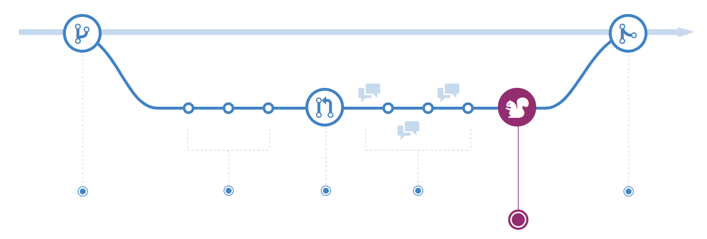

     

  - <b>master로 merge 되고 push 되었을 때 즉시 배포되어야 한다.

    - Github-flow의 핵심
    - master로 merge 가 일어나면 자동으로 배포가 되도록 설정해놓는다.

    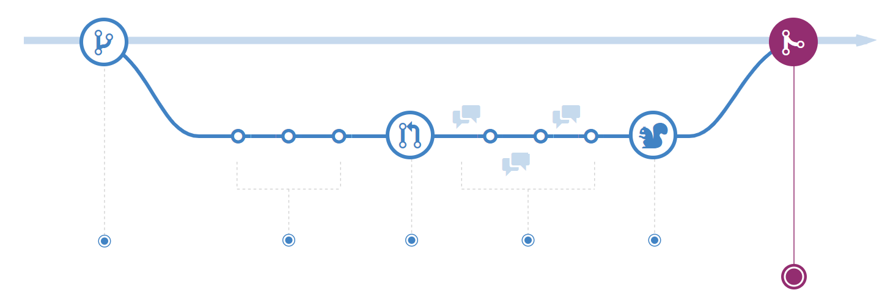

   

   

- <b>장단점</b>

  - 장점
    - 브랜치 구성 전략이 단순하다.
    - 처음 git을 접하는 사람에게 좋은 시스템이 될 수 있다.
    - 깃허브 사이트에서 제공하는 기능을 모두 사용할 수 있다.
    - 코드 리뷰를 자연스럽게 사용할 수 있다.
    - CI가 필수적이며, 배포는 자동으로 진행할 수 있다.
    - Github가 작업을 할 때 이렇게 작업하고 있다.

   

  - 단점
    - CI와 배포 자동화가 되어있지 않은 시스템에서는 사람이 직접 관련된 업무를 진행해야 한다.
    - 프로젝트 규모가 커짐에 따라 점점 관리에 어려움이 발생할 수 있다.

 

 

## 예상질문❔

Q1) Git과 GitHub는 무엇인가?

A1) git이란 형상 관리 도구 중 하나로, 소스 코드를 효과적으로 관리할 수 있게 해주는 소프트웨어이다. github란 분산 버전 컨트롤 소프트웨어 깃을 기반으로 소스 코드를 호스팅하고, 협업 지원 기능들을 지원하는 웹 서비스이다. 현재 가장 인기있는 소스코드 호스팅 서비스이자 소프트웨어 개발 플랫폼이다.

 

Q2) 형상관리는 무엇이고 버전관리와의 차이는 무엇인가?

A2) 소스 코드의 변경 사항을 버전으로 관리하는 것을 버전관리라고 한다. 형상관리는 버전 관리에 변경 이력을 추적하는 기능을 더한 것이다.

 

 

### Reference📖

- https://github.com/fake-developers/1st/blob/main/KJY/%5BGIT%5D%20Git%20%EB%B8%8C%EB%9E%9C%EC%B9%98%20%EC%A0%84%EB%9E%B5%20(Github%20flow%2C%20Git%20flow).md
- https://www.44bits.io/ko/keyword/github
- https://raisonde.tistory.com/entry/%EB%B3%80%EA%B2%BD%EA%B4%80%EB%A6%AC-%EB%B2%84%EC%A0%84%EA%B4%80%EB%A6%AC-%ED%98%95%EC%83%81%EA%B4%80%EB%A6%AC%EC%9D%98-%EC%B0%A8%EC%9D%B4
