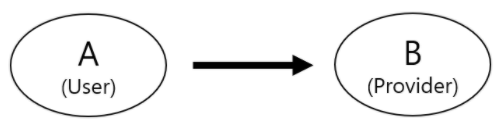
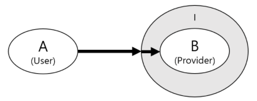
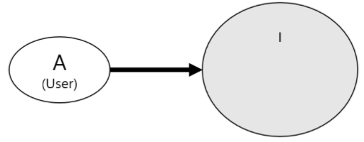
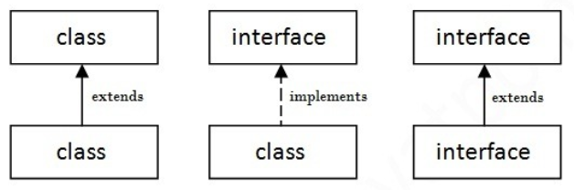

# 추상클래스 <small>(Abstract)</small> 와 인터페이스 <small>(Interface)</small>

:writing_hand: *Assembled by Yunju Jang*

🤝*Contributors : Jeonghea Shin*

<hr>


- <b>추상클래스와 인터페이스</b>
  - 추상클래스와 인터페이스는 상속 받는 클래스, 혹은 구현하는 인터페이스 안에 있는 추상 메소드를 구현하도록 강제한다.

<br/>

### 추상 클래스 (Abstract)

- <b>추상클래스란?</b>

  - 미완성된 클래스

  - 클래스 구현부 내부에 <b>추상 메소드</b>가 <b>하나 이상</b>포함되거나, abstract로 정의된 클래스

    - 일반 메소드도 구현 가능하다.

    > 추상 메소드란?
    >
    > - 메소드의 선언부만 작성하고 구현부는 미완성인 채로 남겨져 있는 메소드이다.
    > - 미완성으로 남겨놓은 이유는 상속받는 클래스에 따라 메소드의 내용이 달라질 수 있기 때문이다.

  - 클래스의 프레임만 구성되어 있다.

  - 직접 객체 생성이 불가능하다.

    - 즉, 인스턴스를 생성할 수 없다.

  - 추상 클래스에서 정의된 <b>추상적인 기능은 하위 클래스에서</b> 상세하게 구현한다.

  <br/>

  <br/>

- <b>추상클래스의 목적</b>

  - 동일한 부모를 가지는 클래스를 묶는 개념으로, <mark>상속</mark>을 받아서 기능을 이용하고 <mark>확장</mark>시키는 것이다.
  - 새로운 클래스를 작성하는데 있어, 그 바탕이 되는 <mark>부모 클래스</mark>로서 중요한 의미를 갖는다.

  <br/>

- <b>추상클래스 상속</b>

  - 단일 상속만 가능하다.

  - 예시

    ``` Java
    // Animal 추상 클래스
    public abstract class Animal{
        public abstract void sound();
    }
    ```

    ``` Java
    // Animal 추상 클래스를 상속 받는 Dog, Cat 클래스
    public class Dog extends Animal{
        public void sound(){
            System.out.println("멍멍");
        }
    }
    
    public class Cat extends Animal{
        public void sound(){
            System.out.println("야옹야옹");
        }
    }
    ```

    

    ``` Java
    // 메인 메소드에서 실행
    public class Main{
        public static void main(String[] args){
            // 인스턴스화
            Dog dog = new Dog();
            Cat cat = new Cat();
            
            dog.sound();
            cat.sound();
        }
    }
    ```

  - 추상클래스를 상속 받는 클래스는 추상클래스에서 선언했던 <mark>추상 메서드를 반드시 구현</mark>해야 한다. 

<br/>

<br/>

<br/>

### 인터페이스 (Interface)

- <b>인터페이스란?</b>
  - 밑 그림만 있는 기본 설계도, 뼈대
    - 추상 클래스 보다 한 단계 더 추상화 되었다고 볼 수 있다.
    - 안의 <b>모든 메소드가 추상 메소드</b>로 구현되어 있다. (추상 클래스와의 차이)
    - 자바8에서는 default 키워드를 이용하여 일반 메소드의 구현도 가능은 하다.
    - 추상클래스와 마찬가지로 <b>직접 객체 생성이 불가능</b>하다.
    - 미리 정해진 규칙에 맞게 구현하도록 표준을 제시하는데 사용한다.
    - 인터페이스끼리 <mark>다중 상속이 가능하다.</mark>

<br/>

<br/>

- <b>인터페이스의 목적</b>
  - 함수의 구현을 강제화하여, <b>구현 객체가 같은 동작을 한다는 것을 보장</b>하는 것이다.

<br/>

- <b>인터페이스 제약 사항</b>
  - 모든 멤버 변수는 <code>public static final</code>이어야 한다. 단, 이는 생략이 가능하다.
  - 모든 메서드는 <code>public abstract</code>여야 한다. 단, 이는 생략이 가능하다.
    - static 메서드와 default 메서드는 제외 (java 8 이후)

<br/>

<br/>

- <b>인터페이스 상속</b>

  - 다중 상속 가능

  - 예시

    ``` java
    interface Changeable {
        // 채널을 바꾸는 기능의 메서드
        void change(Channel c);
    }
    
    interface Powerable {
        // 전원을 껐다 켰다 하는 메서드
        void power(boolean b);
    }
    
    interface Controlable extends Changealbe, Powerable{} // 다중 상속
    ```

    - 부모 인터페이스 (Changeable, Powerable)을 모두 상속받는 자식 인터페이스 (Controlable)
    - Controlable 안에 정의된 멤버는 하나도 없지만, 부모로 부터 상속받은 추상 메서드 change, power를 멤버로 갖게 된다.

    <br/>

    ``` java
    class Control implements Controlable{
       	// 인터페이스에 정의된 추성메소드를 구현한다.
        public void change(Channel c) { /*내용 생략*/}
        public void power(boolean b) { /*내용 생략*/}
    }
    ```

    - Controlable 인터페이스를 구현하는 Control 클래스
    - 만일 구현하는 인터페이스 메소드 중 일부만 구현한다면 abstract를 붙여 추상클래스로 선언해야 한다.

    <br/>

    ``` java
    class Control extends Channel implements Controlable{
        public void change(Channel c) { /*내용 생략*/}
        public void power(boolean b) { /*내용 생략*/}
    }
    ```

    - <b>상속과 구현을 동시에</b> 할 수도 있다.

<br/>

<br/>

- <b>인터페이스의 장점</b>

  - 개발 시간을 단축시킬 수 있다.

    - 인터페이스는 공통이므로 이를 토대로 동시 개발이 가능하다.
    - 즉, 메소드가 미리 정의되어 있기 때문에 백단이 개발되기 전이어도, 프론트를 개발할 수 있다.
    - 수정 범위가 적다.
    - 확장성이 좋다.

    <br/>

  - 표준화가 가능하다.

    - 프로젝트에 사용되는 기본 틀을 인터페이스로 작성한 후 개발되도록 한다.
    - 일관되고 정형화된 프로그램을 개발할 수 있다.

    <br/>

  - 서로 관계 없는 클래스 간 관계를 맺어줄 수 있다.

    - 하나의 인터페이스를 공통적으로 구현함으로써 관계를 매핑한다.

    <br/>

  - 독립적인 프로그래밍이 가능하다.

    - 클래스의 선언과 구현을 분리시킬 수 있다.

    - 클래스와 클래스 간의 직접적인 관계를 인터페이스를 이용하여 간접적인 관계로 변경할 수 있다.

      - 한 클래스의 변경이 다른 클래스에 영향을 미치지 않는다.

    - 예시

      ``` java
      class A{ // 클래스 A 선언
          public void methodA(B b){ // 클래스 B 타입인 b를 매개변수로 받는 메소드
              b.methodB(); // 인스턴스 b의 methodB() 호출
          }
      }
      
      class B{ // 클래스 B 선언
          public void methodB() {
              System.out.println("methodB()");
          }
      }
      
      class test {
          public static void main(String[] args){
              A a = new A(); // A타입 인스턴스 생성 후 A 타입 변수 a에 저장
              a.methodA(new B()); // B타입 새로운 인스턴스 생성 후 이를 매개변수로 하여 methodA() 호출
          }
      }
      ```

      - Class A 는 Class B의 인스턴스를 생성하고, 메소드를 호출한다.

        

      - 이 두 클래스는 서로 직접적인 관계를 가지게 된다.

      - Class A를 작성하려면 Class B가 이미 작성되어 있어야 하고, Class B의 methodB()의 선언부가 변경되면 이를 사용하는 Class A도 변경되어야하는 단점이 있다.

      <br/>

      ``` java
      class A{
          public void methodA(I i){ // 매개변수를 인터페이스 타입 I로 줌
              i.methodB(); // 인터페이스 i의 메소드 methodB를 호출
          }
      }
      
      interface I{ // 인터페이스 I 선언
          public abstract void methodB(); 
      }
      
      class B implements I{
          // 인터페이서 I의 추상메소드 methodB() 구현
          public void methodB(){
              System.out.println("methodB9) in Bclass"); 
          }
      }
      
      class test {
          public static void main(String[] args){
              A a = new A(); // A타입 인스턴스 생성 후 A 타입 변수 a에 저장
              a.methodA(new B()); // B타입 새로운 인스턴스 생성 후 이를 매개변수로 하여 methodA() 호출
          }
      }
      ```

      - 인터페이스를 매개로 클래스 A가 B의 메소드에 접근하도록 한다.

        - 클래스 B가 변경되거나, 다른 클래스로 대체 되어도 A는 전혀 영향을 받지 않는다.

        

      - 클래스 A가 B를 직접 사용하지 않는다.

        - 인터페이스를 통해 연결된 간접적인 관계로 바뀌었다.

        

      - 인터페이스 I는 실제 구현 내용을 감싸고 있는 껍데기이며, 클래스 A는 이 안의 알맹이(클래스)를 몰라도 된다.

<br/>

<br/>

<br/>

#### 클래스와 인터페이스 사이의 관계



- <b>extends</b> : 같은 클래스, 인터페이스 끼리의 상속
- <b>implements</b> : 클래스가 인터페이스를 상속
- 인터페이스는 인터페이스로만 상속받을 수 있음

<br/>

<br/>

#### 추상클래스 vs 인터페이스

- <b>공통점</b>

  - 선언만 존재하고, 구현 내용은 존재하지 않는 클래스이다.
  - 인스턴스화를 할 수 없다.
    - 추상클래스를 상속 받은 자식들과 인터페이스로 구현한 자식들만 객체를 생성할 수 있다.

  <br/>

- <b>차이점</b>

  - 인터페이스는 클래스가 아니지만 추상 클래스는 클래스이다.
  - 인터페이스는 다중 상속이 가능하고, 추상클래스는 단일상속만 가능하다.
  - 추상클래스는 상속을 받아 기능을 확장할 수 있다.
    - 즉, 부모의 유전자를 물려 받는다. 
    - 인터페이스는 구현하는 모든 클래스에 대해 특정한 메소드가 반드시 존재하도록 강제하는 역할을 한다.
    - 유전자가 아니라 사교적으로 필요에 따라 결합하는 관계

<br/>

<br/>

## 예상질문❔

Q1) 추상클래스란 무엇인가?

A1) 하나 이상의 추상 메소드를 가진 클래스로, 이를 상속 받은 클래스에서 해당 메소드를 구현한다.

<br/>

Q2) 인터페이스란 무엇인가?

A2) 추상클래스와 달리, 모든 메소드를 추상메소드로 하여, 이를 상속받는 클래스들의 구조를 잡는 역할을 한다. 다중 상속이 가능하다.

<br/>

<br/>

### Reference📖

- https://github.com/fake-developers/1st/blob/main/SJH/Abstract&Interface.md
