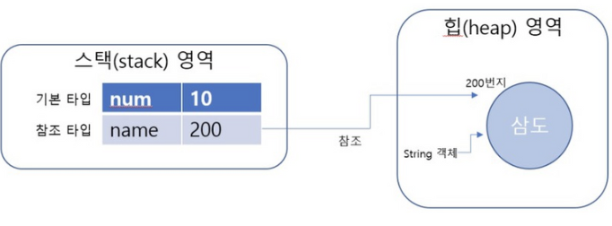

# Java - Call by value 와 Call by reference

:writing_hand: *Assembled by Yunju Jang*

🤝*Contributors : JeongHea Shin*

<hr>


#### 참고) 자바의 타입


- <b> 기본 타입</b>
  - 정수, 실수, 문자, 논리 리터럴을 저장하는 타입
  - 변수에 실제 값을 저장함
  - int, short, long, float, double, char, boolean

<br/>

- <b>참조 타입</b>
  - 객체의 번지를 참조하는 타입
  - 변수에 메모리의 번지를 저장함
  - Array, Class Instance, interface

<br/>

- 즉, 기본 타입과 참조 타입의 차이점은 변수에 무엇을 저장하느냐의 차이이다.

<br/>

<br/>

#### 메모리상에서의 변수



- 메모리상에서 변수는 스택 영역에서 생성되고, 객체는 힙 영역에서 생성된다.
- 기본 타입의 경우는 변수에 실제 값을 저장해 스택에서만 존재하지만
  - 참조 타입의 경우, 힙 영역에 생성되고, 변수에는 힙 영역에 있는 참조 타입의 주소가 저장된다.

<br/>

``` java
char a = 'a'; // 1

if(a == 'a') { //2
	int b = 10;
    char c = 'c';
}

boolean d = true; // 3
```

- 위 코드에서 추석처리한 구간 별로 스택을 살펴보면,

  1. 스택 영역에 a = 'a' 가 저장되어 있다.

  2. a = 'a', b = 10, c = 'c' 3개의 변수가 저장되어 있다.

  3. 2번 블록에 있는 b,c 변수는 사라지고 a, d 변수만 저장되어 있다.

- 추가로, 만약 배열과 같은 변수가 스택에 저장될 경우, 해당 변수에는 힙 영역에 저장되어 있는 배열의 주소를 참조한 값이 저장되어 있다.

<br/>

<br/>

#### 참조 변수의 비교 연산

- 참조 변수에 대해 ==, != 와 같은 비교 연산 수행

  ``` java
  int[] a = {1, 2, 3};
  int[] b = {1, 2, 3};
  
  a == b // false
  a != b // true
  ```

  - a == b 는 false, a != b 는 true인 이유
    - 배열은 참조 타입이기 때문에 실제 변수에 저장된 값은 배열 객체의 주소값으로, a와 b는 실제 다른 객체가 생성이 된 주소의 값들이 저장되기 때문이다.

  <br/>

  <br/>

- <b>String 타입</b>

  - String 타입은 참조 타입 중 주의해야할 타입이다.

  - 문자열 타입의 경우 문자열 리터럴 (값)이 동일하다면 String 객체가 공유된다.

    ``` java
    String a = "nathan";
    String b = "nathan";
    String c = new String("nathan");
    
    a == b // true
    a == c // fase
    a.equals(c) // true
    ```

    - a, b에 같은 값을 저장하고 비교 연산을 수행하면 기본 타입에 의한 결과가 나온다.
      - 하지만 new 연산자로 새로운 String 객체를 생성하여 저장하면 <b>참조 타입</b>에 의한 결과가 나온다.
    - 참조 타입에 대해 비교 연산을 수행할 때에는 equals 메소드를 통해 수행하는 것이 좋다.

<br/>

<br/>

## Call by value 와 Call by reference

#### Call by value 와 Call by reference 차이

- <b>Call by value란?</b>
  - 함수의 호출 방식 중 하나, 값에 의한 호출
    - 메소드 (함수) 에서 인자값을 받을 때 어떤식으로 받아 올 것인지에 대한 방식이다.
  - 함수가 호출될 때 메모리 공간 안에서는 <b>임시의 공간</b>이 생성된다.
    - 그리고 함수가 종료되면 해당 공간은 사라진다.
  - 함수 호출 시 전달되는 변수의 값을 복사하여 인자로 전달한다.
    - 복사된 인자는 함수 안에서 <b>지역적</b>으로 사용되는 변수이다.
    - ex) <code>int a = 3</code> 은 메소드에서 인자값을 받을 때 a라는 자체에 주소를 받는게 아니라 a의 값인 3을 받아 처리하는 방식이다.
  - Java의 경우 함수에 전달되는 인자의 데이터 타입에 따라 기본자료형 또는 참조자료형으로 함수 호출 방식이 나뉜다.

<br/>

- <b>Call by reference란?</b>
  - 참조에 의한 호출
  - 메소드 호출 시, 메모리 공간 안에서는 함수를 위한 <b>별도의 임시 공간</b>이 생성된다.
    - 역시 함수 종료 시 사라진다.
  - 함수 호출 시 인자로 전달되는 변수의 레퍼런스를 전달한다. (해당 변수를 가르킨다.)
  - 값이 아니라, 인자 그 자체에 주소값을 보낸다.
  - 함수 안에서 인자의 값이 변경되면, 함수 호출 시에 있던 변수들도 값이 바뀐다.

<br/>

<br/>

<br/>

#### Call by value 와 Call by reference 예시

- <b>call by value 예시</b>

  ``` java
  class CallByValue{
      public static int subtract(int x, int y){
          swap(x, y);
          return x - y;
      }
      
      public static void swap(int x, int y){
          int temp = x;
          x = y; 
          y = temp; // 복사된 값만 바뀌고 사라짐
      }
      
      public static void main(String[] args){
          int x = 10;
          int y = 20;
          System.out.printf("%d - %d = %d\n", x, y, subtract(x, y));
      }
  }
  
  // 결과 
  // 10 - 20 = -10;
  ```

  - 기본 int 타입의 값을 매개 변수로 받아 두 매개 변수의 값을 swap 한 후 출력하는 코드를 보면 결과는 swap 되기 전의 값으로 출력된다.
  - 즉, Call of Value는 값을 직접 전달 받기 때문에 실제 swap을 해 값을 변경했다 하더라도
    - <b>원본 데이터는 바뀌지 않고, 단순히 복사된 값을 바꾸는 것에 불과하기 때문이다.</b>

<br/>

<br/>

<br/>

- <b>call by reference 예시</b>

  ```  java
  // 참조형 타입의 Call By Reference
  class Number {
      int value;
      
      public Number(int value){
          this.value = value;
      }
  }
  
  public class CallByReference {
      private static int subtract(Number x, Number y){
          swap(x, y);
          return x.value - y.value;
      }
      
      private static void swap(Number x, Number y){
          int z = x.value;
          x.value = y.value;
          y.value = z;
      }
      
      public static void main(String[] args){
          int x = 10;
          int y = 20;
          Number numberX = new Number(x);
          Number numberY = new Number(y);
          int result = subtract(numberX, numberY);
          
          System.out.printf("%d - %d = %d", numberX.value, numberY.value, result);
      }
  }
  
  // 결과
  // 20 - 10 = 10
  ```

```
  
- 객체를 참조하는 주소를 매개변수로 넘겨줘 수행한 결과 값이 실제 swap이 이루어진 것을 볼 수 있다.
  
- call by reference의 경우 객체의 참조 값을 직접 바꾼 것이 아니라 객체의 참조를 통해서 해당 객체의 멤버 변수에 접근하여 값을 바꿔 연산이 수행됨을 알 수 있다.
  
  - 그러나 참조형을 함수의 매개변수로 전달해 바꿔보면 call by value 형식으로 작동된다.
  
    ``` java
    // 참조형 타입의 Call By Value
    class Node {
        int value;
     
        public Node(int value) {
            this.value = value;
        }
    }
     
    public class ReferenceTypeCallByValue {
     
        private static void swap(Node node1, Node node2) {
            Node temp = node1;
            node1 = node2;
            node2 = temp;
        }
     
        public static void main(String[] args) {
            Node node1 = new Node(1);
            Node node2 = new Node(2);
            System.out.println("====Before===");
            System.out.printf("node1 value : %d\n", node1.value);
            System.out.printf("node2 value : %d\n", node2.value);
            swap(node1, node2);
            System.out.println("====After===");
            System.out.printf("node1 value : %d\n", node1.value);
            System.out.printf("node2 value : %d\n", node2.value);
        }
    }
    
    // 결과
    /*
    ====Before===
    node1 value : 1
    node2 value : 2
    ====After===
    node1 value : 1
    node2 value : 2
  */
```

    - 이렇게 매개변수로 전달된 node1, node2의 필드 값이 각각 2, 1로 바뀌지 않고 그대로 1, 2로 출력이 되었다.
    - 메서드를 호출할 때 새로운 reference를 만들어 복사해 호출했기 때문이다. 원본 데이터는 바뀌지 않고, 복사된 값을 바꾸는 것에 불과하다.
    - 이렇듯 자바의 참조형은 Call By Reference가 아니며, 기본 Call By Value 형식으로 동작함을 알 수 있다.

<br/>

<br/>

#### Call by value 와 Call by reference 를 통한 중요한 자바의 특징


- 자바는 객체 (참조 타입) 을 메서드로 넘길 때 참조하는 지역 변수의 실제 주소를 넘기는 것이 아니라,
  - <b>해당 지역변수가 가리키고 있는 힙 영역의 객체를 가리키는, 새로운 지역변수를 생성하여</b> 그것을 통해 <b>같은 객체를 가리키도록 하는 방식</b>임을 알 수 있다.
  - 또한, 새로운 지역변수를 생성해 이루어지기 때문에 <b>기본 타입을 매개변수로 받아 값을 바꾼 경우와, 참조타입을 매개변수로 받아 값을 변경한 경우 모두 스택에서 변경이 이루어지기 때문에 아무런 의미가 없다.</b>
- 결국, 기본적으로 자바에서의 메소드 호출은 참조, 기본형 모두 Call By Value를 따르고 있음을 알 수 있다.
  - 객체의 경우, 객체를 가리키는 주소 값을 넘겨 새로운 지역변수를 통해 Call By Value로 객체를 참조해 모든 메소드와 필드를 호출해 실행이 된다.

<br/>

<br/>

<br/>

## 예상질문❔

Q1) Call By Value와 Call By Reference란 무엇인가?

A1) 메서드에서 인자값을 받아오는 방식으로, Call By Value를 인자의 메모리에 저장되어 있는 데이터를 복사한 값을 받아온다. Call By Reference는 주소에 의한 호출로, 인자의 메모리에 저장되어 있는 주소 값을 복사하여 받아온다. 즉, 값이 아닌 값의 주소를 통해 변수를 가리킨다.

<br/>

<br/>

### Reference📖

- https://sleepyeyes.tistory.com/11
- https://devlog-wjdrbs96.tistory.com/44
- https://nathanh.tistory.com/119
- https://siyoon210.tistory.com/104
- https://re-build.tistory.com/3

