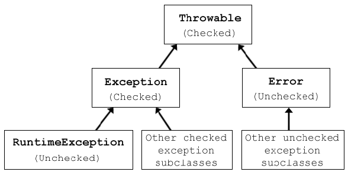
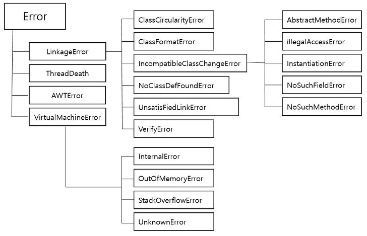
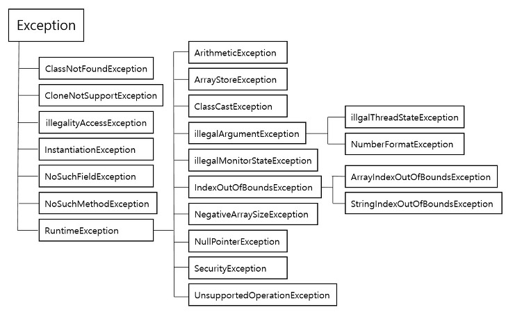

# Error & Exception

:writing_hand: *Assembled by Yunju Jang*

🤝*Contributors : JiYoung-Kwon, JiYe Bae*

<hr>


#### <small>+) 참고 - </small> 프로그램 에러(오류)

- <b> 프로그램 에러란?</b>

  - 프로그램이 실행 중 오작동을 하거나 비정상적으로 종료되는 경우, 이런 결과를 초래하는 원인에 해당한다.

  - 발생 시점에 따라 3가지로 구분

    - **컴파일 에러(compile-time error)** : 컴파일 시에 발생하는 에러
    - **런타임 에러(runtime error)** : 실행 시에 발생하는 에러
    - **논리적 에러(logical error)** : 실행은 되지만, 의도와 다르게 동작하는 것

  - 자바에서는 실행 시 (runtime) 발생할 수 있는 프로그램 오류를 다음과 같이 구분한다.

    - 에러 (Error)

      - 예외 (Exception)

      - Java의 예외처리 class
        

  <br/>

  <br/>

  <br/>

## Error (에러)


- <b>Error 란?</b>

  


  - 프로그램 코드에 의해 수습될 수 없는 심각한 오류이다.


    - 메모리 부족(OutOfMemoryError), 스택오버플로우(StackOverflowError) 등

      > 메모리 부족 (OutOfMemoryError)
      >
      > - JVM에 설정된 메모리의 한계를 벗어난 상황일 때 발생
      > - 힙사이즈가 부족하거나, 너무 많은 class를 로드할때, 가용 가능한 swap이 없을때, 큰 메모리의 native메소드가 호출될 때 등이 있음
      > - 이를 해결하기 위해 dump 파일분석, jvm 옵션 수정 등이 있음

  - 발생 시, 프로그램의 비정상적인 종료를 막을 수 없다.


    - 코드를 고치지 않고서는 해결이 불가능하다.
    - 런타임에서 실행 시 발생한다.
    - 예측 불가능한 Unchecked Error에 속한다.

<br/>

<br/>

<br/>

## Exception (예외)

- <b>Exception이란?</b>

  

  - 프로그램 코드에 의해 수습될 수 있는 다소 미약한 오류를 말한다.

    - Checked Exception
      - 실행하기 전에 예측이 가능하다.
      - 예외 처리가 필수이고, 처리하지 않으면 컴파일이 불가능하다.
      - 주로 외부의 영향으로 발생할 수 있는 것들이 해당된다.
        - 프로그램 사용자들의 동작에 의해 발생하는 경우가 많다.
      - RuntimeException 이외에 있는 모든 예외
        - IOException, FileNotFoundException 등

    <br/>

    - Unchecked Exception
      - 실행하고 난 후에 알 수 있다.
      - 컴파일될 때 체크되지 않는다.
      - 주로 프로그래머의 실수에 의해 발생될 수 있는 예외들이 속한다.
        - 자바의 프로그래밍 요소들과 관계가 깊다.
      - Runtime에 발생하는 Exception
        - ArrayIndexOutOfBoundException, NullPointerException 등

    <br/>

  - 발생하더라도 프로그래머가 이에 대한 적절한 코드를 미리 작성해 놓음으로써 프로그램의 비정상적인 종료를 막을 수 있다. 즉, 예외처리가 가능하다.

<br/>

<br/>

- <b>대표적인 클래스들</b>
  - NullPointerException : Null 레퍼런스를 참조할때 발생, 뭔가 동작시킬 때 발생한다.
  - (XXX)IndexOutOfBoundsException : 배열과 유사한 자료구조(문자열, 배열, 자료구조)에서 범위를 벗어난 인덱스 번호 사용으로 발생한다.
  - (XXX)FormatException : 문자열, 숫자, 날짜 변환 시 잘못된 데이터(ex. "123A" -> 123 으로 변환 시)로 발생, 보통 사용자의 입력, 외부 데이터 로딩, 결과 데이터의 변환 처리에서 자주 발생한다.
  - ArthmeticException : 정수를 0으로 나눌때 발생한다.
  - ClassCastException : 변환할 수 없는 타입으로 객체를 변환할 때 발생한다.
  - IllegalArgumentException : 잘못된 인자 전달 시 발생한다.
  - IOException : 입출력 동작 실패 또는 인터럽트 시 발생한다.
  - IllegalStateException : 객체의 상태가 매소드 호출에는 부적절한 경우 발생한다.
  - ConcurrentModificationException : 금지된 곳에서 객체를 동시에 수정하는것이 감지될 경우 발생한다.
  - UnsupportedOperationException : 객체가 메소드를 지원하지 않는 경우 발생한다.

<br/>

<br/>

- <b>주요 메서드들</b>
  - printStackTrace()
    - 발생한 Exception의 출처를 메모리상에서 추적하면서 결과를 알려준다.
    - 발생한 위치를 정확히 출력해줘서 제일 많이 사용한다.
    - void를 리턴한다.
  - getMessage()
    - 한줄로 요약된 메세지를 String으로 반환해준다.
  - getStackTrace()
    - jdk1.4 부터 지원
    - printStackTrace()를 보완
    - StackTraceElement[]이라는 문자열 배열로 변경해서 출력하고 저장

<br/>

<br/>

<br/>

## 예외처리 (Exception Handling)

- <b>예외처리란?</b>
  - 프로그램 실행 시 발생할 수 있는 예외에 대비한 코드를 작성하는 것을 말한다.
  - 프로그램의 비정상 종료를 막고, 정상적인 실행상태를 유지하기 위해 작성한다.
  - 발생한 예외를 처리하지 못하면, 프로그램은 비정상적으로 종료된다.
  - 처리되지 못한 예외 발생 시, JVM의 예외처리기(UncaughtExceptionHandler)가 받아 원인을 화면에 출력한다.
  - 자바의 예외처리에는 크게 3가지 방법이 존재한다.
    - try ~ catch, throws, throw

<br/>

<br/>

- <b>try-catch문</b>

  - try 블럭

    - 실제 코드가 들어가는 곳으로써 예외 Exception이 발생할 가능성이 있는 코드

  - catch 블럭

    - Try 블록에서 Exception이 발생하면 코드 실행 순서가 Catch 쪽으로 오게된다. 
      - 즉 예외에 대한 후 처리 코드

  - finally 블럭

    - Try 블록에서의 Exception과 발생 유무와 상관 없이 무조건 수행되는 코드로 생략이 가능하다.

  - 흐름

    - try 블럭 내에서 예외가 발생한 경우

      - 발생한 예외와 일치하는 catch 블럭이 있는 지 확인

        - 일치하는 catch블럭을 찾은 경우

          - catch블럭 내의 문장들을 수행
          - 전체 try-catch문을 빠져나가 그 다음 문장을 계속해서 수행

        - 일치하는 catch블럭을 찾지 못한 경우

          - 예외는 처리되지 못함

          <br/>

    - try 블럭 내에서 예외가 발생하지 않은 경우

      - catch 블럭을 거치지 않고 전체 try-catch문을 빠져나가 수행을 계속 함

  - 예시

    ```java
    public class Test {
        public void shouldBeRun() {
            System.out.println("ok thanks.");
        }
    
        public static void main(String[] args) {
            Test test = new Test();
            int c;
            try {
                c = 4 / 0;
            } catch (ArithmeticException e) {
                c = -1;
            } finally {
                test.shouldBeRun();
            }
        }
    }
    ```

<br/>

<br/>

- <b>throws 사용</b>

  - 예외 처리를 현재 메소드가 직접 처리하지 않고 호출한 곳에다가 예외의 발생 여부를 통보한다.

    - 호출한 메소드는 이걸 또 던질건지 직접 처리할 건지 정해야 한다. (return보다 강력)

  - 예외가 발생한 곳에서 처리하는 것이 아니라, 예외가 발생할 코드를 호출한 곳에서 예외를 처리한다.

  - 예시

    ```java
    public class ThrowsEx { 
        public void call_A() throws Exception {
            call_B(); 
        } 
        
        private void call_B() throws Exception { 
            call_C(); 
        } 
        
        private void call_C() throws Exception { 
            System.out.println(1 / 0); //예외 발생
        } 
        
        public static void main(String[] args) throws Exception { 
            ThrowsEx test = new ThrowsEx();
            test.call_A();
        } 
    }
    ```

    - 결과

      ```java
      Exception in thread "main" java.lang.ArithmeticException: / by zero 
          at exception.ThrowsEx.call_C(ThrowsEx.java:13) 
          at exception.ThrowsEx.call_B(ThrowsEx.java:9) 
          at exception.ThrowsEx.call_A(ThrowsEx.java:5) 
          at exception.ThrowsEx.main(ThrowsEx.java:18)
      ```

  <br/>

  <br/>

- <b>throw 사용</b>

  - 키워드 throw를 사용해서 프로그래머가 고의로 예외를 발생시킬 수 있다.

    - 예시

    ```java
    public class ExceptionEx {
    	
    	public static void main(String[] args) {
    		try {
                Exception e = new Exception("고의 발생");
                throw e; //예외 발생시킴
    			// throw new Exception(); 위 두 줄을 한 줄로 줄인 것
    		} catch(Exception e) {
                // 예외 처리
    		}
    	}
    }
    ```

  - throw를 이용한 커스텀 예외처리가 가능하다. (다른 클래스에서 예외처리하는 것)

    - 예시

    - ```java
      // throw 예외처리 예제(클래스)
      public class CustomException extends Exception {
          
      	public CustomException() {
      		System.out.println("CustomException에서 예외 처리");
      	}
      }
      // throw 예외처리 예제(실 사용)
      public class ExceptionTest {
      	
      	public static void main(String[] args) {
      		try {
                  if(//예외 발생 경우)
      				throw new CustomException(); // CustomException 클래스에서 예외 처리
      		} catch(Exception e) {
      			// CustomException() 외의 예외 처리
      		}
      	}
      }
      ```

<br/>

<br/>

<br/>

## 예상질문❔

Q1) 에러란 무엇인가?

A1) 프로그램 코드에 의해 수습될 수 없는 심각한 오류이다. 코드를 고쳐야만 해결이 가능하다.

<br/>

Q2) 예외란 무엇인가?

A2) 프로그램 코드에 의해 수습될 수 있는 다소 미약한 오류를 말한다. 발생하더라도 프로그래머가 이에 대한 적절한 코드를 미리 작성해 놓음으로써 프로그램의 비정상적인 종료를 막을 수 있다. 즉, 예외처리가 가능하다.

<br/>

<br/>

### Reference📖

- [[JAVA\] JAVA의 예외처리 - Throwable, Exception and Error](https://rightnowdo.tistory.com/entry/JAVA-JAVA의-예외처리-Throwable-Exception-and-Error)

  [예외처리 (throwable, exception, error, throws)](https://sjh836.tistory.com/122)

  [자바 Error Exception 차이 정리](https://wakestand.tistory.com/99)

  [[JAVA\] 자바 Exception 개념 및 예외 처리란?](https://limkydev.tistory.com/198)

  [8. 예외처리 (Exception Handling)](https://rebeccacho.gitbooks.io/java-study-group/content/chapter8.html)
