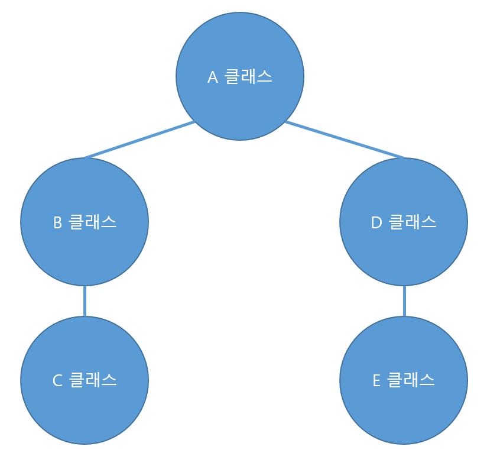

# 제네릭

:writing_hand: *Assembled by Yunju Jang*

🤝*Contributors : JiYoung-Kwon*

<hr>


- <b>제네릭이란?</b>

  - 클래스의 내부에서 사용할 데이터 타입을 클래스 외부에서 지정하는 기법이다.

  - 데이터 타입을 나중에 확정한다.

    - 클래스나 메소드를 선언할 때가 아닌 사용할 때 결정된다.
    - 즉, 인스턴스를 생성할 때나 메소드를 호출할 때 정한다는 의미이다.

    

  - 선언은 <code>클래스<사용할 타입></code>으로 한다.

    ``` java
    public class 클래스명<T>{...}
    public interface 인터페이스명<T>{...}
    ```

<br/>

 <br/>

- <b>제네릭의 장점</b>

  - 타입 안정성이 높다.

    - Object 사용 시와 달리 객체의 타입을 컴파일 타임에 체크할 수 있기 때문이다.

    > 타입 안정성 (type safety)
    >
    > - 의도하지 않은 타입의 객체가 저장되는 것을 막는다.
    > - 저장된 객체를 꺼내올 때 다른 타입으로 잘못 형변환하여 발생하는 오류를 줄인다.

  - 코드가 간결해진다.

<br/>

- <b>제네릭을 사용해야 하는 이유</b>

  - 잘못된 타입이 사용될 수 있는 문제를 컴파일 과정에서 제거할 수 있다.

  - 타입을 국한하기 때문에 요소를 찾아올 때 타입 변환을 할 필요가 없어 프로그램 성능이 향상되는 효과를 얻을 수 있다.

    ``` java
    ArrayList list = new ArrayList(); //제네릭을 사용하지 않을경우
    list.add("test");
    String temp = (String) list.get(0); //타입변환이 필요함
            
    ArrayList<String> list2 = new ArrayList(); //제네릭을 사용할 경우
    list2.add("test");
    temp = list2.get(0); //타입변환이 필요없음
    ```

<br/>

- <b>자주 사용하는 타입 인자</b>

  - | 타입인자 | 설명    |
    | -------- | ------- |
    | < T >    | Type    |
    | < E >    | Element |
    | < K >    | Key     |
    | < N >    | Number  |
    | < V >    | Value   |
    | < R >    | Result  |

<br/>

<br/>

### 제네릭 클래스

- <b>제네릭 클래스의 사용</b>

  - 제네릭은 클래스와 메소드에서 사용할 수 있다.

  - 제네릭 클래스는 제네릭 타입을 선언한 클래스이다.

    - <code>클래스<사용할 타입></code>

      ``` java
      public class Box<T> {
          
          private T item;
      
          public T getItem() {
              return item;
          }
      
          public void setItem(T item) {
              this.item = item;
          }
      }
      ```

    <br/>

    - 멀티 타입 파라미터 : 콤마로 구분해서 여러 개를 선언할 수 있다.

      ``` java
      public class Box<M, I> {
      
          private M material;
          private I item;
      
          public M getMaterial() {
              return material;
          }
      
          public void setMaterial(M material) {
              this.material = material;
          }
      
          public I getItem() {
              return item;
          }
      
          public void setItem(I item) {
              this.item = item;
          }
      }
      ```

<br/>

- <b>제네릭 클래스 사용 방법</b>

  ``` java
  Box<Paper, String> box = new Box<Paper, String>();
  Box<Paper, String> box = new Box<>();   // JDK1.7부터 생략 가능
  Box box = new Box();    // Object로 간주
  ```

  - JDK 1.5 부터 도입되어 1.7부터 생성자의 <>에 타입을 생성할 수 있다.
  - 하위 호환을 위해 타입을 지정하지 않고도 객체를 생성할 수 있다. 이 경우, 타입은 Object 타입이 된다.

<br/>

- 주의할 점
  - 참조변수에서 지정한 타입과 생성자에서 지정한 타입은 반드시 일치해야한다.
  - 두 타입이 서로 상속관계에 있다 해도, 타입이 다르면 컴파일 에러가 발생한다.
  - Cardboard 클래스가 Paper의 자식 클래스라 해도, Cardboard 클래스에서 Box 타입의 인스턴스를 생성할 수 없다.

<br/>

<br/>

<br/>

### 제네릭 메소드

- <b>제네릭 메소드의 사용</b>

  - 제네릭 타입을 선언한 메소드이다.

  - 클래스의 제네릭 타입이 전역 변수처럼 사용되면, 메소드의 제네릭 타입은 해당 메소드 안에서만 사용할 수 있는 <b>지역성</b>을 가진다.

  - 제네릭 클래스가 아닌 일반 클래스 내부에도 제네릭 메소드를 정의할 수 있다.

    - 클래스에 지정된 타입 파라미터와 제네릭 메소드에 정의된 타입 메소드는 상관이 없다.
    - 즉, 제네릭 클래스에 \<T>를 사용하고, 같은 클래스의 제네릭 메소드에서도 \<T>로 같은 이름을 가진 타입 파라미터를 사용해도 둘은 전혀 상관이 없다.

    <br/>

  - 제네릭입 메소드 선언

    ``` java
    public class CoffeeMachine {
    
        public <T> Coffee makeCoffee(T capsule) {
    
            return new Coffee(capsule);
        }
    }
    ```

    - 접근 제한자와 반환 타입 사이에 선언한다.

    <br/>

  - 제네릭 메소드 사용 방법

    ``` java
    CoffeeMachine coffeeMachine = new CoffeeMachine();
    Colombian capsule = new Colombian();
    coffeeMachine.<Colombian>makeCoffee(capsule);
    coffeeMachine.makeCoffee(capsule);  // 타입 추정 가능하므로 생략 가능
    ```

    - 제네릭 메소드를 호출할 때에는 메소드명 앞에 <>로 지정해주어야 한다.
      - 컴파일러가 타입을 추정할 수 있는 경우에는 생략 가능하다.
      - 대부분의 경우 추정이 가능하다.

<br/>

<br/>

<br/>

### 제한된 타입 파라미터

- 제네릭의 상위 타입, 하위 타입을 구체적으로 제한하고 싶을 경우

- 메소드, 인터페이스 ,클래스에서 동일하게 사용 가능

- <T extends 상위 타입> , <T super 하위타입> 으로 제한이 가능하다.

  - 예시

  ``` java
  public class BeforeTest  {
      public < T extends Number, D extends Map > void show( D map, T key ) {
        System.out.println(map.containsKey(key));
      }
  }
  ```

- 내부에서 사용할 T 객체가 꼭 Number 클래스의 하위 타입이어야 할 때

  - 또는 상위 인터페이스의 구현체이어야할 때 사용 가능하다.

- 그래야 메소드 안에서 필요한 인터페이스의 메소드 혹은 클래스의 메소드를 사용할 수 있다.

<br/>

<br/>

<br/>

#### 와일드카드 타입

- <b>와일드카드란?</b> 

  - 코드에서 일반적으로 <code>?</code> 를 와일드카드라고 부른다.

    

  - 사용 예

    - \<?>

      - 모든 클래스나 인터페이스가 올 수 있다. 즉, 제한이 없다.
      - A ~ E 모두 가능

      <br/>

    - <? extends 상위타입>

      - 상위타입 이하로만 올 수 있다.
      - <? extends D> --> D, E 가능

      <br/>

    - <? super 하위 타입>

      - 하위타입 이상으로만 올 수 있다.
      - <? super D> --> D, A 가능

    <br/>

    ``` java
    public class Calcu {
        public void printList(List<?> list) {
           for (Object obj : list) {
        	   System.out.println(obj + " ");  
           }
        }
    
        public int sum(List<? extends Number> list) {
          int sum = 0;
          for (Number i : list) {
        	  sum += i.doubleValue();  
          }
          return sum;
        }
    
       public List<? super Integer> addList(List<? super Integer> list) {
          for (int i = 1; i < 5; i++) {
        	 list.add(i); 
          }
          return list;
        }
    }
    ```


<br/>

<br/>

## 예상질문❔

Q1) 제네릭 타입이란 무엇인가?

A1) 클래스 내부에서 사용할 데이터 타입을 클래스 외부에서 지정하는 것으로, 객체의 타입을 컴파일 시에 확인할 수 있다. 타입 형변환으로 부터 발생하는 오류를 막을 수 있다.

<br/>

Q2) 와일드카드란 무엇인가?

A2) 제네릭 타입 자리에 ?가 오는 것으로, 상위 타입, 하위 타입을 제한하거나 모든 타입에 대한 제한을 걸지 않을 때 사용한다.

<br/>

<br/>

### Reference📖

- https://github.com/fake-developers/1st/blob/main/KJY/%5BJAVA%5D%20%EC%A0%9C%EB%84%A4%EB%A6%AD.md
