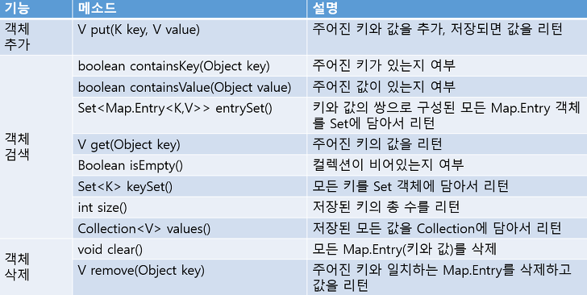
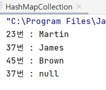
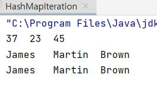
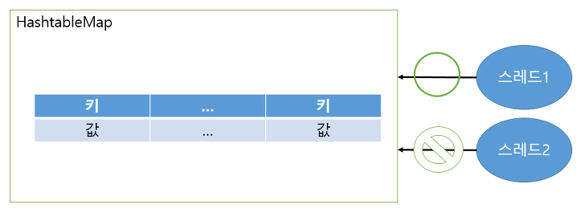
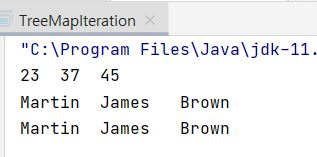

# Java - Collection Framework (HashMap ,TreeMap)

:writing_hand: *Assembled by Yunju Jang*

🤝*Contributors : JiYoung-Kwon*

<hr>


### Map\<K, V> 인터페이스를 구현하는 컬렉션 클래스들

- Map <K, V>를 구현하는 컬렉션 클래스의 인스턴스들은 Key와 Value가 한 쌍을 이루는 형태로 데이터를 저장하는 <b>비선형 자료구조</b>이다.
  - Value를 저장할 때, 이를 찾을 때 사용하는 Key를 함께 저장하는 구조이다.
  - Key는 중복될 수 없고, Value는 중복 되어도 상관이 없다.
  - 기존에 저장된 키와 동일한 키로 값을 저장하면, 기존의 값은 없어지고 새로운 값으로 대치된다.
- Map <K, V>를 구현하는 대표 클래스로 HashMap <K, V>와 TreeMap <K, V>가 있다.
  - 트리 자료구조를 기반으로 구현된 TreeMap <K, V>은 <mark>정렬 상태</mark>를 유지한다는 것이 둘의 가장 큰 차이이다.
  - 이 때 정렬 대상은 Key이다.

<br/>

<br/>

- <b>Map 인터페이스 메소드</b>

  - 키로 객체들을 관리하기 때문에, 키를 파라미터로 갖는 메소드가 많다.
    

  <br/>

  - 매개 변수 타입과 리턴 타입에 K와 V라는 타입 파라미터가 있다.
    - Map 인터페이스가 제네릭 타입이기 때문이다.
    - 구체적인 타입은 구현 객체를 생성할 때 결정된다.

  <br/>

  - 저장된 전체 객체를 대상으로 하나씩 객체를 얻는 방법

    - KeySet() 메소드로 모든 키를 Set 컬렉션으로 얻을 수 있다.

      - 반복자를 통해 키를 하나씩 얻는다.
      - get() 메소드를 통해 값을 얻는다.

      ``` java
      Map<K, V> map = ~;						//생략
       
      Set<K> keySet = map.keySet();
      Iterator<K> it = keySet.iterator();
       
      while (it.hasNext()) {
          K key = it.next();
          V value = map.get(key);
      }
      ```

    <br/>

    - entrySet() 메소드로 모든 Map.Entry를 Set 컬렉션으로 얻는다.

      - 반복자를 통해 Map.Entry 객체를 하나씩 얻는다.
      - getKey()와 getValue() 메소드를 이용하여 키와 값을 얻는다.

      ``` java
      Set<Map.Entry<K, V>> entrySet = map.entrySet();
       
      Iterator<Map.Entry<K, V>> entryIt = entrySet.iterator();
       
      while (entryIt.hasNext()) {
          Map.Entry<K, V> entry = entryIt.next();
       
          K key = entry.getKey();
          V value = entry.getValue();
      }
      ```

<br/>

<br/>

#### HashMap <K, V>

- <b>HashMap이란?</b>

  - Map 인터페이스의 구현 클래스이다.
  - HashMap의 키로 사용할 객체는 hashCode()와 equals() 메소드를 재정의하여 동등 객체가 될 조건을 정해야한다.
    - 동등 객체가 될 조건
      - hashCode()의 리턴 값이 같아야 한다.
      - equals() 메소드가 true를 리턴해야 한다.
  - 주로 키 타입은 String을 많이 이용한다.
    - String은 문자열이 같을 경우, 동등 객체가 될 수 있도록 hashCode()와 equals() 메소드가 재정의 되어있다.

  <br/>

- <b>HashMap <K, V> 사용 예</b>

  ```Java
  import java.util.HashMap;
  
  public class HashMapCollection {
      public static void main(String[] args){
          HashMap<Integer, String> map = new HashMap<>();
  
          // Key-Value 기반 데이터 저장
          map.put(45, "Brown");
          map.put(37, "James");
          map.put(23, "Martin");
  
          // 데이터 탐색
          System.out.println("23번 : " + map.get(23));
          System.out.println("37번 : " + map.get(37));
          System.out.println("45번 : " + map.get(45));
  
          // 데이터 삭제
          map.remove(37);
  
          // 데이터 삭제 확인
          System.out.println("37번 : " + map.get(37));
      }
  }
  ```

  - 실행 결과

    

    - HashMap <K, V> 클래스는 Iterable\<T> 인터페이스를 구현하지 않으니 for-each 문을 통해서, 혹은 '반복자'를 얻어서 순차적 접근을 진행할 수 없다.
    - 대신에 Map<K, V>에는 <code>public Set\<K> keySet()</code> 메소드가 존재한다.
      - 이 메소드는 Set\<E>를 구현하는 컬렉션 인스턴스를 생성하고, 여기에 모든 Key를 담아 반환한다.
      - 이 메소드를 통해 Key를 따로 모으고, 이를 통한 순차적 접근을 진행할 수 있다.

    > +) 참고
    >
    > <b>Iterator 란? </b>
    >
    > - 자바의 컬렉션 프레임워크에서 컬렉션에 저장되어 있는 요소들을 읽어오는 방법을 표준화한 것이다.
    > - 집합체를 다룰 때는 개별적인 클래스에 대해 데이터를 읽는 방법을 알아야 하기 때문에 각 컬렉션에 접근이 힘들어진다.
    >   - 그러나 Iterator를 쓰게 되면 어떤 컬렉션이든 동일한 방식으로 접근이 가능하여 그 안에 있는 항목들에 접근할 수 있는 방법을 제공한다. (다형성)
    > - Iterator 메소드에는 hasNext(), next(), remove()가 있다.
    >   - hasNext() : 읽어올 요소가 남아있는지 확인, true, false 반환
    >   - next() : 다음 데이터 반환
    >   - remove() : next()로 읽어온 요소를 삭제

  <br/>

  - HashMap <K, V>의 순차적 접근 예제

    ```java
    import java.util.HashMap;
    import java.util.Iterator;
    import java.util.Set;
    
    public class HashMapIteration {
        public static void main(String[] args) {
            HashMap<Integer, String> map = new HashMap<>();
    
            // Key-Value 기반 데이터 저장
            map.put(45, "Brown");
            map.put(37, "James");
            map.put(23, "Martin");
    
            // Key 만 담고 있는 컬렉션 인스턴스 생성
            Set<Integer> ks = map.keySet();
    
            // 전체 Key 출력 (for-each문 기반)
            for(Integer n: ks)
                System.out.print(n.toString() + '\t');
            System.out.println();
    
            // 전체 Value 출력 (for-each문 기반)
            for(Integer n : ks)
                System.out.print(map.get(n).toString() + '\t');
            System.out.println();
    
            // 전체 Value 출력 (반복자 기반)
            for(Iterator<Integer> itr = ks.iterator(); itr.hasNext();)
                System.out.print(map.get(itr.next()) + '\t');
            System.out.println();
        }
    }
    
    ```

    

    - <code>Set\<Integer> ks = map.KeySet();</code>
      - Set\<E>는 Iterable\<E>을 상속하므로 예제에서 보이듯 위의 문장 실행 이후 for-each문을 통해, 또는 반복자를 얻어 순차적 접근을 진행할 수 있다.

<br/>

<br/>

#### Hashtable

- <b>Hashtable 이란?</b>

  - HashMap과 동일한 내부 구조를 갖는다.

    - 차이점
      - Hashtable은 동기화된(Synchronized) 메소드로 구성되어 있다.
      - 멀티 스레드가 동시에 이 메소드들을 실행할 수 없다.
      - 하나의 스레드가 실행을 완료해야만 다른 스레드를 실행할 수 있다.
      - 따라서, 멀티 스레드 환경에서 안전하게 객체를 추가, 삭제할 수 있다.

  - 키로 사용할 객체는 hashCode()와 equals() 메소드를 재정의해서 동등 객체가 될 조건을 정해야 한다.

    

<br/>

- <b>Hashtable 사용법</b>

  - ``` java
    Map<K, V> map = new Hashtable<K, V>(); // 기본 생성자 호출
    ```

  - 키 타입과 값 타입을 파라미터로 주고, 기본 생성자를 호출한다.

<br/>

<br/>

#### Properties

- <b>Properties 란?</b>
  - properties는 Hashtable의 하위 클래스이다.
  - Hashtable의 모든 특징을 그대로 가진다.
    - 차이점
      - Hashtable : 키와 값을 다양한 타입으로 지정이 가능하다.
      - Properties : 키와 값을 String 타입으로 제한한 컬렉션이다.
  - 애플리케이션의 옵션 정보, 데이터베이스 연결 정보, 국제화(다국어) 정보가 저장된 프로퍼티 파일 (*.properties) 을 읽을 때 주로 사용한다.
    - 프로퍼티 파일 : 키와 값이 = 기호로 연결되어 있는 텍스트 파일

<br/>

- <b>프로퍼티 파일 읽기</b>

  - ``` java
    Properties properties = new Properties(); // Properties 객체 생성
    properties.load(new FileReader("C:/~/database.properties"));
    ```

    - load() : 프로퍼티 파일로부터 데이터를 읽기 위해 FileReader 객체를 파라미터로 받는다.
    - 프로퍼티 파일은 일반적으로 클래스 파일과 함께 저장된다.
    - Class의 gerResource()메소드를 이용하여 경로를 얻어온다.
    - 프로퍼티 객체에서 해당 키의 값을 얻으려면 getProperty() 메소드를 사용한다.

<br/>

<br/>

#### TreeMap <K, V>

- <b>TreeMap 이란?</b>
  - 이진트리 자료구조를 기반으로 한 Map 컬렉션이다.
  - 키와 값이 저장된 Map.Entry를 저장한다는 점이 TreeSet과의 차이이다.
  - TreeMap에 객체를 저장하면 자동으로 정렬된다.

<br/>

- <b>TreeMap <K, V> 사용 예</b>

  - 트리 자료구조를 기반으로 구현되어 있어 정렬 상태를 유지한다.

  - 이전 예제에서 컬렉션 클래스만 TreeMap <K, V>로 바꾸어 실행

    ```java
    import java.util.Iterator;
    import java.util.Set;
    import java.util.TreeMap;
    
    public class TreeMapIteration {
        public static void main(String[] args) {
            TreeMap<Integer, String> map = new TreeMap<>();
            // ~~~ 위와 동일 
        }
    }
    ```

  

  - Key에 해당하는 나이 정보가 오름차순으로 출력되었다.
  - 반복자는 오름차순으로 Key에 접근한다.

  

<br/>

<br/>

## 예상질문❔

Q1) HashMap <K, V> 클래스는 무엇인가?

Q2) Map <K, V>를 구현하는 대표적인 컬렉션 클래스로, 해쉬 알고리즘을 기반으로 구현되어 있다. 인스턴스들은 Key와 Value가 한 쌍을 이루는 형태로 데이터를 저장한다.

<br/>

Q2) TreeMap <K, V> 클래스는 무엇인가?

A2) Map <K, V>를 구현하는 대표적인 컬렉션 클래스로, 트리 알고리즘을 기반으로 구현되어 있어 정렬 상태를 유지한다는 특징이 있다.

<br/>

<br/>

### Reference📖

- https://thefif19wlsvy.tistory.com/41
- 도서) 윤성우의 열혈 Java 프로그래밍 Chapter 23. 컬렉션 프레임워크 1
