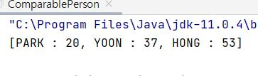

# Java - Collection Framework (HashSet ,TreeSet)

:writing_hand: *Assembled by Yunju Jang*

🤝*Contributors : JiYoung-Kwon* 

<hr>


<b>+) 자바 컬렉션 프레임워크란 ?</b>


- 잘 정의된 구조의 클래스들

- 컬렉션 관련된 클래스의 정의에 적용되는 설계 원칙 또는 구조가 존재한다.

- 제네릭 기반의 클래스와 메소드로 자료구조와 알고리즘을 미리 구현해 놓은 결과물이다.

- 자료구조를 몰라도 트리 기반으로 데이터를 저장할 수 있고, 알고리즘을 몰라도 이진 탐색을 수행할 수 있다.

  

  - 컬렉션 프레임워크의 인터페이스 구조

<br/>

<br/>

### Set\<E> 인터페이스를 구현하는 컬렉션 클래스들

- <b>Set\<E>을 구현하는 클래스의 특성</b>
  - 저장 순서가 유지되지 않는다.
  - 데이터의 중복 저장을 허용하지 않는다.
  - Set이라는 이름처럼 수학에서 말하는 '집합'의 특성을 가지고 있다.
  - <b>인덱스가 존재하지 않는다.</b>
    - 위치 기반으로 데이터를 가져올 수 없다.
    - 인덱스를 파라미터로 갖는 메소드가 존재하지 않는다.
    - 대신, 전체 객체를 대상으로 한 번씩 반복해서 가져오는 <b>반복자 (Iterator) 를 제공한다.</b>

<br/>

<br/>

### HashSet\<E>

- <b>대표 클래스 HashSet\<E> 예제</b>

  ```Java
  import java.util.HashSet;
  import java.util.Set;
  
  public class SetCollectionFeature {
      public static void main(String[] args){
          Set<String> set = new HashSet<>();
          set.add("Toy"); // 1
          set.add("Box"); // 2
          set.add("Robot"); // 3
          set.add("Box"); // 4
  
          System.out.println(set);
      }
  }
  ```

  - 실행 결과

    

    - 저장 순서가 유지되지 않는다.
      - 유지하고자 한다면 LinkedHashSet을 이용해야 한다.
    - Set 인터페이스의 특징대로 중복이 허용되지 않았다. 
      - 중복된 요소를 추가할 시 메소드가 false를 반환하여 실패를 알린다.

  <br/>

  - 두번째 예제

    ```java
    import java.util.HashSet;
    
    class Num{
        private int num;
        public Num(int n) { num = n; } // 정수를 받아 num에 저장
    
        @Override
        public String toString(){
            // num 값을 String으로 형 변환
            return String.valueOf(num);
        }
    }
    
    public class HashSetEqualityOne {
        public static void main(String[] args){
            HashSet<Num> set = new HashSet<>();
            set.add(new Num(7799));
            set.add(new Num(9955));
            set.add(new Num(7799));
    
            System.out.println(set);
        }
    }
    ```

    

    - 7799 값을 지닌 두 인스턴스가 서로 다른 인스턴스로 간주되어 둘 다 저장이 되었다.
    - HashSet\<E> 이 판단하는 동일 인스턴스의 기준은, Object 클래스에 정의되어 있는 다음 두 메소드의 호출 결과를 근거로 하기 때문이다.
      - public boolean equals(Object obj)
      - public int hashCode()
    - 따라서, 이 두 인스턴스가 같은 인스턴스임을 보여야할 때에는 메소드 오버라이딩을 통해야한다.

<br/>

<br/>

- <b>해쉬 알고리즘과 hashCode 메소드</b>

  - 간단한 예시를 통해 해쉬 알고리즘에 대해 살펴보자.
  - num % 3 을 이용하여 해쉬 알고리즘을 사용할 수 있다.
  - 3, 5, 7, 12, 25, 31 이라는 주어진 값들을 분류해보자. 하나의 집합을 구성한다고 가정할 때,
    - 나머지 연산의 결과에 따라 0인 값, 1인 값, 2인 값, 세 부류로 나뉠 수 있다.
  - 정수 5의 존재 여부를 확인하려면 나머지 연산을 진행한다.
    - 나머지 결과가 2이기 때문에 2인 값에 속한다.
  - 속하는 부류를 찾은 후에 <mark>선택된 부류 내에서 탐색을 진행하기 때문에 탐색 속도가 빠르다.</mark>

  <br/>

  - 위의 두 단계를 거쳐 동일한 인스턴스의 존재 여부를 확인하는 클래스가 HashSet\<E> 이다.
    - 즉 탐색 과정은
      - 1단계 : Object 클래스에 정의된 hashCode 메소드의 반환 값을 기반으로 부류 결정
      - 2단계 : 선택된 부류 내에서 eqauls 메소드를 호출하여 동등 비교

  <br/>

  - Object 클래스에 정의되어 있는 hashCode와 equals 메소드는 다음과 같이 정의되어 있다.

    - 인스턴스가 다르면 Object 클래스의 hashCode 메소드는 다른 값을 반환한다.
    - 인스턴스가 다르면 Object 클래스의 equals 메소드는 false를 반환한다.

  - 참고로, Object 클래스의 hashCode 메소드는 인스턴스가 저장된 <b>주솟값</b>을 기반으로 반환 값이 만들어지도록 정의되어 있다.

    - 즉, Object 클래스의 hashCode와 equals는 저장하고 있는 값을 기준으로 동등 여부를 따지지 않는다.
    - 따라서, 위의 예제에서 7799가 다른 인스턴스로 간주되었다.
    - 값을 기준으로 동등 여부를 따지려면 두 메소드를 오버라이딩 해야 한다.

    <br/>

    

  - 수정된 코드와 결과

    ```java
    import java.util.HashSet;
    
    class Num{
        private int num;
        public Num(int n) { num = n; } // 정수를 받아 num에 저장
    
        @Override
        public String toString(){
            return String.valueOf(num);
        }
    
        /* 추가된 코드 */
        @Override
        public int hashCode(){ // num 의 값이 같으면 부류도 같다.
            return num % 3;
        }
    
        @Override
        public boolean equals(Object obj){ // num의 값이 같으면 true를반환한다.
            if(num == ((Num)obj).num)
                return true;
            else
                return false;
        }
        /* */
    }
    
    public class HashSetEqualityOne {
        public static void main(String[] args){
            HashSet<Num> set = new HashSet<>();
            set.add(new Num(7799));
            set.add(new Num(9955));
            set.add(new Num(7799));
    
            System.out.println(set);
        }
    }
    ```

    

    - 참고로 String 클래스는 문자열의 내용 비교가 이뤄지도록 hashCode와 equals를 적절히 오버라이딩 하고 있다.
    - 따라서 HashSet\<E> 인스턴스에는 동일한 문자열을 지니는 String 인스턴스가 둘 이상 저장되지 않는다.

<br/>


<br/>

### TreeSet\<E>

- <b>TreeSet\<E> 클래스의 이해와 활용</b>

  - 트리라는 자료구조를 기반으로 인스턴스를 저장하는 클래스이다.
  - 정렬된 상태가 유지되면서 인스턴스가 저장된다. (트리의 특성)

  <br/>

  - TreeSet\<E> 예제

    ```java
    import java.util.TreeSet;
    
    public class SortedTreeSet {
        public static void main(String[] args){
            TreeSet<Integer> tree = new TreeSet<>();
            tree.add(3); tree.add(1);
            tree.add(2); tree.add(4);
    
            System.out.println(tree);
        }
    }
    ```

    

    - TreeSet\<E> 인스턴스가 정렬 상태를 유지하면서 인스턴스를 저장한다.
    - 따라서 TreeSet\<E>의 반복자는 인스턴스들의 참조 순서를 오름차순을 기준으로 한다는 특징을 갖는다.
    - 수의 경우에는 크고 작음의 기준이 명확하지만, String name, int age 가 동시에 존재하는 경우에는 이름 오름차순인지, 나이 오름차순인지에 대한 기준을 프로그래머가 결정해야 한다.
      - Comparable\<T>을 사용하여 기준을 정한다.

<br>

<br>

- <b>인스턴스의 비교 기준을 정의하는 Comparable\<T> 인터페이스의 구현 기준</b>

  - Comparable\<T> 인터페이스를 구현할 때 정의해야 할 추상 메소드
    - <code>int compareTo(T o)</code>
    - 정의 방법
      - 인자로 전달된 o가 작다면 양의 정수 반환
      - 인자로 전달된 o가 크다면 음의 정수 반환
      - 인자로 전달된 o와 같다면 0을 반환
    - ex) <code>my.comareTo(your);</code>
      - your가 my 보다 작다면 양의 정수, 반대면 음의 정수를 반환하도록 구현
      - TreeSet\<E>는 compareTo 메소드의 호출결과를 바탕으로 정렬을 유지

  <br/>

  - 예제

    ```java
    import java.util.TreeSet;
    
    class Person implements Comparable<Person>{
        private String name;
        private int age;
    
        public Person(String name, int age){
            this.name = name;
            this.age = age;
        }
    
        @Override
        public String toString(){ return name + " : " + age; }
    
        @Override
        public int compareTo(Person p){
            return this.age - p.age; // 인자로 전달된 것이 크면 음수 --> 뒤로 배치
        }
    }
    
    public class ComparablePerson {
        public static void main(String[] args){
            TreeSet<Person> tree = new TreeSet<>();
            tree.add(new Person("YOON", 37));
            tree.add(new Person("HONG", 53));
            tree.add(new Person("PARK", 20));
    
            System.out.println(tree);
        }
    }
    ```

    

    - 인자로 전달된 인스턴스의 나이가 더 많으면 음수가 반환된다.
      - 정렬 순서상 뒤쪽에 위치하게 된다.
    - 나이가 많은 사람을 앞으로 하고 싶으면 p.age - this.age 로 바꾸면 된다.
      - 그러나 일시적인 기준 변경이라면 메소드를 수정하는 것보다 이러한 상황을 고려하여 제공되는 다음 인터페이스를 사용한다.
      - <code>public interface Comparator\<T></code>
        - <code>int compare(T o1, T o2)</code>
      - 이 인터페이스를 구현한 클래스의 인스턴스는 다음 생성자를 통해 전달할 수 있다.
        - <code>public TreeSet(Comparator<? super E> comparator)</code>
      - 이렇게 생성된 TreeSet\<E>의 인스턴스는 생성자로 전달된 인스턴스의 compare 메소드의 호출 결과를 기준으로 정렬을 진행한다.
        - o1 이 o2 보다 크면 양의 정수 반환
        - o1 이 o2 보다 작으면 음의 정수 반환
        - o1 이 o2 와 같으면 0 반환

<br/>

<br/>

## 예상질문❔

Q1) HashSet\<T> 클래스는 무엇인가?

Q2) Set 인터페이스의 구현 클래스로 중복을 허용하지 않고, 순서를 고려하지 않게 인스턴스를 저장하는 클래스이다.

<br/>

Q2) TreeSet\<T> 클래스는 무엇인가?

A2) 트리라는 자료구조를 기반으로 인스턴스를 저장하는 클래스이다. 정렬된 상태가 유지되면서 인스턴스가 저장된다. 

<br/>

<br/>

### Reference📖

- https://rwd337.tistory.com/94
- https://walbatrossw.github.io/java/2018/02/16/java-basic-19-hashset.html
- https://coding-factory.tistory.com/554
- 도서 ) 윤성우의 열혈 Java 프로그래밍 Chapter 23. 컬렉션 프레임워크 1
