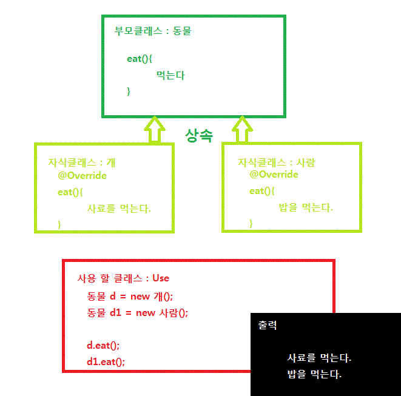
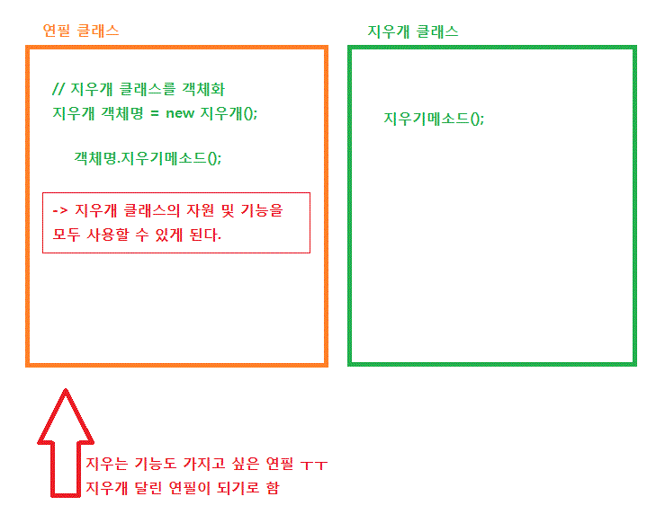

# 상속과 구성

:writing_hand: *Assembled by Yunju Jang*

🤝*Contributors :  JiYoung-Kwon* 

### 상속 (Inheritance)

- <b>상속이란?</b>

  - 클래스가 클래스를 확장하여 부모 클래스의 속성과 동작을 상속할 수 있는 기능이다.
  - 하위 클래스는 상위 클래스의 모든 메소드를 재사용할 수 있고, 재정의를 하여 하위 클래스만의 메소드로 변경할 수도 있다.
  - 부모 클래스의 멤버를 자식 클래스가 물려 받으며, 적은 양의 코드로 새로운 클래스를 작성할 수 있다.

 

- <b>상속의 특징</b>

  - 상속은 OOP에서 <b>is - a</b> 관계를 나타낸다.

    - 본질적으로 A가 B임을 의미한다.
    - 하위 클래스가 상위 클래스의 진짜 하위 타입인 상황에서 쓰여야 한다.
      - ex) 와인 클래스를 상속하는 레드와인 클래스

    

   

   

- <b>상속 방법</b>

  - Extends

    - <code>class 자식 클래스 명 extends 부모 클래스 명 {...}</code>
  - 자바에서는 자식 클래스가 여러 부모로부터 다중 상속 받는 것이 불가능하다.
  - 1개의 부모 클래스로부터의 단일 상속만을 허용한다.

 

 

- <b>상속의 장점</b>

  - 중복된 코드를 줄일 수 있다.
  - 유지보수가 편리하다.
  - 통일성이 있고, 다형성을 구현할 수 있다.

   

- <b>상속의 단점</b>

  - 상속은 단일 패키지에서 사용해야만 안전하다.
  - 하위 클래스는 상위 클래스에 많이 의존하게 된다.
  - 상위 클래스의 코드가 수정되면 하위 클래스의 코드도 수정되어야 하는 경우가 많다. (재정의 메소드)
  - 확장이라는 목표를 두고 상속하면 괜찮으나, 해당 설계가 아닌 상황에서 상속을 사용할 시 문제가 발생할 수 있다.
  - <b>상속은 캡슐화를 위반한다.</b>
    - 하위 클래스가 상위 클래스에 구체적인 구현 내용을 의존하고 있기 때문이다.

   

  - 무분별한 상속은 코드를 복잡하게 만들고 여러가지 문제를 야기할 수 있다.
  - 그럴 때 사용하는 것이 <b>구성</b>이다.

 

 

 

### 구성 (Composition)

- <b>구성이란?</b>

  - 클래스가 다른 클래스의 객체를 멤버 데이터로 포함하는 기능이다.
  - 기존의 부모 클래스를 상속받는 것이 아니라, 클래스의 주소 값을 참조하는 private 필드를 자식 클래스에 만드는 패턴이다.
  - 기존 클래스를 확장하는 대신에 새로운 클래스를 만들고 private 필드로 기존 클래스의 인스턴스를 참조하게하는 것이다.
  - <b>기존 클래스가 새로운 클래스의 구성 요소로 쓰인다.</b>
  - 새로운 클래스의 메서드들은 기존 클래스에서 필요한 메서드를 호출하여 사용하면 된다.
    - 이를 전달(forwarding)이라고 하고, 해당 메소드를 전달 메소드라고 한다.
  - 기존 클래스의 세부 구현과 상관없기 때문에 기존 클래스가 수정되어도 영향을 미치지 않는다.

   

   

- <b>구성의 특징</b>

  - 구성은 OOP에서 <b>has - a</b> 관계를 나타낸다.

  - 다른 객체를 받아들여서 그 객체의 기능을 사용하는 것이다.

    - ex) 사람이 핸드폰을 사서 그 기능을 사용하는 것

  - 받아들인 객체의 자원 (메소드, 변수)을 사용할 수 있다.

  - 어떤 클래스 A가 다른 클래스 B가 가진 기능을 사용하고 싶을 때, B를 포함하면 B의 기능을 사용할 수 있다.

    

   

 

 

### 상속 vs 구성

- 상속과 구성은 두가지 OOP 개념이지만 프로그래머가 달성할 수 있는 방식은 상당히 다르다.
- 상속
- 클래스가 클래스를 확장하여 클래스와 속성 및 동작을 상속하는 기능으로
  - 모든 public 및 private 속성, 동작을 상속하며 하위 클래스가 해당 동작을 재정의할 수 있다.
- 구성
  - 클래스가 다른 클래스의 객체를 멤버 데이터로 포함하는 기능으로
  - 클래스가 다른 클래스에 포함된 경우
  - 컨테이너는 포함된 동작을 변경하거나 추가할 수 없다.

 

 

## 예상질문❔

Q1) 상속이란 무엇인가?

A1) 상위 클래스의 메소드를 하위 클래스가 상속 받아 사용하거나 재정의하여 사용하는 것이다. is-a관계를 나타낸다.

 

Q2) 구성이란 무엇이 있는가?

A2) 새로운 클래스에서 기존의 클래스의 메소드 또는 변수를 멤버 데이터로 포함하여 사용하는 것으로 has - a 관계를 나타낸다.

 

 

### Reference📖

- https://github.com/fake-developers/1st/blob/main/KJY/%5BJAVA%5D%20%EC%83%81%EC%86%8D%EA%B3%BC%20%EA%B5%AC%EC%84%B1.md
