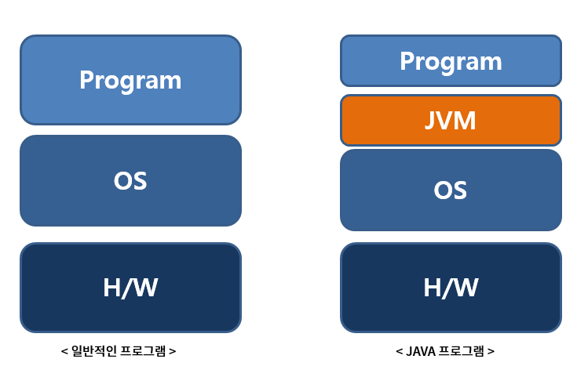

# 자바 언어의 동작 원리

:writing_hand: *Assembled by Yunju Jang*

🤝*Contributors : JiYoung Kwon*

- JVM이란?

  - Java Virtual Machine
  - 일반 프로그램은 운영체제에 의해 실행되는 반면, 자바는 OS에 독립적인 특성을 가진다. JVM 이를 가능하게 해주는 역할을 한다.
  - OS가 JVM을 실행시키면 JVM이 프로그램을 실행 시킨다. <small>즉, JVM 위에서 동작 된다.</small>

  

   

- 자바 프로그램 구동 원리

  1. 소스코드 작성 (.java 파일)

  2. 자바 컴파일러(javac)가 바이트 코드로 변환 (.class 파일)

     > 바이트 코드 
     >
     > ~~~  
     > JVM이 이해할 수 있도록 변환된 코드로, 반기계어이다.
     > ~~~

  3. 런처로 JVM을 구동시킨다.

  4. JVM이 바이트 코드를 해석하여 자바 프로그램이 실행된다.

   

- 자바 동작 프로세스

  

  1. 작성된 자바 소스(.java)를 자바 컴파일러를 통해 자바 바이트 코드(.class)로 컴파일한다.
     - 자바는 JVM에서 실행되어 OS에 독립적이기 때문에 어떤 운영체제에서라도 실행 될 수 있다.

   

  2. 컴파일된 바이트코드는 JVM의 클래스 로더에게 전달된다.

     - 클래스 로더 세부 동작

       2-1. 로드 : 클래스 파일을 가져와 JVM 메모리에 로드

       2-2. 검증 : 자바 언어 명세 및 JVM 명세에 명시된 대로 구성되어 있는지 검사

       2-3. 준비 : 클래스가 필요로하는 메모리를 할당

       2-4. 분석 : 클래스의 상수 풀 내 모든 심볼릭 레퍼런스를 다이렉트 레퍼런스로 변경

       2-5. 초기화 : 클래스 변수들을 적절한 값으로 초기화

   

  3. JVM의 클래스 로더는 동적 로딩을 통해 클래스들을 로딩 및 링크하여 데이터 영역에 올린다.
     - JVM에 올리면서 static이 생성되고, JVM 안에서 아무나 이 static을 접근할 수 있다.

   

  4. 실행 엔진은 JVM 메모리에 올라온 바이트 코드들을 명령어 단위로 하나씩 가져와 실행한다.

     - 실행 엔진의 2가지 동작 방식

       - 자바 인터프리터 : 바디트 코드 명령어를 하나씩 읽어 해석하고 실행, 속도가 느림

       - JIT 컴파일러 : 인터프리터의 단점 보완, 전체 바이트 코드를 컴파일하여 바이너리 코드로 변경 후 직접 실행하는 방식

         <small>* jit :  프로그램을 실제 실행하는 시점에 기계어로 번역하는 컴파일 기법</small>

 

 

## 예상질문❔

Q1) JVM이란 무엇인가?

A1) 자바 코드를 실행시키기 위한 가상 머신으로, OS로부터 메모리를 할당 받아 로딩된 자바 바이트 코드를 실행하는 역할을 한다.

 

Q2) Java 프로그램의 동작 과정은 무엇인가?

A2) 자바 컴파일러가 자바 코드를 컴파일하여 바이트 코드를 만들면 그것을 JVM이 해석하여 실행한다.

 

### Reference📖

- https://swk3169.tistory.com/181
- https://gbsb.tistory.com/2
- https://webfirewood.tistory.com/20
- https://justin-g.tistory.com/56
