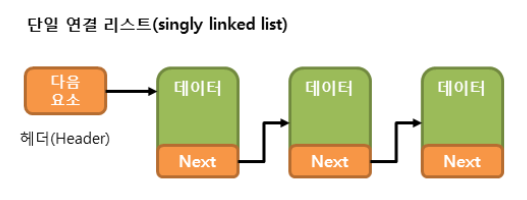
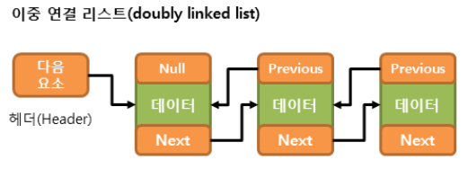

# Java - Collection Framework - List

:writing_hand: *Assembled by Yunju Jang*

🤝*Contributors : JeongHea Shin, JiYe Bae* 

<hr>


### List Collection

- <b>대표적인 List 컬렉션 구현 클래스</b>
  - ArrayList\<E>
  - LinkedList\<E>
  - Vector\<E>
  - Stack\<E>

<br/>

- <b>특성</b>
  - 인덱스 순서로 저장되며, 중복된 데이터를 저장할 수 있다.
  - 구조적으로 데이터를 일렬로 늘여놓는 구조이다.
  - 객체 (데이터 등) 를 저장하면, 인덱스가 자동으로 부여된다.
    - 부여된 인덱스를 통해 데이터의 검색 및 삭제가 가능하다.
    - 인덱스에는 데이터가 저장되어 있는 참조 값을 가진다. (객체 자체를 저장하는 것이 아님)

<br/>

<br/>

- <b>기본적인 List의 메소드</b>

  | 기능      | 메소드                                                       | 설명                                                         |
  | --------- | ------------------------------------------------------------ | ------------------------------------------------------------ |
  | 객체 추가 | - boolean add(E element) <br/>- void add(int index, E element) <br/>- E set( int index, E element) | - 해당 주어진 객체를 맨 끝 인덱스에 추가 <br/>- 해당 인덱스에 객체 추가 <br/>- 해당 인덱스에 주어진 객체로 변경 |
  | 객체 검색 | - boolean contains(Object object) <br/>- E get(int index) <br/>- boolean isEmpty() <br/>- int size() | - 주어진 객체가 저장되어 있는지 여부 확인 <br/>- 해당 인덱스에 저장된 객체 리턴 <br/>- 켈렉션이 비어 있는지 조사 <br/>- 저장되어 있는 전체 객체 수를 리턴 |
  | 객체 삭제 | - void clear() <br/>- E remove(int index) <br/>- boolean remove(Object o) | - 저장된 모든 객체를 삭제 <br/>- 해당 인덱스 객체 삭제 <br/>- 주어진 객체를 삭제 |
  | 기타      | - Iterator iterator() <br/>- boolean equals(Object o) <br/>- Object[] toArray() | - 해당 리스트의 반복자(iterator)를 반환 <br/>- 해당 리스트와 전달된 객체가 같은지 확인 <br/>- 해당 리스트의 모든 요소를 Object 타입의 배열로 반환 |

<br/>

<br/>

<br/>

#### ArrayList

- 구조
  - 저장 용량을 초과한 객체들이 들어오면 자동적으로 저장 용량이 늘어나는 구조이다.
  - 기본 생성자로 ArrayList 객체를 생성하면 내부에 10개의 객체를 저장할 수 있는 초기 용량을 가진다.
  - 저장되는 객체 수가 늘어나면 자동적으로 증가하지만, 처음부터 크게 용량을 잡는 것이 가능하다.
    - <code>ArrayList<String> list = new ArrayList<String>(30);</code>

- 특징
  - jDK 1.2 부터 제공된 ArrayList는 내부적으로 배열을 이용하여 객체를 저장한다.
    - 인덱스를 이용해 배열 요소에 빠르게 접근할 수 있다.
    - 그러나, 크기를 늘리기 위해서 새로운 배열을 생성하고 기존의 요소들을 옮겨야하는 복잡한 과정이 필요하다.
  - 특정 인덱스의 객체를 제거하면 바로 뒤 인덱스부터 마지막 인덱스까지 모두 앞으로 1씩 당겨진다.
    - 마찬가지로 특정 인덱스에 객체를 삽입하면 해당 인덱스부터 마지막 인덱스까지 모두 1씩 밀린다.
  - 동기화를 보장하지 않는다.
    - 필요 시 <code>Collections.synchronizeList()</code> 메서드를 통해 동기화가 보장되는 List를 반환 받아 사용한다.

<br/>

<br/>

- 사용 예시

  ``` java
  ArrayList<Integer> arrList = new ArrayList<Integer>();
  
   
  // add() 메소드를 이용한 요소의 저장
  arrList.add(40);
  arrList.add(20);
  arrList.add(30);
  arrList.add(10);
  
  
  // for 문과 get() 메소드를 이용한 요소의 출력
  for (int i = 0; i < arrList.size(); i++) {
      System.out.print(arrList.get(i) + " ");
  } 
  //실행결과 40 20 30 10
  
   
  // remove() 메소드를 이용한 요소의 제거
  arrList.remove(1);
   
  
  // Enhanced for 문과 get() 메소드를 이용한 요소의 출력
  for (int e : arrList) {
      System.out.print(e + " ");
  }
  //실행결과 40 30 10
  
   
  
  // Collections.sort() 메소드를 이용한 요소의 정렬
  Collections.sort(arrList);
  
   
  
  // iterator() 메소드와 get() 메소드를 이용한 요소의 출력
  Iterator<Integer> iter = arrList.iterator();
  
  while (iter.hasNext()) {
      System.out.print(iter.next() + " ");
  }
  //실행결과 10 30 40 
   
  // set() 메소드를 이용한 요소의 변경
  arrList.set(0, 20);
  
  
  for (int e : arrList) {
      System.out.print(e + " ");
  }
  //실행결과 20 30 40
  
  // size() 메소드를 이용한 요소의 총 개수
  System.out.println("리스트의 크기 : " + arrList.size());
  //실행결과 리스트의 크기 : 3
  ```

  - Collections 클래스
    - JDK 1.2 부터 제공되는 컬렉션에서 동작하거나 컬렉션을 반환하는 클래스
    - 메서드만으로 구성된 클래스

  <br/>

<br/>

#### LinkedList

- 구조

  - ArrayList가 배열을 이용하여 발생하는 단점을 극복하기 위해 고안되어, 선입 선출인 Queue와 양쪽 끝에서의 처리를 하는 Deque의 속성과 메소드를 가지고 있다.
  - 동기화를 보장하지 않는다.
    - 동기화가 필요할 때는  <code>Collections.synchronizeList()</code> 메서드를 통해 동기화가 보장되는 list를 반환 받아 사용한다.

  <br/>

- 특징

  - JDK 1.2 부터 제공된 LinkedList는 연결리스트를 이용하여 요소를 저장한다.
  - 인접 참조를 링크해서 체인처럼 관리한다.
  - 특정 인덱스의 객체를 제거하면 앞 뒤 링크만 변경된다.
  - 즉, 삽입 및 삭제가 빈번할 때 사용하는 것이 효율적이다.

  <br/>

  <br/>

- 종류

  - 단일 연결 리스트 

    

    - 요소의 저장과 삭제 작업이 다음 요소를 가리키는 참조만 변경하면 되므로 아주 빠른 처리가 가능하다.
    - 그러나 현재 요소에서 이전 요소로 접근하기 매우 어렵다.

    <br/>

    <br/>

  - 이중 연결 리스트

    

    - 이전 요소를 가리키는 참조도 가진다.
    - LinkedList 클래스도 위와 같은 이중 연결 리스트를 내부적으로 구현한 것이다.

    <br/>

    <br/>

  - 원형 (환형) 연결 리스트

    - 일반적인 연결 리스트에 마지막 노드와 처음 노드를 연결시켜 원형으로 만든 구조이다.

    <br/>

  - 이중 원형 연결 리스트

    - 이중 연결리스트의 마지막 노드와 처음 노드를 연결시켜 원형으로 만든 구조이다.

<br/>

<br/>

- 사용 예시

  ``` java
  LinkedList<String> lnkList = new LinkedList<String>();
  
  
  // add() 메소드를 이용한 요소의 저장
  lnkList.add("넷");
  lnkList.add("둘");
  lnkList.add("셋");
  lnkList.add("하나");
  
   
  // for 문과 get() 메소드를 이용한 요소의 출력
  for (int i = 0; i < lnkList.size(); i++) {
     System.out.print(lnkList.get(i) + " ");
  }
  //실행결과 넷 둘 셋 하나
  
   
  // remove() 메소드를 이용한 요소의 제거
  lnkList.remove(1);
   
  
  // Enhanced for 문과 get() 메소드를 이용한 요소의 출력
  for (String e : lnkList) {
      System.out.print(e + " ");
  }
  //실행결과 넷 셋 하나
  
  
  // set() 메소드를 이용한 요소의 변경
  lnkList.set(2, "둘");
   
  for (String e : lnkList) {
      System.out.print(e + " ");
  }
  //실행결과 넷 셋 둘
  
  
  // size() 메소드를 이용한 요소의 총 개수
  System.out.println("리스트의 크기 : " + lnkList.size());
  //실행결과 리스트의 크기 : 3
  ```

  - ArrayList와 LinkedList의 메서드가 거의 같다는 것을 볼 수 있다.

    - 이처럼 둘의 차이는 사용 방법이 아닌, 내부적으로 요소를 저장하는 방법에 있다.

    <br/>

  - ArrayList <b>vs</b> LinkedList

    | **구분**   | **순차적으로 추가/삭제** | **중간에 추가/삭제** | **검색**    |
    | ---------- | ------------------------ | -------------------- | ----------- |
    | ArrayList  | 빠르다                   | 느리다               | 빠르다      |
    | LinkedList | 느리다                   | 빠르다               | 느리다<br/> |

    - 성능 비교

      | 비교항목                                                  | ArrayList                                   | LinkedList         |
      | --------------------------------------------------------- | ------------------------------------------- | ------------------ |
      | Element(Object)를 이용한 검색 [contains()]/삭제[remove()] | O(n)                                        | O(n)               |
      | index를 통한 Random 접근(get())                           | O(1)                                        | O(n)               |
      | index를 통한 삽입/삭제 - List의 중간                      | O(n)                                        | O(n)               |
      | Iterator를 통한 반복 중 1스탭                             | O(1)                                        | O(1)               |
      | Iterator를 통한 삽입/삭제 - List의 중간                   | O(n)                                        | O(1)               |
      | 개요                                                      | Dynamic (a.k.a. growable & resizable) array | Doubly-linked list |
      | 삽입/삭제 - 마지막 Element                                | amortized O(1) [대부분]                     | O(1)               |
      | 삽입/삭제 - 최초 Element                                  | O(n)                                        | O(1)               |

<br/>

<br/>

<br/>

#### Vector

- JDK1.0 부터 사용해온 ArrayList 클래스와 같은 동작을 수행하는 클래스이다.
- ArrayList와 같은 구조를 가지고 있으나 동기화된 메서드로 구성되어 있어 멀티 쓰레딩 구조에 안정적이다.
- 과거에 대용량 처리를 위해 사용했으나, 비교적 성능이 좋지 않고 무거워 잘 사용하지 않는다.
  - 현재에는 기존 코드와의 호환성을 위해 존재한다.

<br/>

<br/>

#### Stack

- List 컬렉션 클래스의 Vector 클래스를 상속 받아 전형적인 스택 메모리 구조의 클래스를 제공한다.
- LIFO 구조이다.
  - 가장 나중에 저장된 데이터가 가장 먼저 인출된다. (후입선출)
- 스택 메모리 구조를 표현하기 위해 Vector 클래스의 메서드를 상속 받아 사용한다.
  - 더 복잡하고 빠른 스택 구현을 원한다면 Deque 인터페이스를 구현한 ArrayDeque 클래스를 사용한다.
    - 단, ArrayDeque 클래스는 Stack 클래스와 달리 search() 메서드를 지원하지 않는다.

<br/>

<br/>

<br/>

## 예상질문❔

Q1) List 컬렉션의 특징은 무엇인가?

Q2) 인덱스 순서로 저장되며, 중복된 데이터를 저장할 수 있다. 자동으로 부여된 인덱스를 통해 데이터의 검색 및 삭제가 가능하다.

<br/>

Q2) ArrayList와 LinkedList의 차이는 무엇인가?

A2) ArrayList와 사용 방법은 같으나, LinkedList는 ArrayList에서 배열을 이용하여 발생하는 단점을 극복하기 위해 고안되어, 내부 구조가 약간 다르다. LinkedList의 경우 선입 선출인 Queue와 양쪽 끝에서의 처리를 하는 Deque의 속성과 메소드를 가지고 있다.

<br/>

<br/>

### Reference📖

- [List 컬렉션 클래스](http://www.tcpschool.com/java/java_collectionFramework_list)
- [[Java/Collection\] Java Collection Framework에 대한 이해를 통해 Data Structure 이해하기.](https://postitforhooney.tistory.com/entry/JavaCollection-Java-Collection-Framework에-대한-이해를-통해-Data-Structure-이해하기)
- [[Java\]Collection Framework1 - List(ArrayList / Vector / LinkedList)](https://minhamina.tistory.com/14)
- [List 컬렉션](https://oper6210.tistory.com/35)
- [List 컬렉션2](https://hwan1001.tistory.com/5)
- [LinkedList](https://hwan1001.tistory.com/11)
