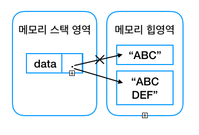

# String, StringBuffer, StringBuilder 비교

:writing_hand: *Assembled by Yunju Jang*

<hr>


- <b>String, StringBuffer, StringBuilder의 공통점</b>
  -  문자열을 저장하고 관리하는 클래스들이다.

<br/>

### String, StringBuffer, StringBuilder의 차이

- <b>String</b>

  > <b>String의 특징</b>
  >
  > - 불변의 성질을 가지고 있다.
  >
  > - StringBuffer, StringBuilder와 다르게 <b>리터럴을 통해 생성되면 그 인스턴스의 메모리 공간은 절대 변하지 않는다.</b>
  >
  > - 리터럴로 생성하면 String Pool 공간에 생성되며, 문자열 값은 절대 변하지 않는다.
  >
  >   - '+' 연산이나, concat() 메서드를 이용하여 변화를 주어도 메모리 공간 내의 값이 변하지 않고,
  >   - String Pool 공간 안에 메로리를 할당 받아 <b>새로운 String 클래스 객체를 만들어</b> 문자열을 나타낸다.
  >
  >   > 예시
  >   >
  >   > ``` Java
  >   > String s = "ABC";
  >   > s += "DEF";
  >   > ```
  >   >
  >   > - String 객체는 내부 데이터를 수정할 수 없으므로 "ABCDEF"라는 <mark>새로운 객체</mark>가 생성되고, data 변수는 이 객체를 참조한다.
  >   > - 기존에 있던 객체는 참조되지 않게 되어 가비지 컬렉션의 메모리 해제를 기다리게 된다.
  >   >
  >   > 
  >
  > <br/>
  >
  > <br/>
  >
  > <b>String의 장점</b>
  >
  > - 불변하기 때문에 단순 조회 연산에서는 타 클래스보다 빠르다.
  > - 불변하기 때문에 멀티쓰레드 환경에서 동기화를 신경 쓸 필요가 없다.
  >
  > <br/>
  >
  > <b>String의 단점</b>
  >
  > - 언제 제거될 지 모른다.
  >   - 새로운 문자열이 만들어지면, 기존의 문자열은 가비지 콜렉터에 의해 제거되어야 하기 때문에
  > - 성능 문제
  >   - 문자열 연산이 많아질 경우, 계속해서 문자열 객체를 만들어 오버헤드를 발생시킨다.
  >
  > <br/>
  >
  > <br/>
  >
  > <b>String과 StringBuffer, StringBuilder와의 차이</b>
  >
  > - String 객체는 한번 생성되면 할당된 공간이 변하지 않지만, 다른 두 클래스의 경우 객체의 공간이 부족해지면 버퍼의 크기를 유연하게 늘려준다.
  >   - String (불변), StringBuffer, StringBuilder(가변)
  >
  > <br/>
  >
  > <b>String 클래스 사용이 적절한 경우</b>
  >
  > - 문자열 연산이 적고, 자주 참조하는 경우에 사용한다.

<br/>

<br/>

- <b>StringBuffer 와 StringBuilder</b>

  > <b>StringBuffer, StringBuilder의 공통적 특징</b>
  >
  > - 크기가 유연하게 변하는 가변적 특성을 가지고 있다.
  >   - 문자열 연산 시 클래스는 한 번만 만들고, 메모리 값을 변경시켜 문자열을 변경한다.
  > - 두 클래스가 제공하는 메서드도 같고, 사용하는 방법도 동일하다.
  >
  > <br/>
  >
  > <b>StringBuffer, StringBuilder의 장점</b>
  >
  > - 문자열 객체를 계속 만들지 않기 때문에 연산이 잦을 때 사용하면 성능이 좋다.
  > - 두 클래스의 메서드들과 같아 호환이 가능하다.
  >
  > <br/>
  >
  > <b>StringBuffer, StringBuilder의 단점</b>
  >
  > - Buffer size를 초기에 설정해야 하는데, 이 동작으로 인해 String 객체보다 생성 속도가 느리게 된다.
  > - 문자열 수정을 할 경우, 마찬가지로 버퍼의 크기를 늘리거나 줄이고, 명칭을 변경해야하는 내부적 연산이 필요하다.
  >   - 많은 양의 수정이 아니라면 String 객체가 나을 수 있다.
  >
  > <br/>
  >
  > <b>StringBuffer와 StringBuilder의 차이</b>
  >
  > - StringBuffer는 멀티쓰레드 환경에서 synchronized 키워드를 사용할 수 있어 멀티스레드 상태에서 동기화를 지원한다. (Thread-safe하다.)
  >
  >   <small>* <mark>Thread-safe</mark> : 멀티 스레드 프로그래밍에서 일반적으로 어떤 함수나 변수, 혹은 객체가 여러 스레드로부터 동시에 접근이 이루어져도 프로그램 실행에 문제가 없음을 뜻함</small>
  >
  > - StringBuilder는 동기화를 지원하지 않기 때문에 멀티쓰레드 환경에 적합하지 않다. (Thread-safe 하지 않음)
  >
  >   - 대신, StringBuffer에 비해 싱글쓰레드 환경에서 연산처리가 빠르다.
  >
  > - StringBuilder가 StringBuffer 보다 속도는 빠르지만, 현업에서는 언제 멀티스레드 환경에서 돌아갈지 알 수 없어, 안정적인 StringBuffer를 사용하기도 한다.
  >
  > <br/>
  >
  > <br/>
  >
  > <b>StringBuffer, StringBuilder가 적절한 경우</b>
  >
  > - 문자열 연산이 많을 때 두 클래스를 사용한다.
  > - 멀티쓰레드 환경에서는 StringBuffer를 사용한다.
  > - 싱글쓰레드 환경이거나 멀티쓰레드 환경이지만 동기화가 필요 없는 경우 (1만번 미만의 연산인 경우) StringBuilder를 사용한다. 
  >   - 연산이 많지 않은 경우는 StringBuffer나 StringBuilder나 차이가 거의 없다.
  >
  > <br/>
  >
  > <br/>
  >
  > > StringBuffer 예제
  > >
  > > ``` Java
  > > public class StringBuffer_Ex{
  > >  public static void main(String[] args){
  > >      String s = "abcdefg";
  > >      StringBuffer sb = new StringBuffer(s);
  > > 
  > >      System.out.println("처음 상태 : " + sb); // 처음 상태 : abcdefg
  > >      System.out.println("문자열 String 반환 : " + sb.toString()); // String 변환 : abcdefg
  > >      System.out.println("문자열 추출 : " + sb.substring(2, 4)); // 문자열 추출 : cd
  > >      System.out.println("문자열 추가 : " + sb.insert(2, "추가")); // 문자열 추가 : ab추가cdefg
  > >      System.out.println("문자열 삭제 : " + sb.delete(2, 4)); // 문자열 삭제 : abcdefg
  > >      System.out.println("문자열 연결 : " + sb.append("hijk")); // 문자열 연결 : abcdefghijk
  > >      System.out.println("문자열의 길이 : " + sb.length()); // 문자열 길이 : 11
  > >      System.out.println("용량의 크기 : " + sb.capacity()); // 용량의 크기 : 23
  > >      System.out.println("문자열 역순 변경 : " + sb.reverse()); // 문자열 역순 변경 : kjihgfedcba
  > >      System.out.println("마지막 상태 : " + sb); // 마지막 상태 : kjihgfedcba
  > >  }
  > > }
  > > ```

  <br/>

<br/>

## 예상질문❔

Q1) String 과 StringBuffer, StringBuilder 와의 차이는 무엇인가?

A1) String은 변하지 않는 메모리 공간을 가지고 있어 + 연산이나 수정이 필요하면 새로운 객체를 만들고 이 객체를 리턴한다, 기존의 객체는 쓸모 없어진다. 그러나 StringBuffer나 StringBuilder는 가변적 성질을 가지고 있어 수정 시 해당 객체를 수정하기 때문에 +연산이나 수정에 유리하다.

<br/>

Q2) StringBuffer와 StringBuilder의 차이는 무엇인가?

A2) StringBuffer는 동기화를 제공하여 Thread-safe하다. 따라서 멀티 쓰레드 환경에 적합하다. 그에 비해 StringBuilder는 동기화를 제공하지 않기 때문에 Thread-safe 하지 않지만, 단일 쓰레드 환경일 경우 StringBuffer 보다 빠르다는 장점이 있다.

<br/>

<br/>

### Reference📖

- https://jeong-pro.tistory.com/85
- https://coding-factory.tistory.com/546
- https://gofnrk.tistory.com/83
- https://gompangs.tistory.com/entry/OS-Thread-Safe%EB%9E%80
