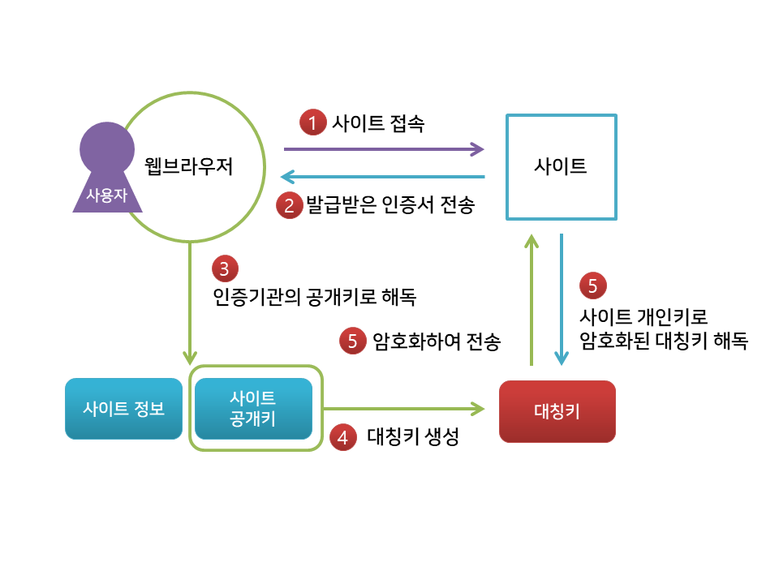
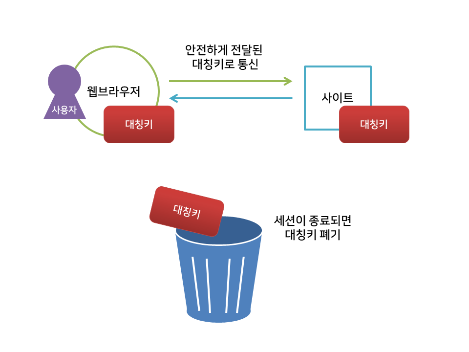

# HTTP와 HTTPS

:writing_hand: *Assembled by Yunju Jang*

🤝*Contributors : JiYoung Kwon*

<hr>


- HTTP 란?


  - HyperText Transfer Protocol
  - 인터넷에서 웹 서버와 사용자 컴퓨터에 설치된 웹 브라우저 사이에 문서를 전송하기 위한 통신 규약 (Protocol)이다.
  - 인터넷에서 Hypertext를 전송하기 위해 사용되는 통신 규약이다.
  - 80번 포트를 이용한다.

    - 클라이언트가 80번 포트에서 서버에 연결하면 80번 포트에서 기다리고 있던 서버는 요청에 응답하면서 자료를 전송한다.
  - Http는 정보를 텍스트로 주고 받는다. <small>네트워크에서 전송 신호를 인터셉트 하는 경우 데이터 유출이 발생할 수 있다. --> 이러한 취약점을 보완한 것이 Https이다.</small> 

  <br/>

- HTTP의 구조

  


  - 애플리케이션 레벨의 프로토콜로, TCP/IP 위에서 작동한다.
  - Stateless 프로토콜이며, Method, Path, Version, Headers, Body 등으로 구성된다.

  <br/>

  <br/>


  - HTTPS 란? 

    - Http + S (Secure Socket)

    - 기본 골격이나 사용 목적 등은 Http 와 거의 동일하지만,

      - 데이터를 주고 받는 과정에 <b>보안 요소가 추가</b>된다. (Http와의 차이점)

    - SSL(Secure Socket Layer)라는 프로토콜을 이용하여 인터넷 상에서의 정보를 암호화한다.

    - 443번 포트를 사용한다.

    - 네트워크 상에서 중간에 제3자가 정보를 볼 수 없도록 공개키 암호화를 지원한다.

    - 실제 전송되는 <b>데이터의 암호화에는 대칭키 암호화</b> 방식을 사용하고, <b>키 교환에는 공개키 암호화</b>를 사용한다.

      > 공개키 / 개인키
      >
      > ```
      > 공개키는 모두에게 공개가 가능한 키이고,
      > 개인키는 나만 가지고 알고 있어야 하는 키이다.
      > ```
      >
      > 
      >
      > - 공개키 암호화 : 자신만 볼 수 있는 <b>개인키</b>로만 복호화 할 수 있음
      > - 개인키 암호화 : <b>공개키</b>로만 복호화할 수 있음, 공개키는 모두에게 공개되어 있어 내가 인증한 정보임을 알려 신뢰성을 보장할 수 있음
      > - 처리속도가 느림
      >
      > <br/>
      >
      > 대칭키
      >
      > - 처리속도가 빠르지만, 서버와 클라이언트가 같은 키를 사용하여, 키를 공유하는 데에 문제가 있음

<br/>

- HTTPS의 동작 과정

  - 인증서 발급

    

    1. 인터넷 사이트는 자신의 정보와 공개키를 인증 기관에 제출한다.

    2. 인증 기관은 제출된 데이터를 검증한 후, 사이트에서 암호화하여 인증서를 발급한다.

    3. 인증 기관은 웹 브라우저에게 자신의 공개키를 제공한다.

  <br/>

  - 사용자의 사이트 접속

    

    1. 사용자가 사이트에 접속하여 자신의 인증서를 웹 브라우저에 보낸다.
    2. 브라우저는 미리 받아둔 인증기관의 공개키로 인증서를 해독하여 검증하고, 사이트의 정보와 사이트의 공개키를 알게 된다.
    3. 얻은 사이트 공개키로 대칭키를 암호화하여 다시 사이트에 전송한다.
    4. 사이트는 개인키로 암호화된 대칭키를 얻게 되고, 이제 대칭키로 데이터를 주고 받을 수 있다.

    <br>

    

  <br/>

<br/>

- HTTP와 HTTPS 의 비교

  - Http에 비해 보안 기능이 추가된 Https가 처리 속도가 더 느리다. <small>오늘 날에는 거의 차이를 느끼지 못한다.</small>

  - 사용자 정보를 웹 서버와 주고 받아야 하는 경우 Http는 정보 유출의 위험성이 있다.

  - 정보 공유 시 SEO에 의해 Https 를 이용하는 사이트가 우선 검색될 수 있다.

    - 보안 문제가 대두되면서, 구글에서는 HTTPS를 사용하는 웹 사이트에 대해 검색 순위 결과에 약간의 가산점을 줌

  - 가속화된 모바일 페이지 (AMP, Accelerated Mobile Pages)를 만들 때에는 HTTPS를 사용한다.

    > AMP
    >
    > ```
    > 모바일 기기에서 훨씬 빠르게 콘텐츠를 로딩하기 위한 방법으로 Google이 만듦
    > HTML에서 불 필요한 부분을 없앤 것이라고 볼 수 있다.
    > ```

  - Https는 인증서를 발급하고 유지하기 위한 추가 비용이 발생하므로, 단순 정보 조회 등만을 처리한다면 Http를 이용하는 것이 좋다.

<br/>

<br/>

## 예상질문❔

Q1) Http와 Https의 차이는 무엇인가?

A1)  Http는인터넷에서 하이퍼텍스트를 전송하기 위한 통신 프로토콜이며 보안이 되지 않기 때문에 정보 유출의 위험이 있다. Https는 이에 보안 요소가 추가된 프로토콜이다. 사용자 정보등을 주고 받을 때에 암호화를 해주며, Http에 비해 보안 기능이 추가되었기 때문에 처리 속도가 약간 느리다.

<br/>

### Reference📖

- https://post.naver.com/viewer/postView.nhn?volumeNo=16561296&memberNo=1834
- https://jeong-pro.tistory.com/89
- https://mangkyu.tistory.com/98
