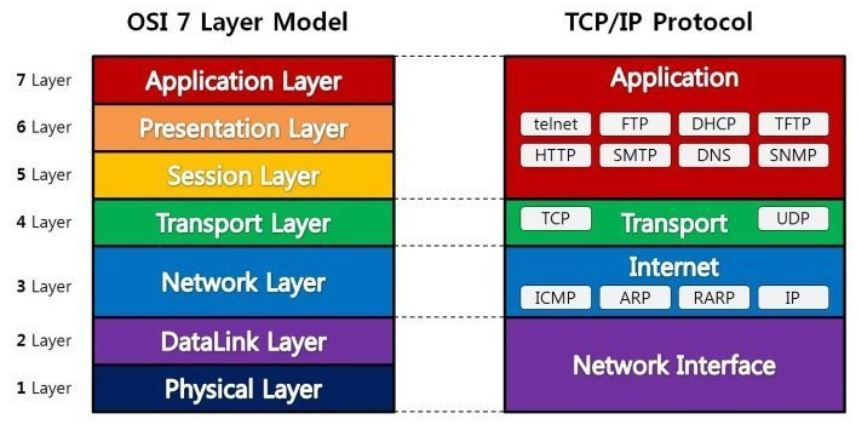

# OSI 7계층

:writing_hand: *Assembled by Yunju Jang*

🤝*Contributors : Jiye Bae*

- OSI 7계층 정의

  ​	국제 표준화 기구 (ISO)가 발표한 네트워크에서 통신이 일어나는 과정을 7단계로 나눈 것이다.

  ​	통신 구조의 모델과 프로토콜의 표준 뼈대를 제공하기 위해 개발되었다.

  

 

- OSI 7계층 개념
  - 계층을 7단계로 구분하고 표준화했기 때문에 여러 회사 장비를 사용해도 네트워크에 이상이 없다.
  - 상위 계층과 하위 계층으로 나뉜다.
  - Encapsulation : 응용 계층에서 부터 데이터에 각각 헤더가 붙어 물리 계층까지 한단계씩 넘겨준다. 최종적으로는 이진 비트가 전송된다.
  - Decapsulation : 수신자가 받은 데이터를 다시 물리 계층 부터 헤더의 정보를 확인하고 떼어내는 과정을 응용 계층까지 반복한다.

 

 

- 계층 분류

  - 1계층 - 물리계층 (Physical Layer)
    - 주로 전기적, 기계적, 기능적 특성을 이용해 통신 케이블로 데이터를 전송한다.
    - 통신 단위는 비트 (On, Off 상태)로, 데이터 전달만 할 뿐, 어떤 데이터인지는 신경쓰지 않는다.
    - 대표적인 장비 : 통신 케이블, 리피터, 허브

   

  - 2계층 - 데이터 링크 계층 (Data Link Layer)
    - 물리 계층을 통해 송수신되는 정보의 오류와 흐름을 관리하여 안전한 정보를 전달하는 역할이다.
    - 통신에서의 오류 찾기, 재전송 기능을 가지고 있다.
    - MAC 주소를 가지고 통신하게 된다.
    - 전송 단위는 프레임이다.
    - 대표적인 장비 : 브리지, 스위치

   

  - 3계층 - 네트워크 계층 (Network Layer)
    - 데이터를 목적지까지 가장 안전하고 빠르게 전달하는 기능을 한다. 이를 라우팅이라고 한다.
    - 경로를 선택하고 주소를 정하고, 경로에 따라 전송 단위인 패킷을 전달해준다.
    - 대표적인 장비 : 라우터

   

  - 4계층 - 전송 계층 (Transport Layer)
    - 송신자와 수신자 간의 효율적 데이터 전송을 위해 오류 검출 및 복구, 흐름제어와 중복검사를 수행한다.
    - 패킷들의 전송이 유효한지 확인하고 전송 실패한 패킷들을 다시 전송한다.
    - 양 끝단의 사용자들이 신뢰성 있는 데이터를 주고 받도록 하는 역할이다.
    - 데이터 전송 단위는 세그먼트이다.

   

  - 5계층 - 세션 계층 (Session Layer)
    - 응용 프로그램에서의 데이터가 통신하기 위한 논리적인 연결이다.
    - 세션 설정, 유지, 종료, 전송 중단 시 복구 등의 기능이 있다.
    - 양 끝단의 응용 프로세스가 통신을 관리하기 위한 방법을 제공한다.

   

  - 6계층 - 표현 계층 (Presentation Layer)
    - 전송 데이터의 형식을 결정하는 계층이다.
    - 데이터의 표현이 상이한 응용 프로세스의 독립성을 제공하고, 암호화한다.

   

  - 7계층 - 응용 계층 (Application Layer)
    - 사용자 인터페이스의 여갈을 담당하는 계층이다.
    - 사용자가 이용하는 네트워크 응용 프로그램이 해당된다.

 

## 예상 질문 ❔

Q1) OSI 7계층은 무엇인가?

A1) 네트워크 통신의 표준성 확보를 위해 국제 표준화 기구 ISO에서 개발한 통신 구조로, 1단계 물리 계층부터, 7단계 응용 계층까지 구조화되어 있다. 

 

### Reference📖

- https://shlee0882.tistory.com/110
- https://reakwon.tistory.com/59
- https://tar-cvzf-studybackup-tar-gz.tistory.com/37
