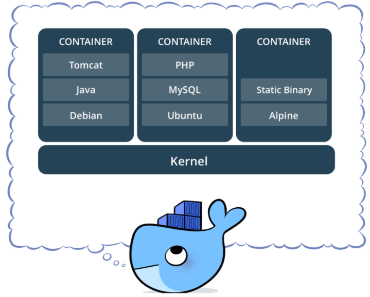
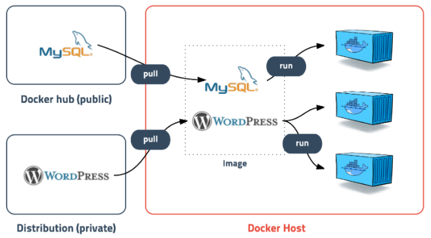
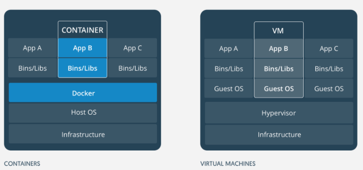
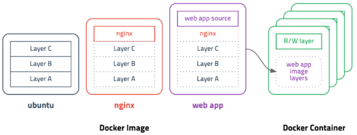

# Docker

:writing_hand: *Assembled by Yunju Jang*

🤝*Contributors : JiYe Bae, Jeonghea Shin*

<hr>


- <small><참고></small> <b>가상화란?</b>

  ```
  물리적인 하드웨어 장치를 논리적인 객체로 추상화하는 것
  즉, 하나의 자원을 쪼개서 쓰거나, 여러개의 자원을 하나인 것 처럼 묶어서 쓸 수 있도록 해준다.
  ```

<br/>


  - <b>Docker 란?</b>

  - 애플리케이션을 신속하게 구축, 테스트 및 배포할 수 있는 <b>컨테이너 기반</b> 오픈 소스 가상화 플랫폼이다.
    - 소프트웨어를 컨테이너라는 표준화된 유닛으로 패키징하는 기술이다.'
  - 컨테이너에는 라이브러리, 시스템 도구, 코드, 런타임 등 소프트웨어를 실행하는 데 필요한 모든 것이 포함되어 있다.

<br/>
    

- <b>Docker에서 중요한 개념 2가지</b>


  - <b>컨테이너 (Container)</b>

    > 
    >
    > - 격리된 공간에서 프로세스가 동작하는 기술이다.
    > - 다양한 프로그램, 실행 환경을 추상화하고 동일한 인터페이스를 제공하여 프로그램의 배포 및 관리를 단순하게 해준다.
    >
    > <br/>
    >
    > <br/>
    >
    > <b>컨테이너의 장점</b>
    >
    > - <b>가볍고 빠른 실행 속도</b>
    >
    >   - Hypervisor* 엔진을 사용하지 않고 Docker Engine을 사용하여 Guest OS 없이 실행이 가능하므로, 더 빠른 속도를 보장할 수 있다.
    >
    >   <small>hypervisor : 호스트 컴퓨터에서 다수의 운영체제를 동시에 실행하기 위한 논리적인 플랫폼으로, 가상화 머신 모니터(VMM, virtual machine monitor)라고도 부른다.</small>
    >
    >   <br/>
    >
    > - <b>높은 직접도</b>
    >
    >   - 여러개의 컨테이너를 만들어 실행중이라 해도, OS는 하나이기 때문에 고밀도가 가능하다.
    >   - 컨테이너에서는 실행되는 프로세스를 위한 메모리만 사용하기 때ㅜㅁㄴ에 낮은 사양에서도 동작할 수 있다.
    >
    >   <br/>
    >
    > - <b>낮은 오버헤드</b>
    >
    >   - 가상화를 위한 하드웨어 애뮬레이터 단계 없이, 분리된 공간을 만들기 때문에 오버헤드가 낮다.
    >
    > <br/>
    >
    > <b>컨테이너의 단점</b>
    >
    > - <b>호스트의 운영체제에 종속적</b>
    >   - 호스트 운영체제의 커널을 공유하여 호스트 운영체제 환경을 그대로 사용해야 한다.
    > - <b>컨테이너별 커널 구성이 불가능</b>
    >   - 커널 하나를 공유하므로 컨테이너마다 다른 커널 작업을 수행할 수 없다.
    >
    > <br/>
    >
    > <small>* 컨테이너, 오버레이 네트워크, 유니온 파일 시스템 등 이미 존재하는 기술을 잘 조합하고 사용하기 쉽게 만들어 도커가 유명해진 것이다.</small>

  <br/>


  - <b>이미지</b>

    >
    >
    >- 컨테이너 실행에 필요한 파일과 설정값 등을 포함하고 있는 것이다.
    >- 이미지를 실행한 상태가 컨테이너이다.
    >
    ><br/>
    >
    ><b>이미지 사용의 장점</b>
    >
    >- 같은 이미지에서 여러개의 컨테이너를 생성할 수 있고, 컨테이너의 상태가 바뀌거나 삭제되더라도 이미지는 변하지 않는다.
    >- 즉, 새로운 서버가 추가되면 미리 만든 이미지를 다운 받아 컨테이너를 생성하기만 하면 된다.
    >- 컨테이너를 실행하기 위한 모든 정보를 가지고 있기 때문에 의존성 파일을 컴파일하고 다른 것을 설치할 필요가 없다.

<br/>

<br/>

- <b>Docker와 가상머신의 차이</b>

  

  - OS 내부에는 물리적 자원을 관리하는 커널 공간과, 사용자 프로세스를 실행하는 사용자 공간으로 나뉜다.

  <br/>

  - <b>가상머신</b>은 OS를 자체적으로 가진다.
    - 즉, 가상머신은 독립된 커널 공간을 가지는 OS를 구성한다.
    - 하이퍼바이저로 가상머신을 올려 가상화한다.

  <br/>

  - <b>컨테이너</b>는 사용자 공간을 여러 개로 나누어 사용한다.
    - 즉, 컨테이너는 커널 공간을 공유하여 좀 더 가볍고 빠르다.
    - Docker 위에 컨테이너를 올려 가상화한다.
    - 가상화 오버헤드가 거의 발생하지 않는다.
    - 어느 환경에서든지 동일하게 작용한다.

<br/>

<br/>

- <b>도커를 사용하는 경우</b>

  - 마이크로 서비스

    - 도커 컨테이너를 통해 표준화된 코드 배포를 활용하여 분산 애플리케이션 아키텍처를 구축하고 확장한다.

    <br/>

  - 데이터 처리

    - 빅데이터 처리를 서비스로 제공한다. 데이터 및 분석 패키지를 기술자가 아닌 사용자도 실행할 수 있는 이동식 컨테이너로 패키징한다.

    <br/>

  - 서비스로서의 컨테이너

    - 안전한 IT 관리형 인프라와 콘텐츠로 분산 애플리케이션을 구축 및 제공한다.

<br/>

<br/>

- <b>레이어 저장 방식</b>

  - 도커 이미지는 컨테이너를 실행하기 위한 모든 정보를 가지고 있기 때문에 용량이 매우 크다.
  - 처음 이미지를 다운 받으면 크게 부담되지 않지만, 기존 이미지에 파일이 하나 추가되었다고 다시 다운 받는 것은 비효율적이다.
  - 따라서 레이어라는 개념을 도입하고 유니온 파일 시스템을 이용하여 여러개의 레이어를 하나의 파일 시스템으로 사용할 수 있게 해준다.

  <br/>

  

  - 이미지는 여러개의 읽기 전용 레이어로 구성되고, 파일이 추가되거나 수정되면 새로운 레이어가 생성된다.
  - 컨테이너를 생성할 때에도 레이어 방식을 사용하여 기존의 이미지 레이어 위에 읽기/쓰기 레이어를 추가한다.
  - 이미지 레이어를 그대로 사용하면서 컨테이너가 실행중에 생성하는 파일이나 변경된 내용은 읽기/쓰기 레이어에 저장되므로 
    - 여러개의 컨테이너를 생성해도 최소한의 용량만 사용한다.

<br/>

<br/>

## 예상질문❔

Q1) 도커란 무엇인가?

A1) 리눅스 컨테이너를 자동으로 생성하고 응용 프로그램들을 이 컨테이너 안에 배치시키는 일을 자동화 하는 오픈 소스 소프트웨어 플랫폼이다.

<br/>

### Reference📖

- https://github.com/fake-developers/1st/blob/main/SJH/Doker.md
- https://github.com/fake-developers/1st/blob/main/BJY/Docker.md
