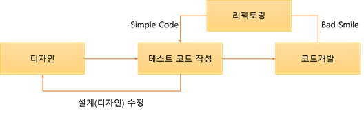

# TDD란 ?

:writing_hand: *Assembled by Yunju Jang*

🤝*Contributors : Jiye Bae*

- TDD 정의

  Test-driven development, 테스트 주도 개발

  소프트웨어 개발 방법론 중 하나로, 매우 짧은 개발 사이클을 반복하는 방법이다.

  애자일 방법론 중 하나인 익스트림 프로그래밍의 'Test-First' 개념에 기반을 둔 단순한 설계를 중요시한다.

 

- TDD의 개념

  ​	테스트 코드를 작성한 뒤에 실제 코드를 작성한다.

  ​	그 과정에서 제대로 동작하는지에 대한 피드백을 적극적으로 받는다.

   

- 일반 개발 방식과의 차이

  

  - 보통의 개발 방식은 '요구사항 분석 -> 설계 -> 개발 -> 테스트 -> 배포'의 형태를 갖는다.
    - 고객의 요구사항은 명확하지 않을 수 있다.
    - 처음부터 완벽한 설계는 어렵다.
    - 재설계 시 코드를 삽입, 수정, 삭제하는 과정에서 불필요한 코드가 남거나 중복될 가능성이 있다.
    - 이러한 코드들은 유지보수를 어렵게한다.

   

  

  - TDD 개발방식은 선 테스트 후 코드 작성으로,
    - 테스트 도중 예외사항을 테스트 케이스에 추가하고 설계를 개선한다.
    - 이후 테스트가 통과된 코드만을 개발 단계에서 실제 코드로 작성한다.
    - 이러한 코드들은 버그가 적고, 간결하다.

   

- TDD의 장점

  - 객체지향적인 코드 개발

    ​	테스트 코드를 먼저 작성하면, 기능과 구조의 명확성이 높아진다.

    ​	테스트의 용이성을 위해 복잡한 기능을 한 함수에 모두 구현할 경우 복잡해지기 때문에, 이를 염두에 두어 자연스럽게 코드의 재사용성이 보장된다.

    +) 재사용성은 유지보수의 용이라는 장점도 가져온다.

     

  - 설계 수정 시간의 단축

    ​	테스트 코드를 먼저 작성하기 때문에 최초 설계안을 만족시키며 입출력 구조와 기능의 정의를 명확히 하게 되므로 설계의 구조적 문제를 빠르게 찾아낸다.

    따라서 예외 사항을 밈리 조사하게 되는 효과가 발생하여 예외 코드를 작성하기 용이하다.

     

  - 디버깅 시간의 단축

    ​	단위 테스트 기반의 테스트 코드를 작성하기 때문에 모듈 별 테스트 진행 시 영역의 분할을 통해 문제점을 쉽게 찾아낼 수 있다.

    +) 만약 TDD 개발이 아니라면 문제가 발생할 수 있는 지점이 DB, APPLICATION, DATA 등 영역이 다양하여 모든 영역의 코드를 살펴봐야하기 때문에 통합테스트 시 쉽게 찾을 수 없다. 

 

 

## 예상 질문❔

Q1) TDD란 무엇인가?

A1) 소프트웨어 개발 방법론 중 하나로, 일반적인 개발 방법과 달리, 일부만 작성된 테스트 코드로 테스트하고 이후에 개발을 반복하는 프로세스를 가지고 있다.

 

Q2) TDD 의 장점은 무엇인가?

A2) 테스트 코드를 먼저 작성하여 기능과 구조의 명확성을 갖게 되고, 이렇게 개발된 코드는 재사용성이 높아진다.

 

### Reference📖

- https://gmlwjd9405.github.io/2018/06/03/agile-tdd.html

- https://m.blog.naver.com/suresofttech/221569611618
- https://wooaoe.tistory.com/33
