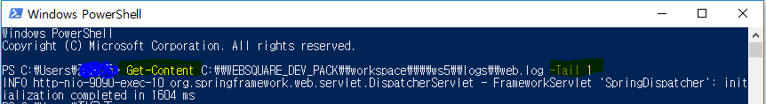
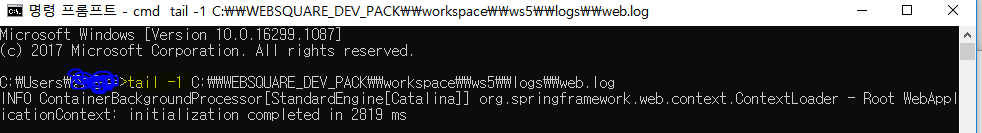

# 💡 Windows cmd에서 tail 명령어 사용하기

✔ 참고 ) tail 명령어

- Linux 계열 시스템 유틸리티로, 입력 받은 파일의 내용을 뒤에서부터 출력해주는 명령어이다.
- Linux 계열에서는 사용 가능하나, Windows 운영체제에서는 따로 지원하지 않는다.

<br/>

<br/>

### 방법1. PowerShell을 이용한다.

- 윈도우 프로그램 중 PowerShell을 이용하면 tail에 해당하는 명령어를 사용할 수 있다.

  ``` powershell
  Get-Content 파일경로\파일명 -Wait -Tail 10
  ```

  - Wait 옵션 : 파일이 업데이트 되면 지속적으로 출력
  - Tail 옵션 : -n 번째 줄까지 출력

  

<br/>

<br/>

### 방법2. tail 실행 파일을 윈도우에 따로 설치하여 사용한다.

✔ 설치 파일은 첫번째 Reference 참고

- zip 파일을 다운로드 받아서 압축을 푼다.

- 32bit 윈도우의 경우 모든 파일을 C:\WINDOWS\system32 에 넣는다.

- 64bit 윈도우의 경우 tail.exe와 grep.exe를 C:\WINDOWS\system32에 넣는다.

  - 나머지 dll 파일들은 C:\WINDOWS\SysWOW64에 넣는다.

- cmd에서 tail 명령어를 리눅스 환경과 동일하게 사용할 수 있다.

  

<br/>

<br/>

### 방법 3) i-Tail 과 같은 tail 프로그램을 설치하여 사용한다.

✔ 나는 쉘 스크립트에서 tail을 사용하기 위함이라 이 방법은 따로 해보지 않았음

- wintail, i-Tail, baretail 등 다양한 프로그램이 존재한다.
- 기본적으로 tail 명령어를 제공하고, 하이라이트 효과나 인코딩 등 약간의 차이가 있다.
- UI를 통해 로그를 볼 수 있어서, 해당 목적으로 사용할 경우 사용해보면 좋을 것 같다.

<br/>

<br/>

<br/>


<hr>


### Reference📖

- https://yamoe.tistory.com/349
- https://yuien.tistory.com/entry/Windows-%EC%9C%88%EB%8F%84%EC%9A%B0%EC%97%90%EC%84%9C-Tail-%EB%AA%85%EB%A0%B9%EC%96%B4-%EC%82%AC%EC%9A%A9-%EB%B0%A9%EB%B2%95
- https://bryan7.tistory.com/1009
