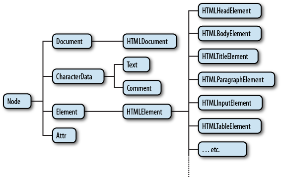

# BOM과 DOM

:writing_hand: *Assembled by Yunju Jang*

🤝*Contributors : Jiye Bae*

- Object Model 이란?

  ​	웹 브라우저의 구성요소들은 객체화되어 있다. 

  ​	이 객체들 제어하여 웹 브라우저를 제어할 수 있고, 서로 계층적인 관계로 구조화 되어있다.

  ​	Object Model은 크게 DOM, BOM으로 분류할 수 있다.

   

- BOM 정의

  ​	Browser Object Model

  ​	브라우저와 관련된 내용들 <small>(ex. 즐겨찾기, 기록, URL 정보 등)</small>, 즉 객체들의 집합을 BOM이라고 한다.

   

- BOM의 역할

  ​	웹 브라우저 창을 관리할 목적으로 제공되는 객체 모음을 대상으로 하는 모델로, 자바스크립트 등에서 사용 가능하다.

  ​	window 객체를 통해 접근할 수 있다.

  - window 객체 모델
    - navigator : 브라우저명과 버전 정보를 속성으로 가진다.
    - window : 최상위 객체로, 각 프레임별 하나씩 존재한다.
    - document : 현재 문서에 대한 정보이다.
    - location : 현재 URL에 대 한 정보로 브라우저에서 사용자가 요청하는 URL이다.
    - history : 현재의 브라우저가 접근했던 URL history를 보여준다.
    - screen : 브라우저의 외부 환경에 대한 정보를 제공한다.

    

- DOM 정의

  ​	Document Object Model

  ​	브라우저가 웹 문서를 이해할 수 있도록 트리구조로 구성한 것이다.

  ​	ex. body 내부에 img 요소 등	

  

  ​	문서 (열려있는 페이지)에 대한 모든 정보를 객체화 시켜 관리한다.

  

- DOM tree 구조

  

  - 웹 문서의 요소를 계층적 구조로 인식하는 DOM 구조는 노드와 가지로 표현한다.
    - 문서 노드 (Document Node) : 최상위 노드로, 하위 노드에 접근하기 위해 거친다.
    - 요소 노드 (Element Node) : 웹 문서의 태그, 자식 노드 (attribute node, text node) 를 변경하여 웹 페이지를 동적으로 조작할 수 있다.
    - 속성 노드 (Attribute Node) : 태그의 모든 속성에 해당한다.
    - 텍스트 노드 (Text Node) : 태그 내 텍스트를 표현한다.

   

  - 모든 텍스트와 이미지, 태그의 속성들까지 객체화하여 표현한다.

   

   

- DOM의 역할

  - html, xml 문서의 프로그래밍 인터페이스로 문서와 문서의 요소(element)에 접근하기 위해 사용된다.
  - 문서 구조, 스타일, 내용 등<small>(html이나 css의 내용)</small>을 변경할 수 있도록 태그(요소)들을 제어한다.

 

 

## 예상질문❔

Q1) BOM이란 무엇인가?

A1) 브라우저에 관련된 내용들을 객체화하여 가지고 있는 객체의 집합이다.

 

Q2) DOM이란 무엇인가?

A2) 브라우저가 웹 문서를 이해할 수 있도록 해당 페이지 안의 문서 내용을 트리 구조로 구성한 객체의 집합이다.

 

### Reference📖

- https://velog.io/@songsong2920/DOM
- https://kevinthegrey.tistory.com/14
- https://cbw1030.tistory.com/46
- https://heecheolman.tistory.com/35
- https://crucifi.tistory.com/32
- https://chrismare.tistory.com/m/entry/Object-ModelDOM-BOM?category=973304
