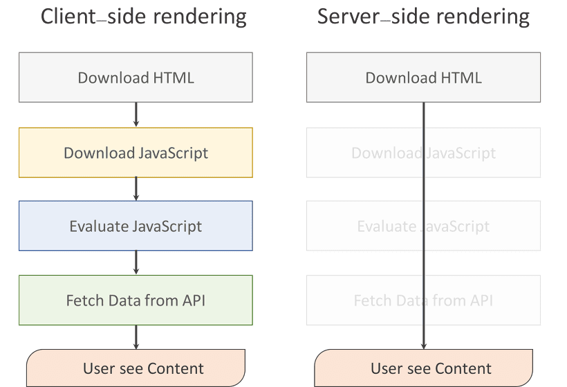

# CSR과 SSR

:writing_hand: *Assembled by Yunju Jang*

🤝*Contributors : JiYoung-Kwon, Jeonghea Shin*

- CSR 이란?

  - Client Side Rendering

  - 최초에 서버에서 한 번 관련 파일을 모두 로딩한 후, 사용자 요청 시 마다 리소스를 서버에 제공하여 클라이언트가 해석하고 렌더링하는 방식이다.

    <small> +) 렌더링 : 서버로 부터 HTML 파일을 받아 브라우저에 뿌려주는 과정 </small>

  - 로딩 이후에는 서버에 데이터만 요청하고, 자바스크립트로 뷰를 컨트롤 한다.

   

- CSR 장단점

  - 장점
    - 첫 로딩에 HTML, static 파일들을 받으면 동적으로 빠르게 렌더링되어 사용자 UX가 뛰어나다.
    - 서버에 요청하는 횟수가 적어 서버 부담이 덜하다.

   

  - 단점
    - 모든 HTML과 static 파일이 로드될 때까지 기다려야 한다.
    - SEO (검색엔진 최적화) 문제가 발생할 수 있다.

   

   

- SSR 이란?

  - Server Side Rendering
  - 서버에서 렌더링을 마치고, Data가 결합된 HTML 파일을 내려주는 방식이다.
  - 요청 시 마다 새로고침이 일어나 서버에 새로운 페이지에 대한 요청을 하는 방식이다.

   

- SSR 장단점

  - 장점
    - 초기 로딩 속도가 빨라 사용자가 콘텐츠를 빨리 볼 수 있다.
    - 모든 검색엔진에 대한 SEO가 가능하다.

   

  - 단점
    - 매번 페이지를 요청할 때마다 새로고침되어 사용자 UX가 다소 떨어진다.
    - 서버에 매번 요청을 하기에 트래픽과 서버 부하가 커진다.

   

   

- CSR과 SSR 비교

|              |                             CSR                              |                             SSR                              |
| :----------: | :----------------------------------------------------------: | :----------------------------------------------------------: |
| 초기로딩속도 | 모든 자바스크립트 파일을 받아와야 한다. **--> 초기에 오래 걸린다**. | 다운 받는 파일이 상대적으로 적다. **--> 속도가 빠르다**. |
|  서버 부담   | 데이터 요청이 있을 때만 서버에 요청한다. **--> 서버 부담이 적다.** | View 변경 마다 서버에 응답한다. **--> 서버에 부담이 된다. ** |
|     SEO      | 처음 HTML 파일은 비어있다. **--> 크롤러가 데이터를 수집할 수 없다.** (단, 구글 제외) | HTML에 대한 정보가 포함되어 있다. **--> 데이터 수집이 가능하다.** |

 

- SEO (검색 엔진 최적화)

  - CSR

    - View를 생성하기 위해 자바스크립트를 통해 동적 렌더링한다.
    - 대부분의 웹 크롤러, 봇이 자바스크립트를 크롤링하지 못해 HTML을 빈 페이지로 인식하여 SEO 사용이 불가능하다.

   

  - SSR

    - View를 서버에서 전부 렌더링하여 HTML에 모든 컨텐츠가 저장되어 있어 SEO 사용이 가능하다.

   

 

## 예상질문❔

Q1) CSR이란 무엇인가?

A1) 최초 요청 시 모든 리소스를 미리 로딩하고, 이후에는 서버에 데이터만 요청하여 뷰를 컨트롤 하는 렌더링 방식이다. 최초 로딩 이후 요청 시에는 상대적으로 로딩 시간이 빠르다.

 

Q2) SSR이란 무엇인가?

A2) 서버에서 렌더링을 마치고 완성된 HTML 파일을 내려주는 방식으로, 요청 시 마다 새로고침이 일어나 새로운 페이지를 제공하는 렌더링 방식이다.

 

### Reference📖

- https://github.com/fake-developers/1st/blob/SJH-01/SJH/CSR%26SSR%20Difference.md
- https://github.com/fake-developers/1st/edit/KJY-01/KJY/%5BWEB%5D%20CSR%EA%B3%BC%20SSR%20%EC%B0%A8%EC%9D%B4.md
