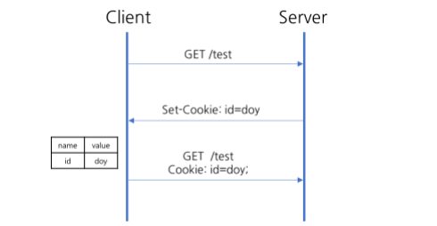
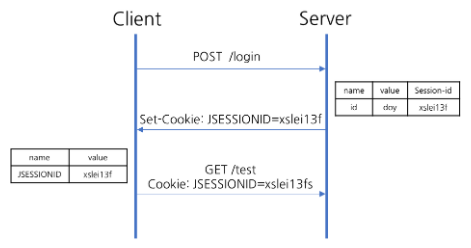

# 쿠키와 세션

:writing_hand: *Assembled by Yunju Jang*

🤝*Contributors : JiYoung-Kwon, Jeonghea Shin*

- 쿠키 (Cookie) 란?

  ​	클라이언트 로컬에 저장되는 키, 값 쌍으로 이루어진 데이터 파일이다.

  

  

- 쿠키의 구성요소

  - 이름 : 각각의 쿠키를 구별하는 데 사용되는 이름
  - 값 : 쿠키의 이름과 관련된 값
  - 유효 시간 : 쿠키의 유지 시간
  - 도메인 : 쿠키를 전송할 도메인
  - 경로 : 쿠키를 전송할 경로 

   

  - 쿠키의 동작 방식

    

    1) 클라이언트가 서버에 페이지를 요청한다.

    2) 서버에서 상태를 유지할 값을 쿠키로 생성한다.

    3) 서버가 클라이언트에 응답하면서 HTTP 헤더에 쿠키를 포함시킨다.

    4) 클라이언트가 서버에 페이지 재요청 시 받았던 쿠키 정보도 같이 HTTP 헤더에 넣어서 요청한다.

    5) 서버는 클라이언트의 요청에서 쿠키 값을 참고하여 이전 상태 정보를 확인 후 응답한다.

    

 

  - 세션이란?

    - 일정 시간동안 브라우저로부터 들어오는 일련의 요구를 하나의 상태로 보고, 그 상태를 일정하게 유지시키는 기술이다.
    - 클라이언트의 정보를 세션 ID를 부여하여 서비스가 돌아가는 서버에 저장한다.

     

  - 세션의 동작 방식

​		1) 클라이언트가 서버에 페이지를 요청한다.

​		2) 서버가 해당 클라이언트에 Session ID를 부여한다.

​		3) 서버가 클라이언트에 응답하면서 HTTP 헤더에 Session ID를 포함하여 응답한다.

​		4) 클라이언트는 발급 받은 세션 아이디를 쿠키로 저장한다.

​		5) 클라이언트가 서버에 페이지 재요청 시, Session ID가 담겨있는 쿠키를 HTTP 헤더에 넣어 요청한다.

 

 

- 쿠키와 세션을 사용하는 이유

  - <mark>HTTP 프로토콜의 특징</mark>을 보완하기 위해 사용한다.

- <b>Connectionless (비연결지향)</b> : 클라이언트가 요청하면 응답 후 접속을 끊는 특성

  - <b>Stateless (상태 없음)</b> : 연결을 끊는 순간 클라이언트와 서버의 통신이 끝나며, 상태 정보를 유지하지 않는 특성
  - 즉, HTTP 프로토콜에서 <mark>상태</mark>를 유지하기 위한 기술로서 사용된다.

   

- 쿠키와 세션 비교

  |          |                            Cookie                            |         Session          |
  | :------: | :----------------------------------------------------------: | :----------------------: |
  | 저장위치 |                            Client                            |          Server          |
  | 저장형식 |                             text                             |          Object          |
  |  리소스  |                     클라이언트의 리소스                      |      서버의 리소스       |
  | 용량제한 |                 도메인 당 20개, 1쿠키 당 4KB                 |        제한 없음         |
  | 만료시점 | 쿠키 저장 시 설정 (설정 없을 시에는 브라우저 종료시 만료) |        알 수 없음        |
  |   속도   |                     빠름 (헤더 참조)                     | 느림 (서버에서 처리) |

 

 

## 예상질문❔

Q1) 쿠키란 무엇인가?

A1) 클라이언트 로컬에 키-값 쌍으로 저장되어 사용되는 데이터이다.

 

Q2) 세션이란 무엇인가?

A2) 일정 시간 동안 클라이언트의 정보를 서버에 저장하여 상태를 일정하게 유지시키는 기술이다.

 

### Reference📖

- https://github.com/fake-developers/1st/blob/SJH-01/SJH/Cookie%26Session.md
- https://github.com/fake-developers/1st/blob/KJY-01/KJY/%5BWEB%5D%20%EC%BF%A0%ED%82%A4%EC%99%80%20%EC%84%B8%EC%85%98.md
