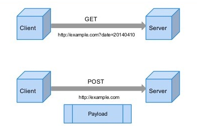

# Get방식과 Post방식

:writing_hand: *Assembled by Yunju Jang*

#### +) 참고 - HTTP Method

- <b>HTTP Method란?</b>
  - 클라이언트가 서버로 요청을 보내는 방식
  - HTTP 프로토콜에서 데이터 전송을 위해 지원하는 7가지 메소드
    - Get과 Post는 이 메소드에 속한다.
  - HTTP 통신 시 보내는 데이터 (HTTP 패킷) 의 구조는 Header 영역과 Body 영역으로 나뉜다.
    - Header에는 크게 여러가지 정보와, 어떠한 방식의 메소드를 사용하는지가 담긴다.
    - 어떤 메소드 방식을 사용했는지에 따라 Body 영역의 사용 유무 및 사용 방법이 달라진다.

 

 

## Get 방식

- <b>Get 방식 특징</b>

  - 주로 어떠한 정보를 가져와서 조회하기 위해 사용되는 방식이다.
  - URL에 Parameter을 붙여서 데이터를 전송한다.
    - <code>http://naver.com/test_api?param1=value1&param2=value2</code>
  - 데이터를 header에 포함하여 전송한다.
    - 따라서, body 영역을 데이터 전송을 위해서는 사용할 필요가 없다.
  - URL에 데이터를 실어 보내기 때문에 대용량 데이터 전송을 하기에 제한 사항이 있다. 
    - 브라우저에서 최대 길이를 제한하며, URL 형식에 맞지 않는 파라미터 이름이나 값은 인코딩되어 전달해야 한다.
    - 한번 요청시 URL 포함 255자까지 전송이 가능하며, HTTP/1.1 에서는 2048자까지 가능하다.
    - 초과 데이터는 절단된다.
    - 또한 데이터가 노출되기 때문에 보안에 취약하다.
  - 캐싱할 수 있다.
    - 속도를 높이거나, 즐겨찾기를 편리하게 하기 위해 사용되는 경우가 많다.

   

   

- <b>Get 방식 사용 방법</b>

  \* 로그인 예시

  - www.yunju.com/login?id=yun&pw=ju
  - ? 마크 : URL의 끝을 알린다.
  - id라는 파라미터에는 yun이라는 값을, pw라는 파라미터에는 ju라는 값을 붙여 전송한다.
  - & 마크 : 여러 개의 파라미터를 사용할 때 구분자 역할로 사용한다.

 

 

 

## Post 방식

- <b>Post 방식 특징</b>

  - 데이터를 서버로 제출하여 추가 또는 수정하기 위해 사용하는 방식이다.

  - Get 방식과 달리 body 영역에 데이터를 실어 보낸다.

    - 데이터 전송에 길이 제한이 없으며, 대용량 데이터를 보내는데 적합하다.
    - 그러나 최대 요청을 받는 시간인 Time Out이 존재하므로, 클라이언트에서 페이지를 요청하고 기다리는 시간이 존재한다.

  - 쿼리스트링 (문자열) 데이터, 라디오 버튼, 텍스트 박스와 같은 객체들의 값이 전송 가능하다.

  - Get 방식과 달리 보내는 데이터를 URL을 통해 노출되지 않아 기본 보안은 되어있다.

    <small>\* 그러나 다른 툴을 사용하여 Post 영역의 데이터를 확인할 수도 있다고 한다.</small>

 

 

- <b>Post 방식 사용 방법</b>
  - Body에 데이터를 넣어 전송하기 때문에, 헤더 필드 중 body의 데이터를 설명하는 Content-Type에 타입을 명시한다.
    - header 영역 : <code><Content-type:application/json; charset=UTF-8></code>
    - body 영역 : <code>{ "param1" : "value1", "param2" : "value2" }</code>

 

 

 

## Get 방식과 Post 방식의 차이

- <b>Get vs Post</b>

  

  - 비교표

    |       처리 방식        |                           Get 방식                           |           Post 방식            |
    | :--------------------: | :----------------------------------------------------------: | :----------------------------: |
    | URL에 데이터 노출 여부 |                              O                               |               X                |
    |        URL 예시        | http://localhost:8080/boardList?name=title&contents=contents | http://localhost:8080/addBoard |
    |     데이터의 위치      |                        Header (헤더)                         |          Body (바디)           |
    |     캐싱 가능 여부     |                              O                               |               X                |

 

 

## 예상질문❔

Q1) Get 방식이란 무엇인가?

A1) HTTP Method의 한 가지로 데이터를 URL에 키값 쌍으로 붙여 전송하는 방식이다.

 

Q2) Post 방식이란 무엇인가?

A2) HTTP Method의 한 가지로 데이터를 body 영역에 담아서 전송하는 방식이다.

 

 

### Reference📖

- https://khj93.tistory.com/entry/GET-%EB%B0%A9%EC%8B%9D%EA%B3%BC-POST-%EB%B0%A9%EC%8B%9D-%EC%9D%B4%EB%9E%80-%EC%B0%A8%EC%9D%B4%EC%A0%90
- https://mangkyu.tistory.com/17
- https://all-record.tistory.com/100
