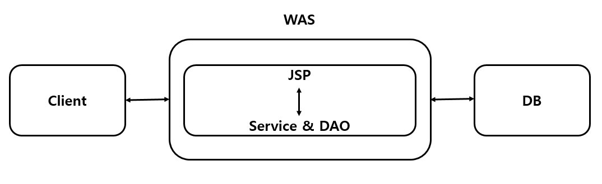
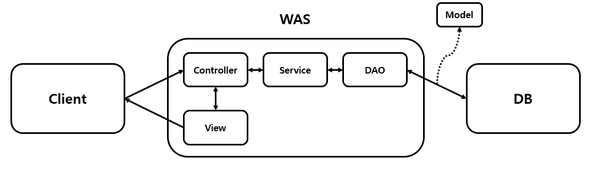
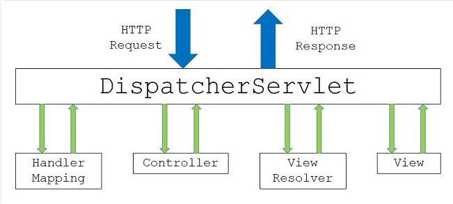

# Spring MVC 패턴

:writing_hand: *Assembled by Yunju Jang*

<!--🤝*Contributors : JiYe Bae*-->

#### +) 참고 - MVC

- <b>MVC 패턴이란?</b>

  - Spring Framework로 웹 개발을 할 때 기본적으로 MVC 패턴을 따른다.

  - MVC 패턴은 Model, View, Controller 이 3가지로 나뉘어 역할을 분할하여 처리하도록 만들어진 디자인 패턴이다.

    

    

 

 

- <b>MVC 패턴 처리 순서</b>
  1. 사용자의 Request를 Controller가 받는다.
  2. Controller는 Business Logic 처리를 Service와 같이 처리한 후 결과를 Model에 담는다.
  3. Model에 저장된 결과를 바탕으로 시각처리를 담당하는View를 제어하여 사용자에게 전달한다.

 

- <b>역할</b>

  - <b>Controller 역할</b>

    - 사용자가 접근한 URL에 따라 요청을 파악한다. 
    - URL에 맞는 Method를 호출하여 Service와 함께 Business Logic을 처리한다.
    - 최종적으로 나온 결과는 Model에 저장하고, View에 던져준다.

     

  - <b>Model 역할</b>

    - Controller 에서 받은 데이터를 저장하는 역할을 한다.

     

  - <b>View 역할</b>

    - Controller로 부터 받은 Model 데이터를 바탕으로 사용자에게 표현해준다.
    - 일반적으로 HTML, JSP 에 해당한다.

 

 

- <b>MVC 패턴의 종류</b> (크게 2가지)

  - Model1 방식

    

    - Java 파일과 <Tag>를 Html에 모두 작성하여 개발한다.
    - 즉, JSP가 모든 요청을 다 처리한다.
    - 개발이 빠르다는 장점이 있으나, 코드가 복잡해져 유지보수가 힘들어진다.

   

   

  - Model2 방식

    

    - 처리해야할 역할을 Controller, View, Model이 모두 나눠 처리한다.
    - Controller는 RequestMapping을 통해 URL 확인 후, 바로 View에 던져줄 지, Service로 들어가 추가적인 Business Logic을 수행할지 결정한다.
    - 이렇게 역할을 나눔으로써 HTML과 Java를 분리할 수 있다.
      - 확장성이 좋고, 유연하며, 유지보수도 쉬워진다.
    - <mark>현재 대부분의 Spring 프로젝트들은 Model2 구조를 따른다.</mark>

 

 

 

## Spring MVC 패턴

- <b>Spring MVC Architecture 란?</b>

  

  - Model, View, Controller를 분리한 디자인 패턴으로, 개발자가 직접 구현한다.

    - Model
    - 애플리케이션의 상태(data)를 나타낸다.
      - 일반적으로 Pojo로 구성된다.
      - JavaBeans

     

    - View
      - 디스플레이 또는 데이터 프리젠테이션
      - Model data의 렌더링을 담당하며, HTML output을 생성한다.
      - JSP와 JSP 이외 Thymeleaf, Groovy, Freemarker 등 여러 Template Engine이 있다.

     

    - Controller
      - View와 Model 사이의 인터페이스 역할
      - Model/View에 대한 사용자 입력 및 요청을 수신하여 그에 따라 적절한 결과를 Model에 담아 View에 전달한다.
        - 즉, Model Object와 이 Model을 화면에 출력할 View Name을 반환한다.
      - Controller --> Service --> Dao --> DB
      - Servlet

 

 

 

- <b>Spring Framework가 제공하는 Class</b>

  - DispatcherServlet

    - Spring에서 제공하는 Servlet 클래스
    - 사용자의 요청을 받는다.
    - Dispatcher가 받은 요청은 HandlerMapping으로 넘어간다.

     

  - HandlerMapping

    - 사용자의 요청을 처리할 Controller를 찾는다. (Controller URL Mapping)
    - 요청 URL에 해당하는 Controller 정보를 저장하는 table을 가진다.
    - 즉, 클래스에 @RequestMapping("/url") annotation을 명시하면, 해당 URL에 대한 요청이 들어왔을 때 table에 저장된 정보에 따라 해당 클래스 또는 메서드에 Mapping한다.

     

  - ViewResolver

    - Controller가 반환한 View Name에 prefix, suffix를 적용하여 View Object를 반환한다.
      - View Name 은 논리적인 이름, View Object는 논리적 이름에 prefix, suffix를 붙인 물리적인 view 파일명이다.
      - 예를 들어, 다음과 같은 구성이면,
        - View Name : home
        - prefix : /WEB-INF/views/
        - suffix : .jsp
      - "/WEB-INF/views/home.jsp" 라는 위치의 View(JSP)에 Controller에게서 받은 Model을 전달한다.
    - 이 후에 해당 View에서 이 Model data를 이용하여 적절한 페이지를 만들어 사용자에게 보여준다.

 

 

 

- <b>Spring MVC 처리 순서</b>

  

  

  1. 클라이언트가 서버에 어떤 요청을 하면, <b>DispatcherServlet</b>이 <u>요청을 가로챈다.</u>

     - web.xml을 살펴보면, 모든 url에 서블릿 매핑을 하여, 모든 요청을 가로챌 수 있게 해두었다. (변경이 가능함)

      

  2. 요청을 가로챈 DispatcherServlet은 <b>HandlerMapping</b>에게 <u>어떤 컨트롤러에게 요청을 위임할지 물어본다.</u>

     - HandlerMapping은 servlet-context.xml에서 @Controller로 등록한 것들을 스캔해서 찾아놨기 떄문에 어느 컨트롤러에게 요청을 위임할지 알고 있다. (앞에서 말한 table)

      

  3. 요청에 매핑된 컨트롤러가 있다면, <b>@RequestMapping</b>을 통하여 <u>요청을 처리할 메서드에 도달한다.</u>

  4. 컨트롤러에서는 해당 요청을 처리할 <b>Service</b>를 주입 받아, 비즈니스 로직을 Service에게 위임한다.

  5. Service에서는 요청에 필요한 작업 대부분 (코딩) 을 담당하며, 데이터베이스 접근이 필요하면 DAO를 주입 받아 DB 처리를 DAO에게 위임한다.

   

  6. DAO는 MyBaits(또는 hibernate 등) 설정을 이용해 SQL 쿼리를 날려 DB에 저장되어 있는 정보를 받아 서비스에게 다시 돌려준다.
     - 이 때, 보통 Request와 함께 날아온 DTO 객체 (@RequestParam, @RequestBody, ...)로 부터 DB 조회에 필요한 데이터를 받아와 쿼리를 만들어 보내고,
     - 결과로 받은 Entity 객체를 가지고 Response에 필요한 DTO 객체로 변환한다.

   

  7. 모든 비즈니스 로직을 끝낸 서비스가 결과물을 컨트롤러에게 넘긴다.
  8. 결과물을 받은 컨트롤러는 필요에 따라 <u>Model 객체에 결과물을 넣거나, 어떤 view 파일(jsp)을 보여줄 것인지 등의 정보를 담아 DispatcherServlet에게 보낸다.</u>
  9. DispatcherServlet은 <b>ViewResolver에게</b> 위에서 받은 <u>뷰에 대한 정보를 넘긴다.</u>
  10. ViewResolver는 해당 JSP를(응답할 View를) 찾아 DispatcherServlet에게 알려준다.
      - servlet-context.xml에서 suffix, prefix를 통해 만들어준 것을 넘김 (위에서 말했던 것)

   

  11. DispatcherServlet은 응답할 View에게 Render를 지시하고, View는 응답 로직을 처리한다.
  12. 결과적으로, DispatcherServlet이 클라이언트에게 렌더링된 View를 응답한다.

 

 

+) web.xml 등 Spring MVC의 파일 구조와 내용을 자세히 보고 싶으면 [여기](https://gmlwjd9405.github.io/2018/12/20/spring-mvc-framework.html)를 방문!

 

## 예상질문❔

Q1) Spring MVC란 무엇인가?

A1) Spring framework에서 MVC 패턴을 사용하는 방식으로, Spring framework에서 이를 편하게 하기 위해 관련 클래스를 제공한다. DispatcherServlet 등의 클래스를 이용하여 Controller, Model, View의 역할을 나눠 수행한다.

 

Q2) Spring MVC 패턴 처리 과정을 설명하라.

A2) DispatcherServlet이 요청을 뺏어 어떤 Controller가 이를 처리할지 HandlerMapping에게 물어, 지정하고 Controller가 이를 처리할 Service를 주입 받아 처리한다. 모든 비즈니스를 끝낸 서비스가 결과물을 컨트롤러에게 넘기면, 컨트롤러는 Model에 결과물을 넣거나, 보여줄 view 파일을 보여줄 것인지 DispatcherServlet에게 보낸다. DispatcherServlet은 ViewResolver에게 이 정보를 넘기고, ViewResolver는 해당 JSP나 응답할 view를 찾아 다시 DispatcherServlet에게 넘겨, DispatcherServlet이 해당 뷰에게 렌더링을 지시하여, 렌더링된 뷰를 응답한다.

 

 

### Reference📖

- https://aridom.tistory.com/61
- https://gmlwjd9405.github.io/2018/12/20/spring-mvc-framework.html
- https://jeong-pro.tistory.com/96
