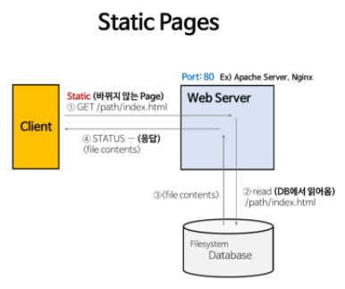
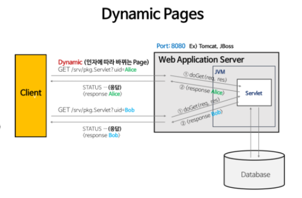

# Web Server와 WAS

:writing_hand: *Assembled by Yunju Jang*

🤝*Contributors : Jeonghea Shin*

### Web Server

- <b>웹 서버란?</b>

  - 소프트웨어와 하드웨어로 구분된다.
  - 하드웨어 : Web 서버가 설치되어있는 컴퓨터
    - 소프트웨어 : 웹 브라우저 클라이언트로 부터 HTTP 요청을 받아 <b>정적인 컨텐츠</b>(html, css, jpeg 등)를 제공하는 서버

   

   

- <b>웹 서버의 기능</b>

  - HTTP 프로토콜을 기반으로 하여 클라이언트(웹 브라우저)의 요청을 서비스하는 기능을 담당한다.

  - 요청에 따라 두가지 기능 중 적절하게 선택하여 수행한다.

    1. 정적인 컨텐츠 제공

       - WAS를 거치지 않고 바로 자원을 제공한다.

        

    2. 동적인 컨텐츠 제공을 위한 요청 전달

       - 클라이언트의 요청을 WAS에 보내고, WAS가 처리한 결과를 클라이언트에게 전달한다.

 

- <b>웹 서버의 예</b>
  - Apache Server, Niginx, IIS(Window 전용 Web 서버) 등

 

 

 

### WAS (Web Application Server)

- <b>WAS 란?</b>

  - 데이터베이스 조회나 다양한 로직 처리를 요구하는 <b>동적인 컨텐츠</b>를 제공하기 위해 만들어진 Application Server 이다.

  - HTTP를 통해 컴퓨터나 장치에 애플리케이션을 수행해주는 미들웨어이다.

    <small>* 미들웨어 : 운영체제와 응용 소프트웨어 사이에서 조정과 중개의 역할을 수행하는 소프트웨어</small>

  - 웹 컨테이너, 또는 서블릿 컨테이너로 불린다.

    - JSP, Servlet 구동 환경을 제공한다.

 

- <b>WAS의 역할</b>
  - WAS = Web Server + Web Container
  - Web Server의 기능들을 구조적으로 분리하여 처리하려는 목적으로 제시되었다.
    - 분산 트랜잭션, 보안, 메시징, 쓰레드 처리 등의 기능을 처리하는 분산 환경에서 사용된다.
    - 주로 DB 서버와 같이 수행된다.
  - 현재 WAS가 가지고 있는 Web Server 도 정적인 컨텐츠 처리에 있어 성능상 큰 차이는 없다.

 

 

- <b>WAS의 기능</b>
  - 프로그램 실행 환경과 데이터베이스 접속 기능을 제공한다.
  - 여러 개의 트랜잭션 (논리적 작업 단위) 관리 기능을 제공한다.
  - 업무를 처리하는 비즈니스 로직을 수행한다.

 

- <b>WAS의 예</b>
  - Tomcat, JBoss, Jeus, Web Sphere 등

 

 

 

#### WAS와 Web Server를 나누는 이유

- <b>서버 부하 방지</b> 

  - WAS는 DB 조회나 다양한 로직을 처리하느라 바쁘다.
    - 따라서 단순 정적 컨텐츠는 웹 서버에서 빠르게 클라이언트에 제공하는 것이 좋다.
  - WAS는 기본적으로 동적 컨텐츠를 제공하기 위해 존재한다.
    - WAS가 정적 컨텐츠까지 처리하게 되면 부하가 커지고, 동적 처리가 지연된다.
    - 이로 인해 수행 속도가 느려져 페이지 <b>노출 시간이 늘어나는 문제</b>가 발생하여 효율성이 크게 떨어진다.

   

- <b>물리적 분리를 통한 보안 강화</b>

  - WAS의 경우 DB 서버에 대한 접속 정보가 있기 때문에 외부로 노출될 경우 보안상 문제가 발생할 수 있다.
  - SSL에 대한 암복호화 처리에 웹서버를 사용한다.

 

- <b>여러대의 WAS 연결 가능</b>

  - <mark>Load Balancing</mark>을 위해 Web Server를 사용한다.

    <small>* Load Balancing : 부하 분산, 컴퓨터 네트워크 기술의 일종으로 둘 또는 셋 이상의 중앙처리장치나 저장장치와 같은 컴퓨터 자원들에게 작업을 나누는 것</small>

  - fail over (장애 극복) 와, fail back (장애 전 상태) 처리에 유리하다.

  - 특히 대용량 웹 애플리케이션의 경우 여러개의 서버를 사용, Web Server와 WAS를 분리하여 무중단 운영을 위한 장애 극복에 쉽게 대응할 수 있다.

    - ex) 앞단의 웹서버에서 오류가 발생한 WAS를 이용하지 못하도록 한 후 WAS를 재시작하여 사용자는 오류를 느끼지 못하고 이용할 수 있다.

 

- <b>여러 웹 애플리케이션 서비스 가능</b>
  - 하나의 서버에서 PHP Application과 Java Application 을 함께 사용할 수 있다.

 

- <b>기타</b>
  - 접근 허용 IP 관리, 2대 이상의 서버에서의 세션 관리 등도 웹서버에서 처리하면 효율적이다.

 

<small>즉, 자원 이용의 효율성 및 장애 극복, 배포 및 유지보수의 편의성을 위해 분리한다.</small>

<small>웹 서버를 WAS 앞에 두고 필요한 WAS들을 웹서버에 플러그인 형태로 설정하면 더 효율적인 분산 처리가 가능하다.</small>

 

 

#### Web Service Architecture

- <b>Client -> Web Server -> DB</b>

  

  - 웹 서버는 파일 경로 이름을 받아 경로와 일치하는 file contents를 반환한다.
  - 항상 동일한 페이지를 반환한다.
  - ex) image, html, css, javascript 파일과 같이 컴퓨터에 저장되어 있는 파일들

   

   

- <b>Client -> WAS -> DB</b>

  

  - 인자의 내용에 맞게 동적인 컨텐츠를 반환한다.
  - 사용자의 요청을 Servlet에서 동적으로 처리하여 모든 사용자가 서로 다른 결과를 서버로 부터 응답 받는다.

   

   

- <b>Client -> Web Server -> WAS -> DB</b>

  

  - 웹 서버는 웹 브라우저 클라이언트로 부터 HTTP 요청을 받는다.
  - 웹 서버는 클라이언트의 요청을 WAS로 보낸다.
  - WAS는 관련된 서블릿을 메모리에 올린다.
  - WAS는 web.xml을 참조하여 해당 서블릿에 대한 Thread를 생성한다. (Thread Pool 이용)
  - HttpServletRequest 와 HttpServletResponse 객체를 생성해 서블릿에 전달한다.
    - Thread는 서블릿의 service() 메소드를 호출한다.
    - service() 메소드는 요청에 맞게 doGet() 또는 doPost() 메소드를 호출한다.
  - doGet() 또는 doPost() 메소드는 인자에 맞게 생성된 적절한 동적 페이지를 Response 객체에 담아 WAS에 전달한다.
  - WAS는 Response 객체를 HttpResponse 형태로 바꾸어 웹 서버에 전달한다.
  - 생성된 Thread를 종료하고, HttpServletRequest와 HttpServletResponse 객체를 제거한다.

 

 

## 예상질문❔

Q1) 웹서버란 무엇인가?

A1) 웹 브라우저 클라이언트로 부터 Http 요청을 받아 정적인 컨텐츠를 제공하는 서버이다. 동적 컨텐츠를 제공하기 위해 브라우저의 요청을 WAS에 보내고, WAS가 처리한 결과를 다시 브라우저에게 뿌리는 역할도 한다.

 

Q2) WAS란 무엇인가?

A2) 데이터 베이스 조회나 다양한 로직 처리를 요하는 동적인 컨텐츠 제공을 위한 애플리케이션 서버로, 웹 컨테이너 또는 서블릿 컨테이너라고도 불린다.

 

 

### Reference📖

- https://github.com/fake-developers/1st/blob/main/SJH/WAS&Web%20Server.md
